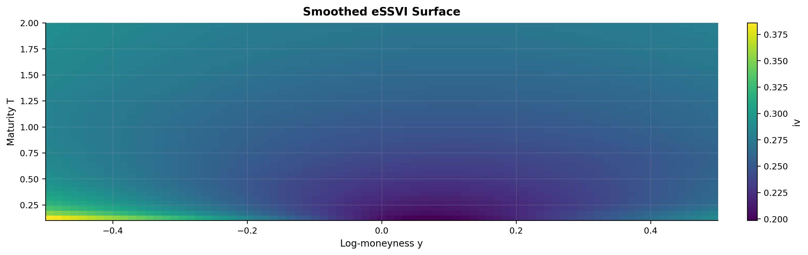
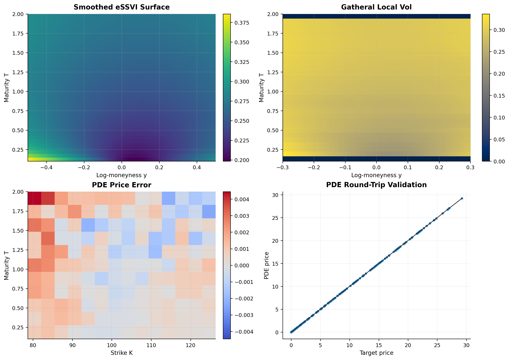

# option_pricing

Typed Python library for **vanilla option pricing, implied-volatility workflows, volatility surfaces, local-vol diagnostics, and finite-difference PDE pricing**.

It supports **analytic Black–Scholes(-Merton)** pricing, **CRR binomial trees** for European and American vanilla options, **Monte Carlo under GBM**, and more advanced **surface / local-vol / PDE** workflows — with both **instruments-based** and **flat-input** APIs.

[](https://github.com/willemk-stack/option-pricing-library/actions/workflows/tests.yaml)
[](https://codecov.io/gh/willemk-stack/option-pricing-library)
[](https://github.com/willemk-stack/option-pricing-library/actions/workflows/deploy-docs.yml)
[](./LICENSE)



> **Note:** This file is **auto-generated** from `README.template.md` and snippets in `examples/`.  
> To edit, modify the template or example sources, then run:
>
> ```bash
> python scripts/render_readme.py
> ```
>
> Publish the canonical visual bundle with:
>
> ```bash
> python scripts/build_visual_artifacts.py all --profile publish
> ```

---

## Why this repo

This project is designed as a **typed, test-backed quant library** rather than a notebook-only collection of pricing code.

Core strengths:

- **Multiple pricing engines** for vanilla options: Black–Scholes, Monte Carlo, and CRR binomial trees
- **Volatility tooling**: implied-vol inversion, smiles, surfaces, no-arbitrage checks, SVI fitting and repair, eSSVI calibration / projection
- **Advanced numerics**: local-vol extraction, diagnostics, and finite-difference PDE pricing
- **Validation-first approach**: analytic baselines, convergence checks, stress tests, and CI-executed notebooks
- **Layered API design**: simple flat-input workflows, instrument-based workflows, and curves-first pricing contexts

Docs: [📘 willemk-stack.github.io/option-pricing-library](https://willemk-stack.github.io/option-pricing-library)  
API Reference: [📘 /api](https://willemk-stack.github.io/option-pricing-library/api/)

---

## Best places to start

### Flagship demos

The repo now presents its strongest volatility and numerics signals through a **split demo suite**:

- **Surface flagship:** `demos/06_surface_noarb_svi_repair.ipynb`
  - best for static-surface engineering, no-arbitrage diagnostics, SVI fitting, repair, and interpolation judgment
- **eSSVI bridge:** `demos/07_essvi_smooth_surface_for_dupire.ipynb`
  - best for the smooth Dupire-ready term-structure handoff and analytic `w_T`
- **Local vol + PDE flagship:** `demos/08_localvol_pde_repricing.ipynb`
  - best for diagnostics-first local vol, PDE repricing, and convergence
- **Integration proof:** `demos/09_surface_to_localvol_pde_integration.ipynb`
  - keeps the full workflow connected without making one notebook carry every story
- **PDE appendix:** `demos/05_pde_pricing_and_diagnostics.ipynb`
  - isolates solver credibility before talking about surfaces

How to position them publicly:

- **SVI** = static-surface engineering
- **eSSVI** = smooth term structure and preferred Dupire handoff
- **Local vol + PDE** = numerical engineering and validation



Validated by:

- constant-vol recovery tests for Dupire local volatility
- vanilla PDE checks against Black–Scholes baselines
- digital-option convergence and remedy tests
- QuantLib comparison tests for local-vol digital pricing
- explicit seam / `w_T` diagnostics explaining the slice-stack path's time-boundary artifacts

Start here:

- **Decision guide:** `docs/user_guides/flagship_capstone2_page.md`
- **Surface docs:** `docs/user_guides/flagship_surface.md`
- **eSSVI bridge docs:** `docs/user_guides/flagship_essvi_bridge.md`
- **Local vol + PDE docs:** `docs/user_guides/flagship_localvol_pde.md`

---

## Installation

Core library:

```bash
pip install -e .
```

Development (tests, notebooks, linting, docs):

```bash
pip install -e ".[dev,docs]"
```

Python requirement:

- **Python 3.12+**

---

## API styles

The repo supports three complementary ways to work:

- **Flat-input API** for quick experiments and tutorial-style usage (`PricingInputs`)
- **Instrument-based API** to separate contracts from pricing engines (`VanillaOption`, `ExerciseStyle`)
- **Curves-first API** for discount / forward curve workflows (`PricingContext`)

### Recommended API path

- **Recommended API**: instrument-based workflow (`VanillaOption` + instrument pricers). This is the intended public entry point for most users and keeps contracts separate from pricing methods.
- **Convenience API**: flat-input workflow (`PricingInputs`). Use this for compact tutorials, tests, and quick checks.
- **Advanced API**: curves-first + surface / PDE workflows (`PricingContext`, vol, diagnostics). Use this when you need term structures, surfaces, or local-vol / PDE pipelines.

---

## Quick example (convenience API)

The convenient `PricingInputs` workflow is a good starting point for quick pricing checks and tutorials:

```python
from option_pricing import (
    MarketData,
    OptionSpec,
    OptionType,
    PricingInputs,
    binom_price,
    bs_greeks,
    bs_price,
    mc_price,
)
from option_pricing.config import MCConfig, RandomConfig

market = MarketData(spot=100.0, rate=0.05, dividend_yield=0.0)
# In PricingInputs, expiry is the absolute expiry T; with t=0 it equals tau numerically.
spec = OptionSpec(kind=OptionType.CALL, strike=100.0, expiry=1.0)
p = PricingInputs(spec=spec, market=market, sigma=0.20, t=0.0)

print("BS:", bs_price(p))
print("Greeks:", bs_greeks(p))

cfg_mc = MCConfig(
    n_paths=_mc_paths(200_000), antithetic=True, random=RandomConfig(seed=0)
)
price_mc, se = mc_price(p, cfg=cfg_mc)
print("MC:", price_mc, "(SE=", se, ")")

print("CRR:", binom_price(p, n_steps=500))
```

---

## Instrument workflow

Instruments cleanly separate *what you’re pricing* (the contract) from *how it’s priced* (the pricer and model).

```python
from option_pricing import (
    ExerciseStyle,
    MarketData,
    OptionType,
    VanillaOption,
    binom_price_instrument,
    bs_price_instrument,
    mc_price_instrument,
)

inst = VanillaOption(
    expiry=1.0,
    strike=100.0,
    kind=OptionType.CALL,
    exercise=ExerciseStyle.EUROPEAN,
)

market = MarketData(spot=100.0, rate=0.02, dividend_yield=0.0)
sigma = 0.2

# Analytic (BS)
bs_price_instrument(inst, market=market, sigma=sigma)

# Monte Carlo
mc_price_instrument(inst, market=market, sigma=sigma)

# Binomial tree (European / American)
binom_price_instrument(inst, market=market, sigma=sigma, n_steps=200)
```

Both APIs share the same pricing engines underneath; the flat-input versions simply wrap instruments internally.

---

## Curves-first example (`PricingContext`)

```python
from option_pricing import (
    FlatCarryForwardCurve,
    FlatDiscountCurve,
    OptionType,
    PricingContext,
    binom_price_from_ctx,
    bs_greeks_from_ctx,
    bs_price_from_ctx,
    mc_price_from_ctx,
)
from option_pricing.config import MCConfig, RandomConfig

spot = 100.0
r = 0.05
q = 0.00
sigma = 0.20
tau = 1.0
K = 100.0

discount = FlatDiscountCurve(r)
forward = FlatCarryForwardCurve(spot=spot, r=r, q=q)
ctx = PricingContext(spot=spot, discount=discount, forward=forward)

print(
    "BS:",
    bs_price_from_ctx(
        kind=OptionType.CALL, strike=K, sigma=sigma, tau=tau, ctx=ctx
    ),
)
print(
    "Greeks:",
    bs_greeks_from_ctx(
        kind=OptionType.CALL, strike=K, sigma=sigma, tau=tau, ctx=ctx
    ),
)

cfg_mc = MCConfig(
    n_paths=_mc_paths(200_000), antithetic=True, random=RandomConfig(seed=0)
)
price_mc, se = mc_price_from_ctx(
    kind=OptionType.CALL, strike=K, sigma=sigma, tau=tau, ctx=ctx, cfg=cfg_mc
)
print("MC:", price_mc, "(SE=", se, ")")

print(
    "CRR:",
    binom_price_from_ctx(
        kind=OptionType.CALL, strike=K, sigma=sigma, tau=tau, ctx=ctx, n_steps=500
    ),
)
```

---

## Implied volatility example

```python
from option_pricing import (
    ImpliedVolConfig,
    MarketData,
    OptionSpec,
    OptionType,
    RootMethod,
    implied_vol_bs_result,
)

market = MarketData(spot=100.0, rate=0.05, dividend_yield=0.0)
# In PricingInputs-based workflows, expiry is the absolute expiry T.
spec = OptionSpec(kind=OptionType.CALL, strike=100.0, expiry=1.0)

cfg = ImpliedVolConfig(
    root_method=RootMethod.BRACKETED_NEWTON, sigma_lo=1e-8, sigma_hi=5.0
)

res = implied_vol_bs_result(mkt_price=10.0, spec=spec, market=market, cfg=cfg)

rr = res.root_result
print(f"IV: {res.vol:.6f}")
print(f"Converged: {rr.converged}  iters={rr.iterations}  method={rr.method}")
print(f"f(root)={rr.f_at_root:.3e}  bracket={rr.bracket}  bounds={res.bounds}")
```

---

## What is implemented

### Pricing engines

- **Black–Scholes(-Merton)** price and Greeks
- **CRR binomial tree** for European and American vanilla options
- **Monte Carlo under GBM** with optional variance-reduction features
- **Finite-difference PDE pricing** for selected advanced workflows

### Volatility and diagnostics

- **BS implied-volatility inversion** with bracketing-based solvers
- **Smile** and **VolSurface** objects with interpolation support
- **Static no-arbitrage diagnostics** for surfaces
- **SVI fitting and repair** workflows
- **eSSVI calibration, validation, and smooth-surface projection** workflows
- **Local-vol extraction and diagnostics** from surfaces
- **Convergence and model-validation utilities**

---

## Project layout

| Layer | Purpose |
| --- | --- |
| **`instruments/`** | Contracts, payoffs, and exercise-style abstractions |
| **`market/`** | Spot, rates, dividends, curves, and pricing contexts |
| **`pricers/`** | Public pricing entry points for analytic, tree, Monte Carlo, and PDE workflows |
| **`models/`** | Model-specific internals such as Black–Scholes and local-vol components |
| **`vol/`** | Implied vol, smiles, surfaces, SVI/eSSVI tooling, and local-vol extraction |
| **`numerics/`** | Root-finding, finite differences, tridiagonal solvers, and PDE building blocks |
| **`diagnostics/`** | Arbitrage checks, convergence studies, repricing, and validation helpers |
| **`viz/`** | Plotting helpers for surfaces, diagnostics, and reports |

---

## Demos and notebooks

| File | Topic |
| --- | --- |
| `demos/01_black_scholes_and_greeks.ipynb` | Analytic pricing + Greeks |
| `demos/02_monte_carlo_pricing_and_error.ipynb` | Monte Carlo pricing + standard errors |
| `demos/03_binomial_convergence.ipynb` | CRR tree convergence |
| `demos/04_implied_volatility.ipynb` | Implied-volatility inversion |
| `demos/05_pde_pricing_and_diagnostics.ipynb` | PDE pricing, stability, and convergence diagnostics |
| `demos/06_surface_noarb_svi_repair.ipynb` | Surface flagship: no-arb diagnostics, SVI fitting, repair, and interpolation judgment |
| `demos/07_essvi_smooth_surface_for_dupire.ipynb` | eSSVI bridge: nodal calibration, smooth projection, and Dupire-ready handoff |
| `demos/08_localvol_pde_repricing.ipynb` | Numerics flagship: local-vol diagnostics, PDE repricing, and convergence |
| `demos/09_surface_to_localvol_pde_integration.ipynb` | Integration proof: surface -> eSSVI bridge -> local vol -> PDE |

---

## Validation and development

Development checks:

```bash
ruff check .
black --check .
pytest -q
mypy
```

The repo also includes:

- GitHub Actions for tests and docs
- README freshness checks
- CI notebook execution via `nbmake`

---

## Roadmap

See the MkDocs roadmap: [docs/roadmap.md](./docs/roadmap.md)

---

## License

Licensed under the **Apache-2.0** License. See [LICENSE](./LICENSE) for details.
