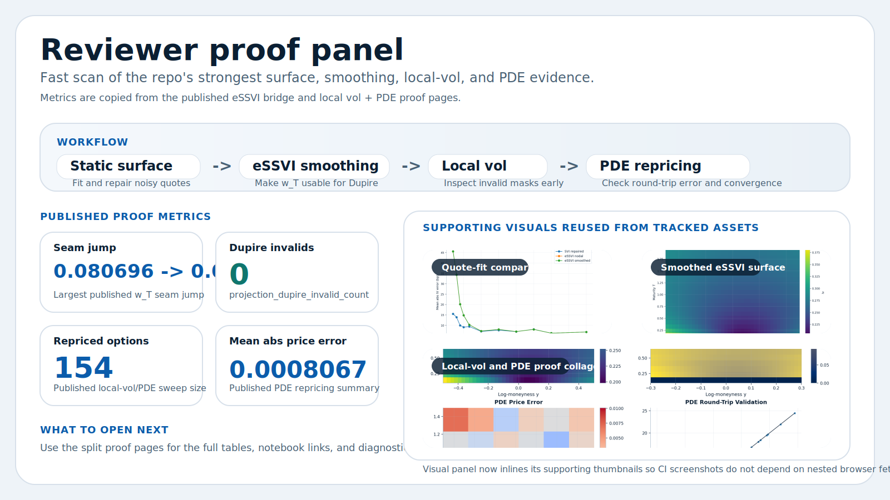

# option_pricing

Typed Python library for vanilla option pricing, implied-volatility workflows, surface repair, smooth Dupire handoff, local-vol diagnostics, and finite-difference PDE pricing.

[](https://github.com/willemk-stack/option-pricing-library/actions/workflows/tests.yaml)
[](https://codecov.io/gh/willemk-stack/option-pricing-library)
[](https://github.com/willemk-stack/option-pricing-library/actions/workflows/deploy-docs.yml)
[](./LICENSE)

This repo is strongest where quant libraries often get vague: the surface-repair-to-local-vol-to-PDE path is implemented, instrumented, benchmarked, and documented with visible evidence.

- What it does: Black-Scholes, CRR trees, Monte Carlo, implied-vol inversion, surface repair, eSSVI smoothing, local-vol extraction, and PDE pricing behind one typed package.
- Why it is technically strong: the hard steps stay inspectable through no-arbitrage checks, SVI repair tables, eSSVI seam diagnostics, invalid-mask reports, repricing sweeps, and convergence plots.
- Where the proof is: the proof-path pages, the benchmark page, and the architecture diagrams linked below.



## Proof at a glance

| Area | Evidence already in the repo | Open |
| --- | --- | --- |
| Surface repair | Quoted-vs-repaired surfaces plus per-expiry SVI residuals and slice repair status | [Surface repair workflow](https://willemk-stack.github.io/option-pricing-library/user_guides/surface_workflow/) |
| Smooth Dupire handoff | Worst observed seam jump reduced from `8.07e-2` to `8.17e-5`, with `projection_dupire_invalid_count = 0` on the published projection | [eSSVI smooth handoff](https://willemk-stack.github.io/option-pricing-library/user_guides/essvi_smooth_handoff/) |
| Local-vol and PDE validation | `154` options repriced, mean abs price error `8.1e-4`, max abs IV error `18.7 bp` on the published sweep | [Local-vol and PDE validation](https://willemk-stack.github.io/option-pricing-library/user_guides/localvol_pde_validation/) |
| Performance evidence | Vectorized implied-vol inversion reaches `446x` speedup at `801` strikes, and the benchmark page publishes runtime/error and remedy tradeoffs | [Performance evidence](https://willemk-stack.github.io/option-pricing-library/performance/) |


The benchmark overview is generated from committed benchmark artifacts, not presentation-only screenshots. Reproduction commands and environment notes live on the [Performance evidence page](https://willemk-stack.github.io/option-pricing-library/performance/).

## Start here

| If you want to review... | Open this first |
| --- | --- |
| The strongest end-to-end engineering proof | [Decision guide](https://willemk-stack.github.io/option-pricing-library/user_guides/decision_guide/) |
| The recommended public API | [Instruments guide](https://willemk-stack.github.io/option-pricing-library/user_guides/instruments/) |
| The system design and module boundaries | [Architecture](https://willemk-stack.github.io/option-pricing-library/architecture/) |
| Measured scaling and numerical tradeoffs | [Performance evidence](https://willemk-stack.github.io/option-pricing-library/performance/) |
| The generated API surface | [API reference](https://willemk-stack.github.io/option-pricing-library/api/) |

## What this library is strongest at

- Typed public API layers: instrument-based pricing, flat-input convenience helpers, and curves-first workflows.
- Surface engineering: implied-vol inversion, smile and surface objects, no-arbitrage checks, analytic SVI fitting, and repair.
- Smooth Dupire handoff: nodal eSSVI calibration, smooth projection, seam diagnostics, and local-vol extraction.
- Numerical validation: repricing grids, convergence studies, digital-payoff remedies, and committed benchmark artifacts.

## Architecture and trust signals

- [Architecture](https://willemk-stack.github.io/option-pricing-library/architecture/) shows the package split across instruments, market objects, pricers, volatility tooling, numerics, and diagnostics.
- [Performance evidence](https://willemk-stack.github.io/option-pricing-library/performance/) publishes the measured IV, PDE, local-vol, digital-remedy, macro-pipeline, and tree benchmark families.
- The proof notebooks under `demos/` are executed in CI with `nbmake`, so the public workflow pages are tied to checked code rather than static screenshots.

## Installation

Install directly from GitHub:

```bash
pip install "git+https://github.com/willemk-stack/option-pricing-library.git"
```

For a local editable checkout:

```bash
python -m venv .venv
# Windows
.\.venv\Scripts\activate
# macOS / Linux
# source .venv/bin/activate

python -m pip install --upgrade pip
pip install -e .
```

Supported extras from `pyproject.toml`:

- `pip install -e ".[plot]"` for plotting helpers used by diagnostics and docs figures
- `pip install -e ".[notebooks]"` for the demo notebook environment
- `pip install -e ".[dev]"` for tests, benchmarks, linting, formatting, and typing
- `pip install -e ".[docs]"` for MkDocs and API-reference generation

Python requirement:

- **Python 3.12+**

## API styles

The repo supports three complementary ways to work:

- **Instrument-based API** for the clearest public workflow (`VanillaOption`, `ExerciseStyle`, instrument pricers)
- **Flat-input API** for compact examples and quick checks (`PricingInputs`)
- **Curves-first API** for discount/forward curves and surface-aware workflows (`PricingContext`)

### Recommended API path

- **Recommended API**: instrument-based workflow (`VanillaOption` + instrument pricers). This keeps contracts separate from pricing methods.
- **Convenience API**: flat-input workflow (`PricingInputs`). Use this for concise tutorials, tests, and smoke checks.
- **Advanced API**: curves-first plus surfaces, local vol, and PDE (`PricingContext`, vol, diagnostics). Use this when you need term structures or the full surface-to-PDE path.

## Quick example (recommended instrument workflow)

Instruments separate what is being priced from how it is priced.

```python
from option_pricing import (
    ExerciseStyle,
    MarketData,
    OptionType,
    VanillaOption,
    binom_price_instrument,
    bs_price_instrument,
    mc_price_instrument,
)

inst = VanillaOption(
    expiry=1.0,
    strike=100.0,
    kind=OptionType.CALL,
    exercise=ExerciseStyle.EUROPEAN,
)

market = MarketData(spot=100.0, rate=0.02, dividend_yield=0.0)
sigma = 0.2

bs_price_instrument(inst, market=market, sigma=sigma)
mc_price_instrument(inst, market=market, sigma=sigma)
binom_price_instrument(inst, market=market, sigma=sigma, n_steps=200)
```

The flat-input functions call the same pricing engines underneath; they are a convenience layer, not a separate implementation.

## Compact flat-input example

```python
from option_pricing import (
    MarketData,
    OptionSpec,
    OptionType,
    PricingInputs,
    binom_price,
    bs_greeks,
    bs_price,
    mc_price,
)
from option_pricing.config import MCConfig, RandomConfig

market = MarketData(spot=100.0, rate=0.05, dividend_yield=0.0)
# In PricingInputs, expiry is the absolute expiry T; with t=0 it equals tau numerically.
spec = OptionSpec(kind=OptionType.CALL, strike=100.0, expiry=1.0)
p = PricingInputs(spec=spec, market=market, sigma=0.20, t=0.0)

print("BS:", bs_price(p))
print("Greeks:", bs_greeks(p))

cfg_mc = MCConfig(n_paths=200_000, antithetic=True, random=RandomConfig(seed=0))
price_mc, se = mc_price(p, cfg=cfg_mc)
print("MC:", price_mc, "(SE=", se, ")")

print("CRR:", binom_price(p, n_steps=500))
```

## Curves-first example (`PricingContext`)

```python
from option_pricing import (
    FlatCarryForwardCurve,
    FlatDiscountCurve,
    OptionType,
    PricingContext,
    binom_price_from_ctx,
    bs_greeks_from_ctx,
    bs_price_from_ctx,
    mc_price_from_ctx,
)
from option_pricing.config import MCConfig, RandomConfig

spot = 100.0
r = 0.05
q = 0.00
sigma = 0.20
tau = 1.0
K = 100.0

discount = FlatDiscountCurve(r)
forward = FlatCarryForwardCurve(spot=spot, r=r, q=q)
ctx = PricingContext(spot=spot, discount=discount, forward=forward)

print(
    "BS:",
    bs_price_from_ctx(
        kind=OptionType.CALL, strike=K, sigma=sigma, tau=tau, ctx=ctx
    ),
)
print(
    "Greeks:",
    bs_greeks_from_ctx(
        kind=OptionType.CALL, strike=K, sigma=sigma, tau=tau, ctx=ctx
    ),
)

cfg_mc = MCConfig(n_paths=200_000, antithetic=True, random=RandomConfig(seed=0))
price_mc, se = mc_price_from_ctx(
    kind=OptionType.CALL, strike=K, sigma=sigma, tau=tau, ctx=ctx, cfg=cfg_mc
)
print("MC:", price_mc, "(SE=", se, ")")

print(
    "CRR:",
    binom_price_from_ctx(
        kind=OptionType.CALL, strike=K, sigma=sigma, tau=tau, ctx=ctx, n_steps=500
    ),
)
```

## Implied volatility example

```python
from option_pricing import (
    ImpliedVolConfig,
    MarketData,
    OptionSpec,
    OptionType,
    RootMethod,
    implied_vol_bs_result,
)

market = MarketData(spot=100.0, rate=0.05, dividend_yield=0.0)
# In PricingInputs-based workflows, expiry is the absolute expiry T.
spec = OptionSpec(kind=OptionType.CALL, strike=100.0, expiry=1.0)

cfg = ImpliedVolConfig(
    root_method=RootMethod.BRACKETED_NEWTON, sigma_lo=1e-8, sigma_hi=5.0
)

res = implied_vol_bs_result(mkt_price=10.0, spec=spec, market=market, cfg=cfg)

rr = res.root_result
print(f"IV: {res.vol:.6f}")
print(f"Converged: {rr.converged}  iters={rr.iterations}  method={rr.method}")
print(f"f(root)={rr.f_at_root:.3e}  bracket={rr.bracket}  bounds={res.bounds}")
```

## What is implemented

### Pricing engines

- **Black-Scholes(-Merton)** price and Greeks
- **CRR binomial tree** for European and American vanilla options
- **Monte Carlo under GBM** with optional variance-reduction features
- **Finite-difference PDE pricing** for selected advanced workflows

### Volatility and diagnostics

- **BS implied-volatility inversion** with bracketing-based solvers
- **Smile** and **VolSurface** objects with interpolation support
- **Static no-arbitrage diagnostics** for surfaces
- **SVI fitting and repair** workflows
- **eSSVI calibration, validation, and smooth-surface projection**
- **Local-vol extraction and diagnostics** from differentiable implied surfaces
- **Convergence and repricing validation utilities**

## Project layout

| Layer | Purpose |
| --- | --- |
| **`instruments/`** | Contracts, payoffs, and exercise-style abstractions |
| **`market/`** | Spot, rates, dividends, curves, and pricing contexts |
| **`pricers/`** | Public pricing entry points for analytic, tree, Monte Carlo, and PDE workflows |
| **`models/`** | Model-specific internals such as Black-Scholes and local-vol components |
| **`vol/`** | Implied vol, smiles, surfaces, SVI/eSSVI tooling, and local-vol extraction |
| **`numerics/`** | Root-finding, finite differences, tridiagonal solvers, and PDE building blocks |
| **`diagnostics/`** | Arbitrage checks, convergence studies, repricing audits, and reports |
| **`viz/`** | Plotting helpers for surfaces, diagnostics, and published figures |

## Proof notebooks

| File | Topic |
| --- | --- |
| `demos/06_surface_noarb_svi_repair.ipynb` | Surface repair, no-arbitrage checks, SVI fitting, and repair |
| `demos/07_essvi_smooth_surface_for_dupire.ipynb` | Nodal eSSVI calibration, smooth projection, and Dupire handoff |
| `demos/08_localvol_pde_repricing.ipynb` | Local-vol diagnostics, PDE repricing, and convergence |
| `demos/09_surface_to_localvol_pde_integration.ipynb` | End-to-end integration path from surface to PDE |
| `demos/05_pde_pricing_and_diagnostics.ipynb` | PDE-only diagnostics and digital-remedy appendix |

## Validation and development

<details>
<summary>Contributor notes</summary>

This file is auto-generated from `README.template.md` and snippets in `examples/`.

```bash
python scripts/render_readme.py
```

Refresh the committed visual bundle with:

```bash
python scripts/build_visual_artifacts.py all --profile publish
```

</details>

Development checks:

```bash
ruff check .
black --check .
pytest -q
mypy
```

The repo also includes GitHub Actions for tests and docs, README freshness checks, and CI notebook execution via `nbmake`.

## Future work

See the published Future work page: [docs/roadmap.md](https://willemk-stack.github.io/option-pricing-library/roadmap/)

## License

Licensed under the **Apache-2.0** License. See [LICENSE](./LICENSE) for details.
