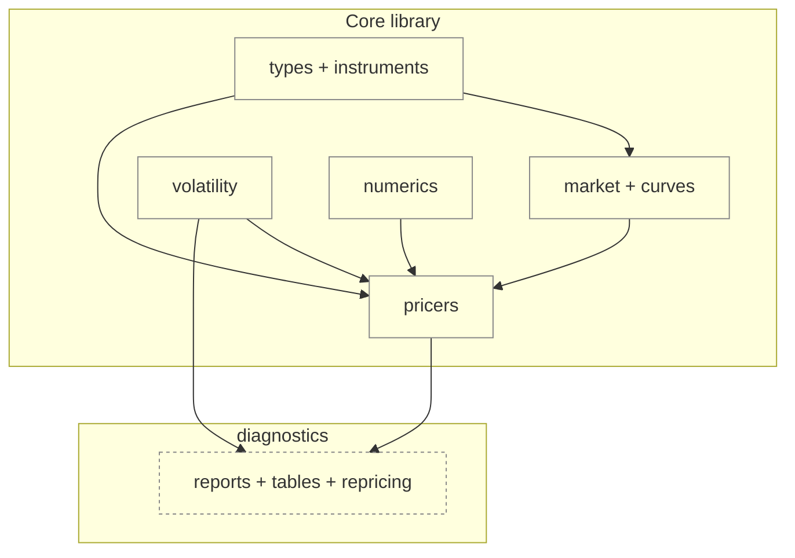
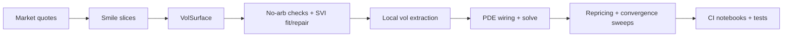

# Architecture & Design

This page summarizes the architecture and design choices for `option_pricing`.

## At a glance

- **Recommended path:** instrument-based pricing (`VanillaOption` + `*_price_instrument*`)
- **Convenience path:** flat inputs (`PricingInputs` + `bs_price` / `mc_price` / `binom_price`)
- **Advanced path:** curves + surfaces + local vol + PDE (`PricingContext`, `VolSurface`, `LocalVolSurface`, PDE pricers)

!!! tip "If you’re new here"
    Start with the instrument-based API. It keeps **contracts**, **market data**, and **pricing engines** separate and scales best as workflows grow.

## Design goals

- Provide a typed, test-backed quant library rather than a notebook-only collection
- Support multiple pricing engines (Black–Scholes, CRR binomial, Monte Carlo, PDE) behind a coherent API
- Treat volatility tooling as first-class (implied vol inversion, smiles/surfaces, no-arb checks, SVI fit/repair)
- Make local-vol + PDE workflows diagnostics-heavy (invalid masks, denominator failures, stability cues)
- Preserve layered APIs: flat inputs for quick use, instrument-based for clarity, curves-first for term structures
- Emphasize validation and convergence (analytic baselines, remedies for discontinuities, repricing consistency, CI-executed notebooks)

## Choose your API surface

| You have… | You want… | Use this |
|---|---|---|
| `S, K, T, r, q, vol` | quick scalar price/greeks | `bs_price`, `bs_greeks` |
| a `VanillaOption` + market container | clear “contract + pricer” API | `bs_price_instrument`, `mc_price_instrument`, `binom_price_instrument` |
| curves / forwards / term structure | curves-first pricing | curves-first functions + `PricingContext` |
| a smile/surface (grid or SVI) | no-arb checks + diagnostics + local vol | `VolSurface`, `check_surface_noarb`, `LocalVolSurface` |
| local vol + PDE solve | full workflow + validation loop | PDE pricers + diagnostics (`option_pricing.diagnostics.vol_surface.*`) |

!!! warning "Convenience API"
    The flat `PricingInputs` path is supported (and useful for tutorials), but the **instrument-based API** is the canonical path.

## Public API map (canonical vs convenience)

The package re-exports public symbols from `__init__.py`, including:

- **Types:** `OptionType`, `OptionSpec`, `DigitalSpec`, `MarketData`, `PricingInputs`
- **Instruments:** `ExerciseStyle`, `VanillaPayoff`, `VanillaOption`, `DigitalOption`, `TerminalPayoff`
- **Curves-first:** `PricingContext`, `DiscountCurve`, `ForwardCurve`, `FlatDiscountCurve`, `FlatCarryForwardCurve`
- **Pricing entrypoints:** `bs_price*`, `bs_greeks*`, `mc_price*`, `binom_price*`
- **Implied vol:** `implied_vol_bs`, `implied_vol_bs_result`
- **Vol objects:** `VolSurface`, `Smile`

Paths:

- **Canonical:** instrument-based pricing (`VanillaOption` + `bs_price_instrument`, `mc_price_instrument`, `binom_price_instrument`)
- **Convenience / legacy:** flat input path (`PricingInputs`, `bs_price`, `mc_price`, `binom_price`)
- **Advanced:** curves-first + surfaces + local vol + PDE (`PricingContext`, `VolSurface`, `LocalVolSurface`, PDE pricers)

## Layered architecture

### Layer responsibilities

- **Types and instruments:** contract specs and payoff interfaces (`OptionSpec`, `DigitalSpec`, `VanillaOption`, `DigitalOption`, `TerminalPayoff`)
- **Market / curves:** discount and forward curves, curves-first context (`PricingContext`, `FlatDiscountCurve`, `FlatCarryForwardCurve`)
- **Models:** coefficient builders for BS and local-vol PDEs (`bs_pde_coeffs`, `local_vol_pde_coeffs`)
- **Numerics:** grids, PDE operators, solvers, remedies (`GridConfig`, `solve_pde_1d`, `LinearParabolicPDE1D`, `ICRemedy`)
- **Volatility:** implied vol inversion, smiles/surfaces, no-arb checks, local-vol extraction (`VolSurface`, `Smile`, `check_surface_noarb`, `LocalVolSurface`, `local_vol_from_call_grid`)
- **Pricers:** public engines (BS / MC / CRR / PDE)
- **Diagnostics:** surface diagnostics and repricing audits

### Dependency direction (audit)

- Core pricing paths depend on numerics/models/volatility modules but **do not import** `option_pricing.diagnostics`
- Diagnostics explicitly depend on vol + pricers (e.g. `run_surface_diagnostics` calls `check_surface_noarb`)
- Import boundaries are guarded by a test (`tests/test_import_boundaries.py`)

SVG diagram (legacy)

## Flagship end-to-end workflow (surface → local vol → PDE → validation)

1. **Quotes → smiles → surface**

    - Build surface from quotes: `VolSurface.from_grid(rows, forward=...)`
    - Alternative: per-expiry SVI fit via `VolSurface.from_svi(..., calibrate_kwargs=...)` using `calibrate_svi`

2. **No-arbitrage diagnostics + SVI fit/repair**

    - Surface checks: `check_smile_price_monotonicity`, `check_smile_call_convexity`, `check_surface_noarb`
    - SVI calibration: `calibrate_svi(...)` → `SVIFitResult`
    - SVI repair hooks: `repair_butterfly_raw`, `repair_butterfly_jw_optimal`, `repair_butterfly_with_fallback`
    - Diagnostics table: `svi_fit_table(surface)`

3. **Local vol extraction**

    - Gatheral (from implied surface): `LocalVolSurface.from_implied(...)`, `LocalVolSurface.local_var(...)`, `LocalVolSurface.local_var_diagnostics(...)`
    - Dupire (from call price grids): `local_vol_from_call_grid(...)` and `local_vol_from_call_grid_diagnostics(...)`
    - Diagnostics reason codes: `LVInvalidReason`, `GatheralLVReport`, `DupireLVReport`

4. **PDE wiring + solve**

    - Domain selection: `BSDomainConfig`, `bs_compute_bounds`
    - PDE wiring: `bs_pde_wiring` and `local_vol_pde_wiring`
    - Solver: `solve_pde_1d(problem, grid_cfg=..., method=..., advection=...)`
    - Remedies for discontinuous payoffs: `ICRemedy`, `ic_cell_average`, `ic_l2_projection`
    - Rannacher time stepping: `RannacherCN1D`

5. **Repricing and validation loop**

    - Repricing grid: `localvol_pde_repricing_grid(...)` compares PDE prices to implied Black-76 targets
    - Convergence sweep: `localvol_pde_single_option_convergence_sweep(...)`
    - CI notebook execution: `pytest -q demos --nbmake`

SVG workflow diagram (legacy)

## Key domain objects

- `OptionSpec`, `DigitalSpec`, `PricingInputs` (core typed inputs)
- `MarketData`, `PricingContext` (flat and curves-first market containers)
- `VanillaOption`, `DigitalOption`, `ExerciseStyle` (instrument layer)
- `VolSurface`, `Smile` (implied vol objects)
- `SVIParams`, `SVISmile`, `SVIFitResult` (SVI model objects)
- `LocalVolSurface`, `LocalVolResult`, `GatheralLVReport`, `DupireLVReport` (local-vol objects + diagnostics)
- `GridConfig`, `PDESolution1D`, `LinearParabolicPDE1D` (PDE numerics core)

## Extension points

- Add a pricer: implement a new module in `pricers/` following the `PricingInputs` or instrument-based pattern
- Add a vol model: create a new smile/slice implementation and plug into `VolSurface` slices or extend `VolSurface.from_*` builders
- Add a PDE method: register a new method factory via `register_method` in `numerics.pde.methods`
- Add diagnostics: extend `run_surface_diagnostics` with new tables or arrays

## Invariants and guardrails

### Surface and smile invariants

- Surface construction validates forward/strike positivity and strict log-moneyness ordering
- Smile interpolation enforces monotone-safe interpolation (Fritsch–Carlson, U-split fallback, linear fallback)
- No-arb proxies: monotonicity/convexity checks use reconstructed Black-76 call prices; calendar checks use total variance monotonicity in `T`

### Local-vol invariants

- Local-vol diagnostics: invalid masks with reason codes (denominators, curvature, non-finite inputs, negativity)

### PDE/grid invariants

- PDE solver checks: grid sizes must be valid (`Nx >= 4`, `Nt >= 2`), grids strictly increasing, boundary enforcement at each step
- Domain bounds: BS-specific `LOG_NSIGMA` bands include spot/strike and enforce log-flooring for `S > 0`

### Payoff discontinuity remedies

- Discontinuous payoff remedies: `ICRemedy` supports cell-average and L2 projection (used in digital PDE workflows)

## Validation and confidence (tests + CI evidence)

Strongest tests:

- `test_dupire_recovers_constant_vol` (Dupire local vol recovery from Black-76 grid)
- `test_localvol_pde_vanilla_matches_bs_on_constant_surface` (local-vol PDE vs BS baseline)
- `test_bs_price_pde_matches_black_scholes` (BS PDE vs analytic)
- `test_bs_digital_price_pde_matches_analytic_cell_avg_return_solution` (digital PDE with IC remedy)
- `test_convergence_remedies_digital` (Rannacher + IC remedies for discontinuities)
- `test_localvol_digital_matches_quantlib_fd_on_flat_svi_surface` (QuantLib cross-check)
- `test_surface_calendar_variance_ok` / `test_surface_calendar_variance_fails_when_w_decreases` (calendar checks)
- `test_calibrate_svi_fits_synthetic_smile_linear_no_regularization` (SVI calibration)
- `test_repair_butterfly_raw_returns_feasible` (SVI repair)
- `test_noarb_worst_points_and_run_surface_diagnostics` (diagnostic tables + JSON report)
- `test_localvol_digital_convergence_sweep_over_strikes_and_maturities` (digital convergence sweeps)

Showcase notebooks executed in CI:

- CI runs: `pytest -q demos --nbmake`
- Demos: `demos/05_vol_surface_and_noarb.ipynb`, `demos/06_pde_pricing_and_diagnostics.ipynb`, `demos/07_vol_surfaces_localvol_pde.ipynb`

## Optional refactors / maintenance risks (repo-grounded)

- Local-vol surface is explicitly demo-grade for SVI-derived slices with piecewise-linear `w_T` interpolation and warns about banding/instability; consider prioritizing planned time-consistent SSVI/eSSVI
- Diagnostics depend on pandas/matplotlib in tests; matplotlib is optional and skipped via `pytest.importorskip`
- QuantLib cross-check is optional and skipped when QuantLib is missing
