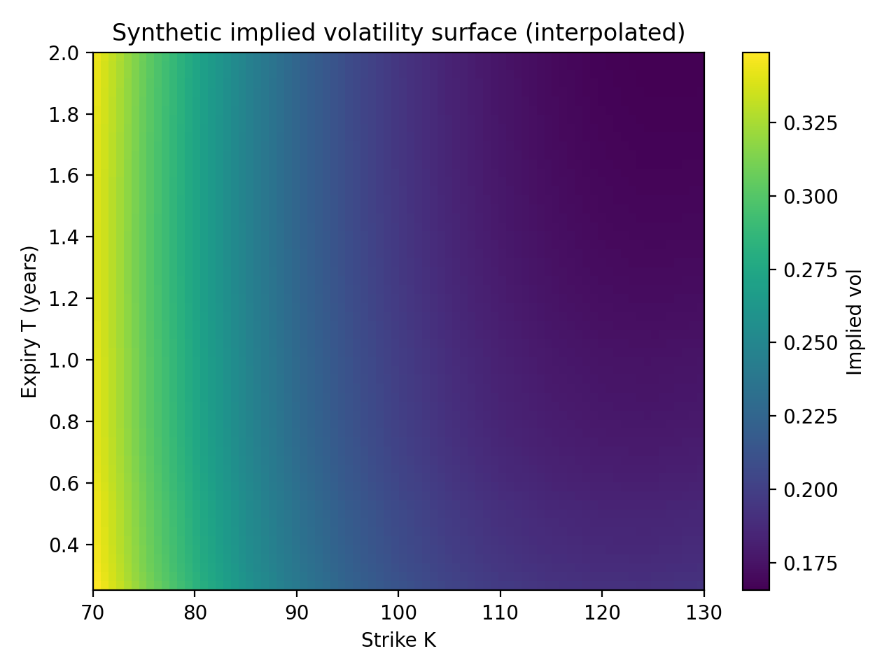
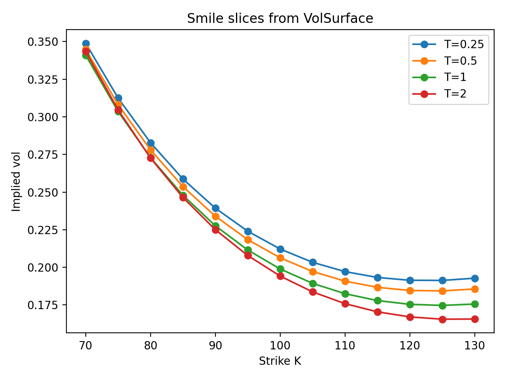

# Option Pricing Library

A small, usage-first Python library for pricing **European options** under common textbook models:

- **Black–Scholes (BS)** closed-form pricing (and analytic Greeks)
- **CRR binomial tree** pricing (European)
- **Monte Carlo (GBM)** pricing with a reported **standard error**

The public API is intentionally small: you build a `PricingInputs` bundle, then call top-level pricers from `option_pricing`.

## Vol surface at a glance





## Quick example

```python
from option_pricing import (
    MarketData,
    OptionSpec,
    OptionType,
    PricingInputs,
    bs_price,
    binom_price,
    mc_price,
)
from option_pricing.config import MCConfig, RandomConfig

market = MarketData(spot=100.0, rate=0.05)
opt = OptionSpec(kind=OptionType.CALL, strike=100.0, expiry=1.0)  # expiry is an absolute time
p = PricingInputs(spec=opt, market=market, sigma=0.20, t=0.0)

bs = bs_price(p)
cfg_mc = MCConfig(n_paths=50_000, random=RandomConfig(seed=0))
mc, se = mc_price(p, cfg=cfg_mc)
binom = binom_price(p, n_steps=400)

print(f"BS:    {bs:.4f}")
print(f"MC:    {mc:.4f}  (SE={se:.4f})")
print(f"CRR:   {binom:.4f}")
```

Notes:

* Times are **floats** (typically in **years**). `t` is “now”; `expiry` is an **absolute** time `T`. Time-to-maturity is `tau = T - t`.
* Rates are assumed to be **continuously compounded**.
* All top-level pricers dispatch on `OptionType` (`CALL` / `PUT`) via `p.spec.kind`.

## Where to go next

* **Get set up:** [Installation](installation.md)
* **Build something quickly:** [Quickstart](user_guides/quickstart.md)
* **See everything available:** [Public API](api.md)
* **Learn the theory background:** [Notes](notes/index.md)
