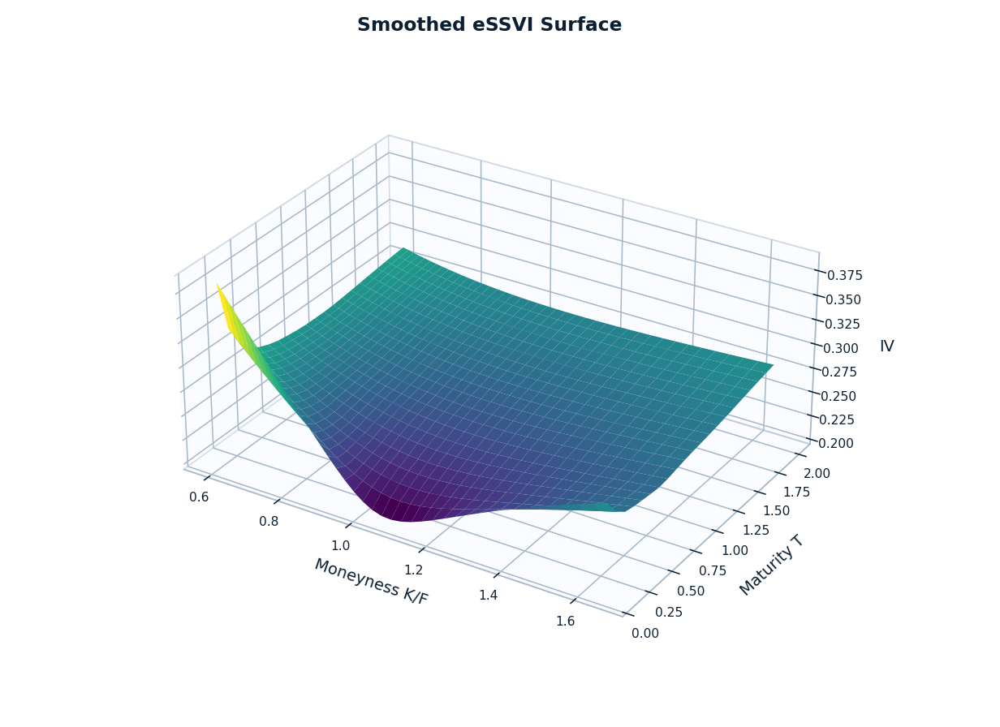
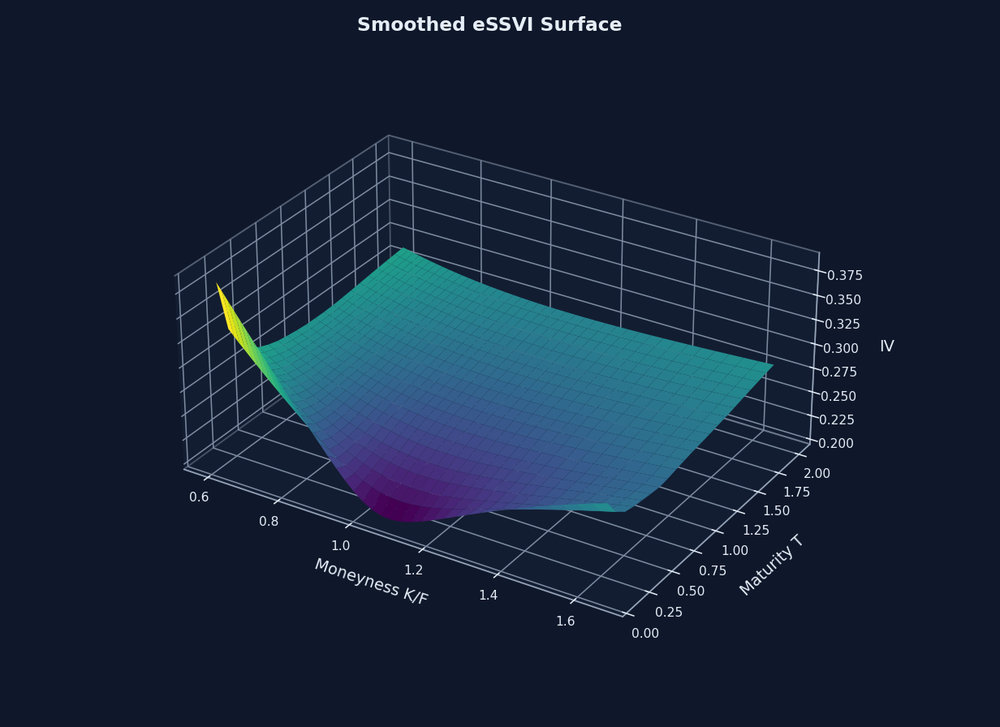

hide:
    - toc

<h1 class="homepage-hero__title homepage-page-title">Option Pricing Library</h1>

Typed pricing, surface repair, and validated numerics

This repo is strongest when the review follows one workflow: repair noisy implied-vol quotes, make the Dupire handoff smooth enough to differentiate, and validate the local-vol/PDE leg with repricing and convergence evidence.

The library surface is typed and reusable, but the main signal is judgment rather than abstraction. The docs keep assumptions, safeguards, and failure modes visible instead of hiding them behind one cleaned-up result.

[See the eSSVI handoff](user_guides/essvi_smooth_handoff.md){ .md-button .md-button--primary }
[Start with surface repair](user_guides/surface_workflow.md){ .md-button }
[Review performance evidence](performance.md){ .md-button }

Why this library matters

The project is not just a pricing API. It shows the full proof path from noisy market quotes to a smooth surface, then through local-vol extraction and PDE validation, with the delicate parts left visible for review.

If you are evaluating quant depth or engineering maturity, the fastest route is the proof sequence rather than the full API catalog.

## Signature proof moment

The proof object is the smoothed eSSVI surface used for the Dupire handoff, with smaller diagnostics showing the repair stage before it and the local-vol/PDE validation that follows.

<figure class="diagram diagram--hero homepage-signature-figure" style="--diagram-max-width: 980px" markdown="1">
{ .diagram-img .diagram-light }
{ .diagram-img .diagram-dark }
<figcaption>The standout object is the <a href="user_guides/essvi_smooth_handoff.md">smooth eSSVI handoff</a>: the surface that makes <code>w_T</code> usable for Dupire-oriented local-vol extraction instead of leaving the workflow at a repaired slice stack.</figcaption>
</figure>

<figure class="diagram diagram--quiet homepage-support-card" style="--diagram-max-width: 100%" markdown="1">
{ .diagram-img .diagram-light }
{ .diagram-img .diagram-dark }
<figcaption><a href="user_guides/surface_workflow.md">Surface repair</a> stays visible first, so the hero surface does not hide the quoted-versus-repaired comparison that starts the proof path.</figcaption>
</figure>

<figure class="diagram diagram--quiet homepage-support-card" style="--diagram-max-width: 100%" markdown="1">
{ .diagram-img .diagram-light }
{ .diagram-img .diagram-dark }
<figcaption><a href="user_guides/localvol_pde_validation.md">Local-vol / PDE validation</a> closes the loop with <code>154</code> repriced options and a published mean abs price error of <code>8.1e-4</code>.</figcaption>
</figure>

## Open the proof pages

[Proof path step 1Surface repair workflowSee the quoted surface, the repaired SVI fit, and the slice-level stress before any smoothing tradeoff is accepted.](user_guides/surface_workflow.md){ .doc-link-card .doc-link-card--quiet }

[Proof path step 2eSSVI smooth handoffSee why time continuity matters, how seam stress drops, and why the smoother surface is the preferred Dupire input.](user_guides/essvi_smooth_handoff.md){ .doc-link-card .doc-link-card--quiet }

[Proof path step 3Local-vol / PDE validationSee repricing scatter, error localization, and convergence evidence for the final numerical leg of the workflow.](user_guides/localvol_pde_validation.md){ .doc-link-card .doc-link-card--quiet }

[Benchmark case studyPerformance evidenceOpen the authored benchmark page for implied-vol scaling, PDE runtime/error tradeoffs, digital remedies, and stage budgets.](performance.md){ .doc-link-card .doc-link-card--quiet }

## Secondary routes

- [Architecture](architecture.md) for the recruiter-facing systems view and safeguard story
- [Decision guide](user_guides/decision_guide.md) if you want the proof sequence in one routing page
- [API reference](api/index.md) for the typed public surface and generated symbol docs
- [Installation](installation.md) for local setup and editable development
