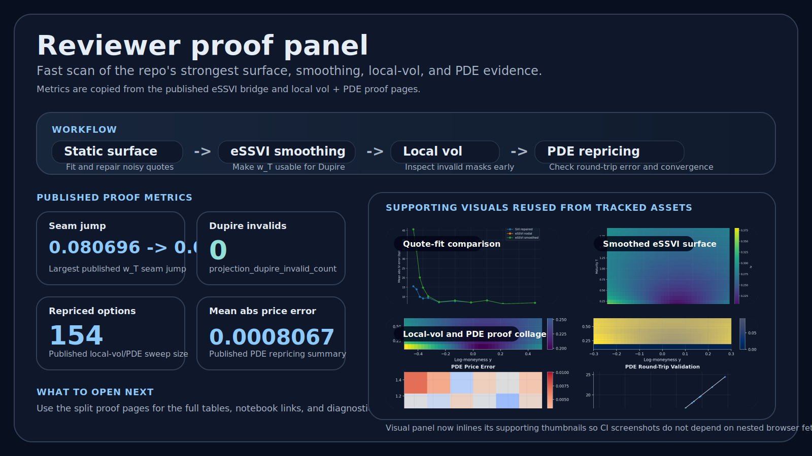

---
hide:
  - navigation
  - toc
---

# Option Pricing Library

  
Typed pricing, surface repair, and validated numerics

  
This library prices vanilla options, repairs noisy implied-vol surfaces, smooths the Dupire handoff with eSSVI, and validates the local-vol/PDE workflow with repricing and convergence evidence.

  

[Read the proof path](user_guides/decision_guide.md){ .md-button .md-button--primary }
[Start with the recommended API](user_guides/instruments.md){ .md-button }
[Review performance evidence](performance.md){ .md-button }
  

<figure markdown class="diagram" style="--diagram-max-width: 1180px">
  { .diagram-img .diagram-light }
  { .diagram-img .diagram-dark }
  <figcaption>The fastest single scan: quoted-to-repaired surface evidence, smooth Dupire handoff evidence, and local-vol/PDE validation evidence in one panel.</figcaption>
</figure>

## Validation snapshot

  

    
Seam control

    
Worst observed <code>w_T</code> seam jump

    

      8.07e-2
      &rarr;
      8.17e-5
    

  

  

    
Dupire handoff

    
<code>projection_dupire_invalid_count</code>

    

      0
    

  

  

    
PDE repricing

    
Published repricing sweep

    

      154
      options repriced
    

    

      Mean abs price error
      8.1e-4
    

    

      Max abs IV error
      18.7 bp
    

  

## First clicks

| If you want to review... | Open this |
| --- | --- |
| The strongest end-to-end proof path | [Decision guide](user_guides/decision_guide.md) |
| The recommended public API | [Instruments](user_guides/instruments.md) |
| The measured runtime and scaling story | [Performance evidence](performance.md) |
| The system design and module boundaries | [Architecture](architecture.md) |
| The generated API reference | [API reference](api/index.md) |

## What makes this repo credible quickly

- The public API is typed and layered rather than notebook-only.
- The surface workflow shows quoted data, repair diagnostics, and fit stress instead of a single polished chart.
- The eSSVI handoff page shows why the time-derivative problem matters before local-vol extraction begins.
- The local-vol/PDE page publishes repricing and convergence evidence, and the benchmark page publishes runtime/error tradeoffs from committed artifacts.

## Continue by intent

- [Installation](installation.md) for a local checkout or editable setup
- [Guides](user_guides/index.md) for the API and workflow map
- [Performance evidence](performance.md) for committed benchmark plots and summaries
- [Architecture](architecture.md) for package structure and dependency direction
- [Future work](roadmap.md) for what is still exploratory
