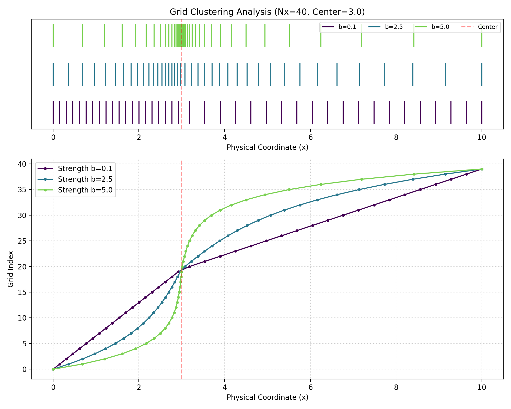

# Finite Difference Methods for Black–Scholes (Duffy, 2006) — Sprint 1 Notes

*PDE framing + 1D finite-difference scaffold for European options*

---

## 0) Notation (keep consistent everywhere)

- Spatial grid: \(x_j = x_{\min} + jh,\; j=0,\dots,N\), with \(h=\Delta x\)
- Time grid: \(t_n = nk,\; n=0,\dots,M\), with \(k=\Delta t\)
- Grid function: \(u_j^n \approx u(x_j,t_n)\)
- Interior nodes: \(j=1,\dots,N-1\); boundary nodes: \(j=0,N\)

> In option pricing you often solve **backward in calendar time** \(t\) with terminal payoff at \(T\). Many implementations use time-to-maturity \(\tau = T-t\) to turn the problem into a forward march in \(\tau\).

---

## 1) PDE + IBVP framing (what problem are we solving?)

A broad class of pricing PDEs (after suitable transforms) can be written as a 1D linear parabolic PDE:

\[
u_t = a(x,t)\,u_{xx} + b(x,t)\,u_x + c(x,t)\,u.
\]

Interpretation:

- **Diffusion** \(a u_{xx}\): smooths gradients
- **Drift/advection** \(b u_x\): transports features
- **Reaction** \(c u\): growth/decay (often \(-ru\) in finance)

A PDE problem is an **IBVP** (initial boundary value problem). You must specify:

- Domain: \(x\in[x_{\min},x_{\max}],\; t\in[0,T]\)
- Terminal/initial condition (in finance: terminal payoff)
- Two boundary conditions (left and right)

In option pricing:

\[
V(\cdot,T)=\text{payoff}(\cdot).
\]

---

## 2) “Well-posed” (practical definition)

A PDE setup is **well-posed** if:

1. a solution exists,
2. it is unique,
3. it depends continuously on the inputs (IC/BC/coefficients).

Practical takeaway: bad or incompatible boundary/terminal data can produce non-unique or unstable numerics even when the PDE itself looks fine.

---

## 3) Finite differences (1D stencils)

### First derivative \(u_x\)

Forward (1st order):

\[
u_x(x_j,t_n) \approx \frac{u_{j+1}^n-u_j^n}{h} + O(h).
\]

Backward (1st order):

\[
u_x(x_j,t_n) \approx \frac{u_j^n-u_{j-1}^n}{h} + O(h).
\]

Central (2nd order):

\[
u_x(x_j,t_n) \approx \frac{u_{j+1}^n-u_{j-1}^n}{2h} + O(h^2).
\]

### Second derivative \(u_{xx}\)

Central (2nd order):

\[
u_{xx}(x_j,t_n) \approx \frac{u_{j+1}^n - 2u_j^n + u_{j-1}^n}{h^2} + O(h^2).
\]

### Time derivative (baseline)

Forward Euler (1st order):

\[
u_t(x_j,t_n) \approx \frac{u_j^{n+1}-u_j^n}{k} + O(k).
\]

---

## 4) Truncation error, consistency, stability, convergence

- **Truncation error (TE):** derived by Taylor expansion; leading discarded term sets the order.
- **Consistency:** TE \(\to 0\) as \(h,k\to 0\).
- **Stability:** perturbations (rounding, data noise) do not amplify uncontrollably.
- **Convergence:** numerical solution \(\to\) true solution as \(h,k\to 0\).

**Lax Equivalence (linear IVP):** consistency + stability ⇒ convergence.

---

## 5) Time stepping: the \(\theta\)-scheme (explicit / implicit / CN)

Let \(L_h\) denote the spatial discretization of the operator \(L\). The \(\theta\)-scheme is:

\[
\mathbf{u}^{n+1} = \mathbf{u}^n + k\Big((1-\theta)L_h\mathbf{u}^n + \theta L_h\mathbf{u}^{n+1}\Big).
\]

Rearrange to matrix form:

\[
\underbrace{\left(I - k\theta L_h\right)}_{A}\mathbf{u}^{n+1}
=
\underbrace{\left(I + k(1-\theta)L_h\right)}_{B}\mathbf{u}^{n}
\;+\;\mathbf{g}^{n,n+1},
\]

where \(\mathbf{g}^{n,n+1}\) collects boundary-condition contributions.

Special cases:

- \(\theta=0\): explicit Euler (cheap, conditionally stable)
- \(\theta=1\): implicit Euler (damping, typically stable for diffusion)
- \(\theta=\tfrac12\): **Crank–Nicolson** (2nd order in time for smooth solutions)

In 1D, \(A\) and \(B\) are typically **tridiagonal** ⇒ solve with Thomas algorithm.

---

## 6) CN interior-only system + boundary contributions (implementation-ready)

Define the full grid vector at time \(t_n\):

\[
\mathbf{u}^n = \big[u_0^n,\;u_1^n,\;\dots,\;u_{N-1}^n,\;u_N^n\big]^T.
\]

Assume Dirichlet boundaries (common in Black–Scholes truncation):

\[
u_0^n = \alpha(t_n),\qquad u_N^n=\beta(t_n).
\]

Split into boundary vs interior:

- Boundary: \(\mathbf{u}_B^n = [u_0^n,\;u_N^n]^T\)
- Interior: \(\mathbf{u}_I^n = [u_1^n,\dots,u_{N-1}^n]^T\)

From \(A\mathbf{u}^{n+1}=B\mathbf{u}^n+\mathbf{g}\), restricting to interior rows:

\[
A_{II}\mathbf{u}_I^{n+1} + A_{IB}\mathbf{u}_B^{n+1}
=
B_{II}\mathbf{u}_I^n + B_{IB}\mathbf{u}_B^n + \mathbf{g}_I.
\]

Move known boundary terms to the RHS:

\[
A_{II}\mathbf{u}_I^{n+1}
=
B_{II}\mathbf{u}_I^n
+
\big(B_{IB}\mathbf{u}_B^n - A_{IB}\mathbf{u}_B^{n+1}\big)
+
\mathbf{g}_I.
\]

**Key implementation fact (1D tridiagonal):** boundary coupling only modifies the **first and last** entries of the RHS vector.

### Diffusion-only template (intuition)

For \(u_t = a u_{xx}\) with constant \(a\), define \(r=\dfrac{ak}{h^2}\). CN at an interior node:

\[
-\frac{r}{2}u_{j-1}^{n+1} + (1+r)u_j^{n+1} -\frac{r}{2}u_{j+1}^{n+1}
=
\frac{r}{2}u_{j-1}^{n} + (1-r)u_j^{n} +\frac{r}{2}u_{j+1}^{n}.
\]

---

## 7) Drift discretization choices (central vs upwind)

For the drift/advection term \(b(x,t)u_x\):

- **Central difference:** 2nd order, but can oscillate in advection-dominated regimes.
- **Upwind:** 1st order, introduces numerical diffusion, often improves monotonicity.

Rule of thumb: if drift dominates diffusion (high “Péclet-like” behavior), consider upwinding/stabilization.

---

## 8) Black–Scholes mapping (finance → PDE)

### Black–Scholes PDE in spot \(S\)

For a European option \(V(S,t)\):

\[
\frac{\partial V}{\partial t}
+ \frac12\sigma^2 S^2 \frac{\partial^2 V}{\partial S^2}
+ r S \frac{\partial V}{\partial S}
- rV = 0,
\qquad
V(S,T)=\text{payoff}(S).
\]

### Far-field boundary conditions (typical asymptotics)

Call:

- as \(S\to 0\): \(V\to 0\)
- as \(S\to\infty\): \(V \sim S - K e^{-r(T-t)}\)

Put:

- as \(S\to 0\): \(V \sim K e^{-r(T-t)}\)
- as \(S\to\infty\): \(V\to 0\)

In practice: truncate to \([S_{\min},S_{\max}]\) (or \([x_{\min},x_{\max}]\)) and impose these as Dirichlet boundaries.

### Why log-price \(x=\log S\) helps

- \(S\in(0,\infty)\) maps to \(x\in(-\infty,\infty)\)
- Uniform grid in \(x\) corresponds to exponential spacing in \(S=e^x\)
- Truncation via “\(m\) sigmas” heuristic:

\[
x_{\min/\max} \approx \log(S_0) + \left(r-\tfrac12\sigma^2\right)T \pm m\,\sigma\sqrt{T}.
\]

---

## 9) Implementation scaffold (`pde_fd.py`) — what to parameterize

**Grid**

- coordinate: `S` vs `logS`
- bounds: explicit or `m_sigmas`
- nodes: `Nx`
- spacing: uniform vs clustered (around strike/spot/barrier)

**Time stepping**

- `theta` (\(0.5\) CN, \(1.0\) implicit Euler)
- `Nt` or `dt_max`
- Rannacher smoothing: `n_rannacher`
- event times (dividends, Bermudan dates, monitoring)

**Boundary conditions**

- per boundary: `DIRICHLET / NEUMANN / ROBIN`
- boundary functions of time (or time-to-maturity)
- far-field model: call vs put asymptotic

**Payoff / constraints**

- payoff callable
- (later) American/Bermudan: exercise rule / projection / penalty

**Linear solver**

- 1D: Thomas algorithm
- (later) 2D+: sparse solver + tolerances

**Convergence runner**

- grid refinement schedule, error norms, reference price

---

## 10) Crank–Nicolson issues (Duffy-style cautions) + mitigations

Known issues in finance PDEs:

- oscillations (“ringing”) near non-smooth payoff kinks (e.g., at strike)
- noisy Greeks near strike unless grid is well-designed
- near-neutral stability when diffusion is small (advection-dominated)

Mitigations:

- **Rannacher smoothing:** a few initial implicit Euler steps then switch to CN
- drift stabilization: upwind / flux limiting when needed
- grid design: place strike on-grid; local refinement near strike/spot

---

## 11) X-grid clustering (sinh mapping around a center)

This documents the clustered 1D grid construction used by `build_x_grid`.  
Goal: build a **monotone grid** on \([x_{\min},x_{\max}]\) with **higher density near** a chosen center \(x_c\), while keeping endpoints fixed.

### Inputs (`GridConfig`)

- \(x_{\min} =\) `cfg.x_lb`, \(x_{\max}=\) `cfg.x_ub`
- \(x_c=\) `cfg.x_center` with \(x_{\min}<x_c<x_{\max}\)
- \(N_x=\) `cfg.Nx`
- \(b=\) `cfg.cluster_strength` with \(b\ge 0\)
- `cfg.spacing ∈ {UNIFORM, CLUSTERED}`

### Uniform grid (baseline)

If `spacing == UNIFORM`:

\[
x_j = x_{\min} + j\frac{x_{\max}-x_{\min}}{N_x-1},\qquad j=0,\dots,N_x-1.
\]

### Clustered grid: normalized sinh map



Start from a uniform parameter grid \(u\in[-1,1]\):

\[
u_j = -1 + 2\frac{j}{N_x-1},\qquad j=0,\dots,N_x-1.
\]

Define the normalized transform:

\[
r(u)=\frac{\sinh(bu)}{\max_{v\in[-1,1]}|\sinh(bv)|}.
\]

Since \(\max_{v\in[-1,1]}|\sinh(bv)|=\sinh(b)\) for \(b>0\), this is:

\[
r(u)=\frac{\sinh(bu)}{\sinh(b)}\in[-1,1],\qquad (b>0).
\]

So:

\[
r_j = r(u_j)=\frac{\sinh(bu_j)}{\sinh(b)}.
\]

**Interpretation**

- \(b\to 0\): \(r(u)\approx u\) (nearly uniform)
- larger \(b\): stronger clustering near \(r=0\) (hence near \(x_c\))

### Asymmetric physical mapping to \([x_{\min},x_{\max}]\)

Because \(x_c\) may not be the midpoint, scale left and right sides separately:

\[
L=x_c-x_{\min},\qquad R=x_{\max}-x_c.
\]

Map:

\[
x_j=
\begin{cases}
x_c + r_j\,L, & r_j\le 0,\\[6pt]
x_c + r_j\,R, & r_j>0.
\end{cases}
\]

Enforce endpoints exactly:

\[
x_0 := x_{\min},\qquad x_{N_x-1}:=x_{\max}.
\]

**Properties**

- \(x_j\in[x_{\min},x_{\max}]\) by construction
- monotone increasing grid (since \(r(u)\) is monotone in \(u\))
- smallest spacing near \(x_c\), growing smoothly toward boundaries (stronger as \(b\) increases)

**Practical tips**

- Pick \(x_c\) near the key region (often \(\log K\), \(\log S_0\), or between them).
- Moderate \(b\) first (e.g., \(1\)–\(4\)); too large \(b\) can create extreme cell-size ratios.
- If you want an exact node at the center, choose odd \(N_x\) so \(u_{(N_x-1)/2}=0 \Rightarrow x=x_c\).
- On non-uniform grids, use spatial discretizations that account for variable spacing (uniform-grid central differences lose formal order if applied blindly).

### Reference implementation

```python
def build_x_grid(cfg: GridConfig) -> np.ndarray:
    cfg.validate()
    if cfg.spacing == SpacingPolicy.UNIFORM:
        return np.linspace(cfg.x_lb, cfg.x_ub, cfg.Nx)

    # clustered: sinh map around center, but keep points within [x_lb, x_ub]
    u = np.linspace(-1.0, 1.0, cfg.Nx)
    b = cfg.cluster_strength

    raw = np.sinh(b * u)
    raw = raw / np.max(np.abs(raw))  # normalize to [-1, 1]

    x = np.empty_like(raw, dtype=float)

    left_scale = cfg.x_center - cfg.x_lb
    right_scale = cfg.x_ub - cfg.x_center

    neg = raw <= 0
    pos = ~neg
    x[neg] = cfg.x_center + raw[neg] * left_scale
    x[pos] = cfg.x_center + raw[pos] * right_scale

    x[0] = cfg.x_lb
    x[-1] = cfg.x_ub
    return x
```