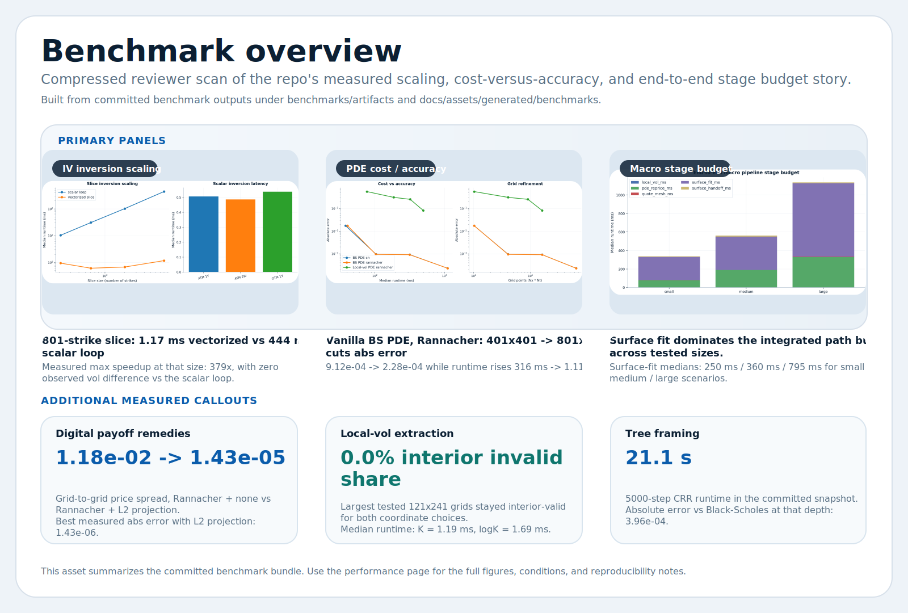
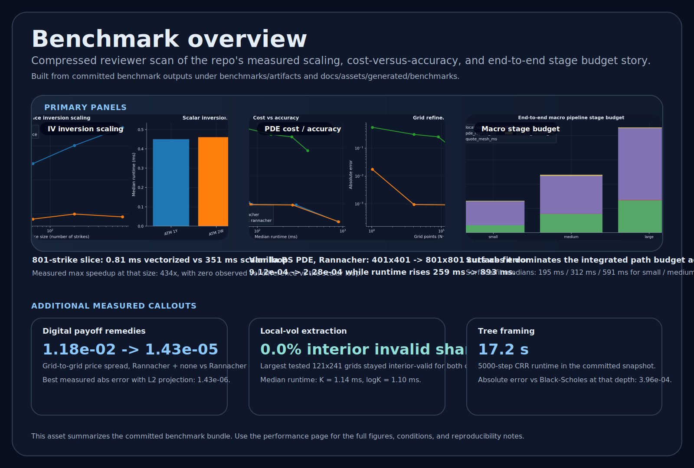
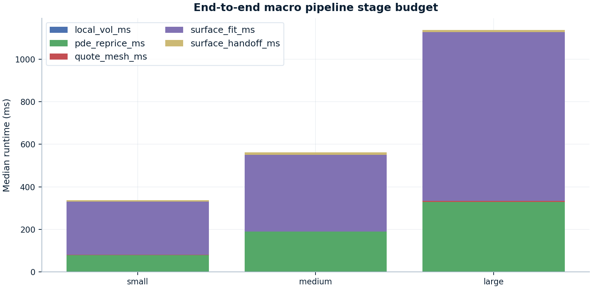
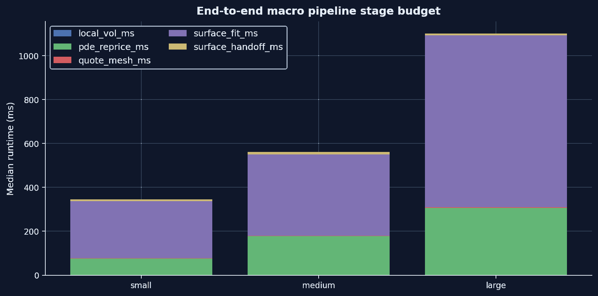
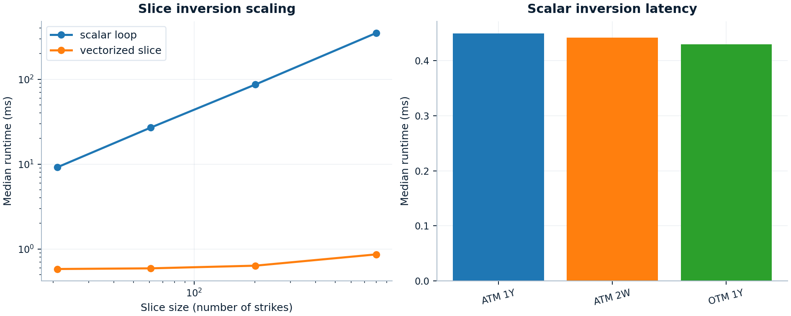
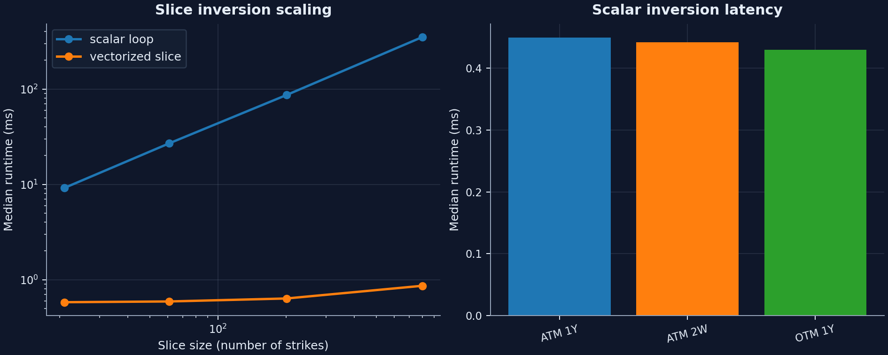
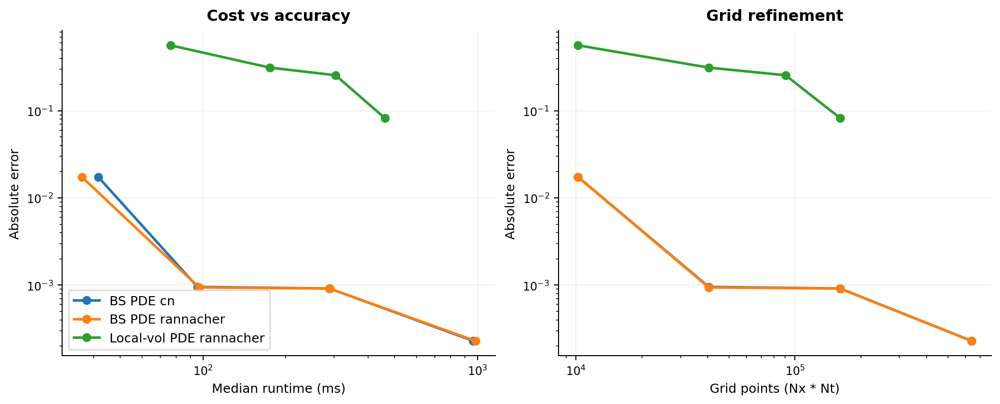
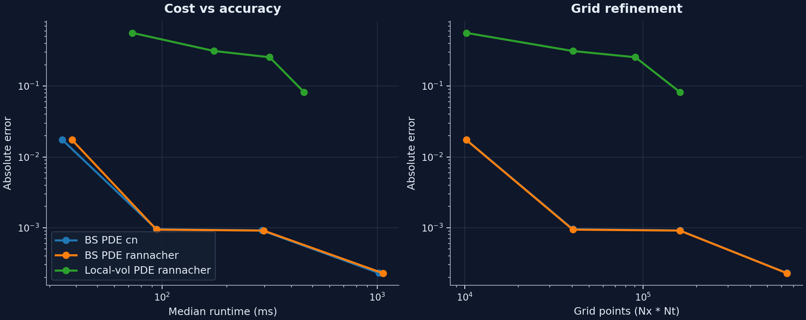
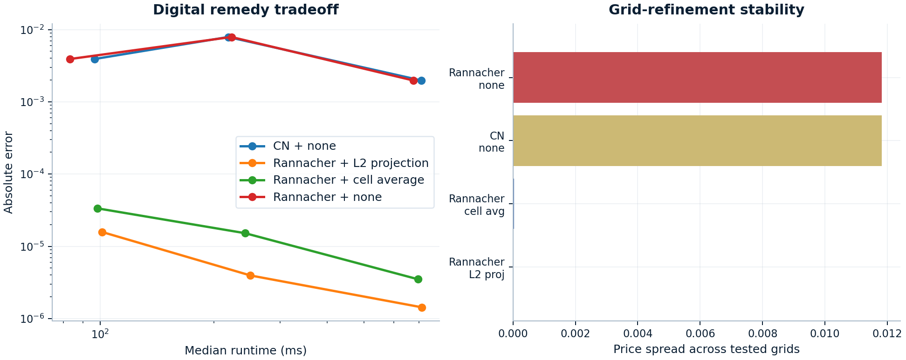
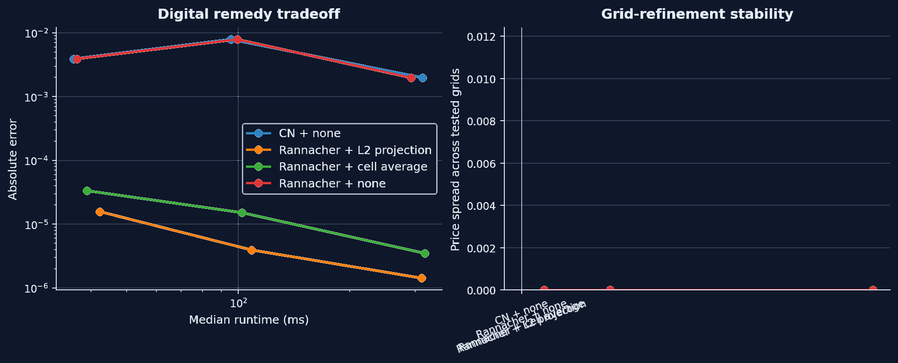

<!-- Generated from scripts/templates/performance.md.template and benchmarks/artifacts/*. Do not edit docs/performance.md directly. -->

# Performance evidence

<div class="doc-intro" markdown="1">
<p class="doc-intro__kicker">Flagship benchmark page</p>
<p class="doc-intro__lead">This page is the committed benchmark bundle for the runtime questions that matter most in review: workload-class scaling, PDE cost versus accuracy, digital-payoff remedies, and the end-to-end surface-to-PDE stage budget.</p>
<p class="doc-intro__support">Read it as a benchmark case study rather than a leaderboard. The point is to show what actually matters, where extra runtime buys something real, and which stages deserve optimization effort before the quieter ones do.</p>
<div class="doc-pill-row">
  <span class="doc-pill">Vectorized IV scaling</span>
  <span class="doc-pill">Runtime versus error</span>
  <span class="doc-pill">Stage-budget attribution</span>
</div>
</div>

<div class="proof-route-shell proof-route-shell--performance" markdown="1">
<p class="proof-route-shell__label">Read after the proof path</p>
<div class="proof-route" role="navigation" aria-label="Proof route">
<a class="proof-route__item" href="../"><span class="proof-route__step">Start</span><span class="proof-route__title">Homepage overview</span></a>
<a class="proof-route__item" href="../user_guides/surface_workflow/"><span class="proof-route__step">Step 1</span><span class="proof-route__title">Surface repair</span></a>
<a class="proof-route__item" href="../user_guides/essvi_smooth_handoff/"><span class="proof-route__step">Step 2</span><span class="proof-route__title">eSSVI handoff</span></a>
<a class="proof-route__item" href="../user_guides/localvol_pde_validation/"><span class="proof-route__step">Step 3</span><span class="proof-route__title">Local-vol / PDE</span></a>
<span class="proof-route__item proof-route__item--current proof-route__item--followup" aria-current="page"><span class="proof-route__step">Follow-up</span><span class="proof-route__title">Performance evidence</span></span>
</div>
</div>

## Benchmark overview

<p class="doc-section-lead">This opening proof object does the same job the other flagship pages do: land one bounded review surface first, then let the page zoom into interpretation. It compresses the benchmark families that matter most in review before the narrative narrows to runtime priorities and supporting checks.</p>

<figure markdown class="diagram diagram--hero performance-overview-panel" style="--diagram-max-width: 1180px">
  { .diagram-img .diagram-light }
  { .diagram-img .diagram-dark }
  <figcaption>One view across the benchmark families that matter most in review: vectorized IV scaling, runtime/error tradeoffs, digital remedies, and integrated stage-budget attribution.</figcaption>
</figure>

<div class="doc-panel doc-panel--strong performance-reading-panel" markdown="1">
<p class="doc-panel__label">What actually matters</p>
- The strongest review signal here is not one absolute timing number. It is whether the bundle separates workload-class wins, cost-versus-accuracy tradeoffs, and genuine end-to-end bottlenecks.
- In the committed macro run, surface fitting plus PDE repricing already consume 97.6% to 98.8% of total runtime, while quote mesh + handoff + local-vol stay between 7.71 ms and 14.13 ms combined.
- That is why this page is best read as a default-setting case study: it justifies method choice, escalation guidance, remedy selection, and optimization order, not machine-independent latency promises.
</div>

## Runtime priorities

<p class="doc-section-lead">This is the flagship benchmark moment on the page because it answers the optimization question directly: where does the workflow actually spend time, and which stages are already cheap enough that polishing them first would be the wrong judgment?</p>

<div class="performance-flagship-shell" markdown="1">
<p class="performance-flagship-shell__eyebrow">Editorial flagship figure</p>
<figure markdown class="diagram performance-flagship-figure" style="--diagram-max-width: 1120px">
  { .diagram-img .diagram-light }
  { .diagram-img .diagram-dark }
  <figcaption>The integrated stage-budget family is the clearest optimization-priority proof object: surface fitting and PDE repricing dominate, while the handoff stages stay cheap.</figcaption>
</figure>
</div>

<div class="doc-panel doc-panel--strong performance-flagship-panel" markdown="1">
<p class="doc-panel__label">Optimization judgment</p>
- Surface fitting is the main scaling driver in every published scenario.
  It rises from 250.25 ms to 794.53 ms, which is why optimization effort belongs there before smaller orchestration stages.
- PDE repricing is the second budget line, not a rounding error.
  It grows from 78.65 ms to 328.23 ms and stays materially larger than the handoff or local-vol construction steps.
- Quote mesh generation, smooth handoff, and local-vol extraction remain the low-leverage stages.
  Combined, they stay at 7.71 ms to 14.13 ms, so the benchmark bundle argues against optimizing them first.
</div>

## What the committed snapshot establishes

<p class="doc-section-lead">The table is the compact claim set for the benchmark bundle: each row pairs a workload, a reference, and the reason the published result matters. It is strongest when read as a bounded justification set, not as a promise that every workload should be pushed to the finest or fastest-looking point.</p>

| Family | Conditions | Reference | What the committed snapshot shows |
| --- | --- | --- | --- |
| Implied-vol inversion | Scalar BS inversion and Black-76 slice inversion on 21-801 strikes | Scalar loop baseline | The vectorized slice path reaches 379x speedup at 801 strikes while preserving zero measured vol difference versus the scalar loop. Scalar single-option inversions stay around 0.49 ms to 0.54 ms. |
| Vanilla PDE | Black-Scholes European call, Nx=Nt from 101 to 801 | Analytic Black-Scholes price | Absolute error falls from about 1.74e-02 at 101x101 to about 2.28e-04 at 801x801. Runtime rises from about 40.7 ms to about 1.1 s. |
| Digital PDE remedies | Digital call, Nx=Nt in {101, 201, 401} | Analytic digital price | The untreated path keeps an ~1.18e-02 refinement spread, while Rannacher + cell average cuts it to 3.00e-05 and Rannacher + L2 projection cuts it to 1.43e-05. |
| End-to-end macro pipeline | Synthetic SVI quote mesh -> fitted surface -> handoff probe -> local-vol surface -> representative local-vol PDE | Stage-level timing only | Surface fitting dominates the measured stage budget (250.2 ms, 359.7 ms, 794.5 ms for small, medium, large), with PDE repricing second (78.6 ms, 188.7 ms, 328.2 ms). |

## Core benchmark families

### Implied-vol inversion

<p class="doc-section-lead">This is the workload-class proof: the library is built for real smiles and surfaces rather than just isolated single-option demos.</p>

<figure markdown class="diagram" style="--diagram-max-width: 980px">
  { .diagram-img .diagram-light }
  { .diagram-img .diagram-dark }
</figure>

Treat this figure as a workload-class result rather than a single-option latency contest. Use the vectorized slice inverter whenever the workload is a smile or surface rather than an isolated option. At 801 strikes the committed snapshot records about 1.17 ms for the vectorized slice path versus about 444.29 ms for the scalar-loop baseline.

### PDE runtime versus error

<p class="doc-section-lead">The numerical question here is not whether a finer grid is better in principle. It is how much extra runtime buys how much visible error reduction, and when the finest published point stops being the most sensible default.</p>

<figure markdown class="diagram" style="--diagram-max-width: 980px">
  { .diagram-img .diagram-light }
  { .diagram-img .diagram-dark }
</figure>

The vanilla PDE curve shows the expected refinement tradeoff against an analytic benchmark. From 201x201 to 801x801, runtime rises from about 103.76 ms to 1.11 s while absolute error only falls from 9.41e-04 to 2.28e-04. That supports medium grids as the practical default starting point unless the error budget says otherwise. The local-vol curve uses a finer-grid local-vol PDE solve as its reference because there is no closed-form target for that path. In the committed snapshot, the published local-vol tradeoff runs through 401x401 against a 601x601 reference solve.

### Digital-payoff remedies

<p class="doc-section-lead">This is the clearest benchmark family for engineering judgment rather than raw speed, because the remedy choice changes whether refinement is actually trustworthy.</p>

<figure markdown class="diagram" style="--diagram-max-width: 980px">
  { .diagram-img .diagram-light }
  { .diagram-img .diagram-dark }
</figure>

<div class="doc-panel doc-panel--quiet" markdown="1">
<p class="doc-panel__label">Why this matters</p>
Leaving the discontinuity untreated keeps runtime modest, but it also leaves materially larger error and much wider grid-to-grid drift. The cell-average and L2-projection remedies both stabilize the refinement path without changing the runtime order of magnitude. This is the benchmark family that most clearly shows domain-aware numerical maturity.
</div>

## Supporting checks

<p class="doc-section-lead">These are useful supporting checks, but they are not the main benchmark story. They help place the local-vol and tree paths in the broader method lineup without asking every plot to carry hero weight.</p>

### Local-vol extraction

The published local-vol extraction run compares `strike_coordinate="K"` and `strike_coordinate="logK"` on the same smooth synthetic SVI-driven call grids. Both stayed at `0%` interior invalid share through the largest tested grid.

| Coordinate | Largest tested grid | Median runtime | Interior invalid share |
| --- | --- | --- | --- |
| `K` | `121 x 241` | 1.19 ms | 0.0% |
| `logK` | `121 x 241` | 1.69 ms | 0.0% |

The full figure is available at [localvol_scaling.png](assets/generated/benchmarks/localvol_scaling.png).

### Tree scaling

The CRR benchmark remains useful for convergence discussion, but the published numbers make its placement clear: it is an interpretable reference path, not the preferred engine for repeated European-vanilla work at large step counts.

| `n_steps` | Median runtime | Absolute error vs Black-Scholes |
| --- | --- | --- |
| `200` | 20.5 ms | 9.90e-03 |
| `1000` | 922.4 ms | 1.98e-03 |
| `5000` | 21.1 s | 3.96e-04 |

The full figure is available at [tree_scaling.png](assets/generated/benchmarks/tree_scaling.png).

## Environment and reproducibility

- Snapshot environment: Python `3.12.0`, NumPy `2.4.0rc1`, SciPy `1.16.3`, pandas `2.2.3`, 16 logical CPUs.
- Treat the absolute timings as machine-specific. The defensible signal is the relative slope of each curve, the runtime/error tradeoff, and which workflow dominates the stage budget.
- The machine-readable snapshot used for this page is committed under `benchmarks/artifacts/`, with stable summary metadata in `benchmarks/artifacts/performance_summary.json`.

To reproduce the published bundle from a standard project environment:

```bash
python -m pip install -c scripts/ci-constraints.txt -e ".[dev,docs,plot]"
RUN_BENCHMARKS=1 pytest benchmarks -q --benchmark-only --benchmark-json benchmarks/artifacts/pytest-benchmark.json --benchmark-verbose
python scripts/build_benchmark_artifacts.py --pytest-benchmark-json benchmarks/artifacts/pytest-benchmark.json
python scripts/render_performance_page.py
```

The `pytest-benchmark` JSON is kept as the raw timing record. The publishing script turns that raw run plus direct error and reference computations into committed CSV, JSON, and figure artifacts for docs use.

## What These Benchmarks Justify

<p class="doc-section-lead">The benchmark bundle is strongest when it supports a design decision rather than advertising a runtime in isolation.</p>

<div class="doc-panel doc-panel--strong performance-justification-panel" markdown="1">
<p class="doc-panel__label">Main takeaway</p>
The published evidence supports concrete defaults:

- prefer the vectorized implied-vol slice path for smile and surface workloads
- treat medium PDE grids as the practical starting point and escalate when the error budget says otherwise
- discuss digital payoffs together with the remedy choice, not just the runtime line
- spend optimization effort on surface fitting or PDE repricing before touching the already-cheap handoff stages
</div>

<div class="doc-panel doc-panel--quiet performance-scope-panel" markdown="1">
<p class="doc-panel__label">What this bundle does not prove</p>
It does not establish machine-independent latencies, universal optimal grids, or blanket claims about every payoff family. It justifies relative workload choice, bounded numerical escalation, remedy necessity for digital payoffs, and optimization order inside the committed publication scenarios.
</div>
