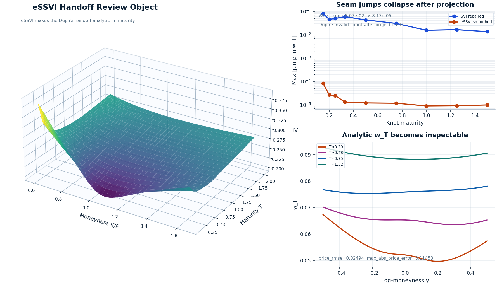
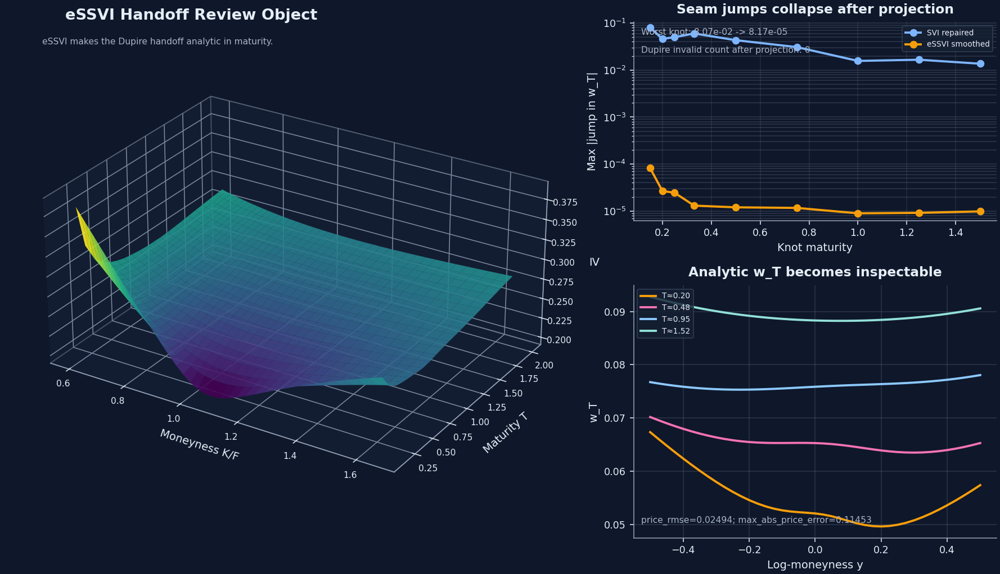

# eSSVI smooth handoff

Proof path step 2

This is the quant handoff decision in the workflow. Static SVI repair can clean up each expiry and still fail Dupire if the maturity direction leaves seam stress in total-variance derivatives.

The page therefore defends one explicit bridge: preserve the exact calibrated nodes for inspection, then project into a continuous eSSVI surface only because Dupire needs analytic <code>w</code>, <code>w_y</code>, <code>w_yy</code>, and especially <code>w_T</code>. The win is a usable derivative object; the tradeoff is accepting a bounded projection error instead of pretending piecewise time interpolation is good enough.

  Parameterization defended
  `w_T` continuity matters
  Explicit Dupire bridge

[Open the notebook](https://github.com/willemk-stack/option-pricing-library/blob/main/demos/07_essvi_smooth_surface_for_dupire.ipynb){ .md-button .md-button--primary }
[Next: local-vol and PDE validation](localvol_pde_validation.md){ .md-button }

## Signature evidence

This is the handoff review object: one continuous eSSVI surface for the Dupire bridge, the seam-jump evidence that justifies the projection, and the analytic <code>w_T</code> slices that show the page is targeting derivatives rather than cosmetic implied-vol smoothing.

<figure class="diagram diagram--hero essvi-signature-figure" style="--diagram-max-width: 1180px" markdown="1">
{ .diagram-img .diagram-light }
{ .diagram-img .diagram-dark }
<figcaption>The 3D surface is only the left panel of the proof. The actual handoff argument is that the worst published seam jump collapses from <code>0.080696</code> to <code>0.000082</code>, analytic <code>w_T</code> becomes inspectable across moneyness, and the projection still keeps <code>projection_dupire_invalid_count = 0</code>.</figcaption>
</figure>

## Design choices defended

The handoff is strongest when the mathematical choices are stated explicitly rather than hidden behind one smooth-looking surface.

Why this parameterization

Continuous eSSVI terms keep the bridge analytic

eSSVI is used here because the Dupire bridge needs analytic <code>w</code>, <code>w_y</code>, <code>w_yy</code>, and <code>w_T</code> together with explicit admissibility checks. A generic slice stack can match nodes without giving a clean derivative object in <code>T</code>.

Why this smoothing target

Smooth total variance, not prettier IV

Dupire consumes derivatives of total variance. The target is therefore continuity in <code>w(T, y)</code> and especially stable <code>w_T</code>, not cosmetic smoothing of an implied-vol heatmap.

What continuity matters

Seam jumps are the failure mode

The worst knot on the published surface drops from <code>0.080696</code> to <code>0.000082</code> at <code>T = 0.15</code>. The same order-of-magnitude seam reduction persists through the mid-curve and long end.

Tradeoff accepted

Bounded projection error for usable derivatives

The bridge accepts <code>price_rmse = 0.02494</code> and <code>max_abs_price_error = 0.11453</code> so Dupire receives a zero-invalid-count smooth surface instead of exact but kinked time interpolation.

## Problem

Naive handoff fails when exact nodal agreement is treated as sufficient. Dupire is sensitive to the maturity direction, so a surface can look calm expiry by expiry while still carrying mathematically important kinks in <code>w_T</code>.

- The repaired SVI result is still a stack of slices, not automatically a smooth derivative object in maturity.
- Piecewise interpolation across expiry can hide seam stress until the workflow asks for local-vol derivatives.
- If the bridge stays implicit, the later local-vol and PDE pages inherit the consequences without showing where the time-direction risk entered.

Assumptions carried into this bridge

This page starts after static repair, not before it. The repaired slices are already the inspectable reference object, the market context is fixed, and the remaining question is whether the maturity direction is smooth enough for a Dupire-oriented handoff.

Why naive handoff fails

A generic expiry stack can still rely on piecewise-linear total-variance interpolation in <code>T</code>. That keeps <code>w_T</code> only piecewise constant, which is exactly the failure mode the handoff has to remove.

Why this is not cosmetic smoothing

The point is not that the surface looks smoother. The point is that the bridge produces one explicit continuous object with analytic derivatives and separate validation, while the exact nodal surface remains available for inspection instead of being overwritten.

## Chosen Method

The bridge keeps the exact calibrated nodes visible, then accepts smoothing only through an explicit eSSVI projection whose continuity target and tradeoff are both reviewable.

| Layer | Object or check | Design choice and reason |
| --- | --- | --- |
| Preserved object | `ESSVINodalSurface(fit.nodes)` | Keep the exact calibrated nodes reviewable before any Dupire-oriented tradeoff is accepted |
| Parameterization | projected eSSVI term structures | Use a continuous parameter surface because the bridge needs analytic <code>w</code>, <code>w_y</code>, <code>w_yy</code>, and <code>w_T</code> together |
| Quantity smoothed | total variance in maturity | Target the object Dupire differentiates rather than smoothing implied vol for display polish |
| Continuity target | seam stress in `w_T` across knots | Treat maturity-direction derivative jumps as the real handoff failure mode |
| Validation split | `validate_essvi_nodes(...)`, `validate_essvi_continuous(...)`, `evaluate_essvi_constraints(...)` | Keep nodal admissibility, continuous-surface constraints, and sampled checks separate instead of collapsing them into one vague pass/fail |
| Downstream use | `LocalVolSurface.from_implied(...)` | Hand the next page one explicit smooth bridge object rather than an interpolation accident |

## Supporting evidence

The hero carries the quant argument. One quieter downstream diagnostic remains only to show that, once the handoff is accepted, the resulting local-vol field becomes inspectable instead of breaking immediately at maturity seams.

<figure class="diagram diagram--quiet" style="--diagram-max-width: 760px" markdown="1">
{ .diagram-img .diagram-light }
{ .diagram-img .diagram-dark }
<figcaption>This stays secondary on purpose. It shows that the handoff now produces a differentiable local-vol object worth inspecting, while the full numerical judgment remains on the <a href="localvol_pde_validation.md">local-vol and PDE validation</a> page.</figcaption>
</figure>

### Handoff checks

| Check | Published evidence | What it defends |
| --- | --- | --- |
| Worst seam jump | `T = 0.15`: `0.080696 -> 0.000082` | the projection targets the real handoff failure mode rather than just surface cosmetics |
| Mid-curve seam jump | `T = 0.50`: `0.043331 -> 0.000012` | continuity improvement persists away from the shortest maturities |
| Long-end seam jump | `T = 1.50`: `0.013674 -> 0.000010` | the seam reduction remains visible beyond the front end |
| Projection tradeoff | `price_rmse = 0.02494`; `max_abs_price_error = 0.11453` | the bridge accepts bounded projection error instead of pretending exact node interpolation is enough for Dupire |
| Dupire readiness | `projection_dupire_invalid_count = 0` | the projected surface stays admissible for the next local-vol step |

## Tradeoffs

The smoothed handoff is a deliberate bridge into Dupire, not an attempt to maximize every metric at once.

Main takeaway

The workflow keeps two objects on purpose: the exact nodal eSSVI surface for inspection and the smoothed eSSVI surface for Dupire-oriented use. That separation is the mathematical judgment on display. Exact nodes are not discarded, but the next stage receives the continuous surface because analytic <code>w_T</code> matters more here than preserving every seam of the slice stack.

- Keep `ESSVINodalSurface` visible when exact calibrated-node fidelity is the point of the analysis.
- Prefer `ESSVISmoothedSurface` when the handoff into local vol depends on analytic <code>w</code>, <code>w_y</code>, <code>w_yy</code>, and <code>w_T</code>.
- Use [Local-vol and PDE validation](localvol_pde_validation.md) to judge whether this handoff tradeoff pays off numerically.
