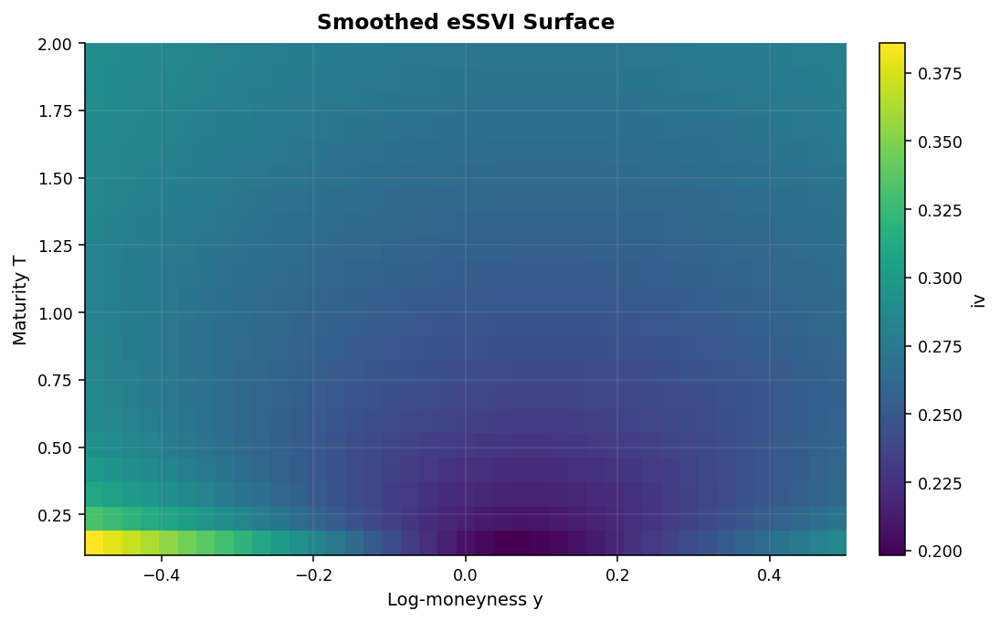
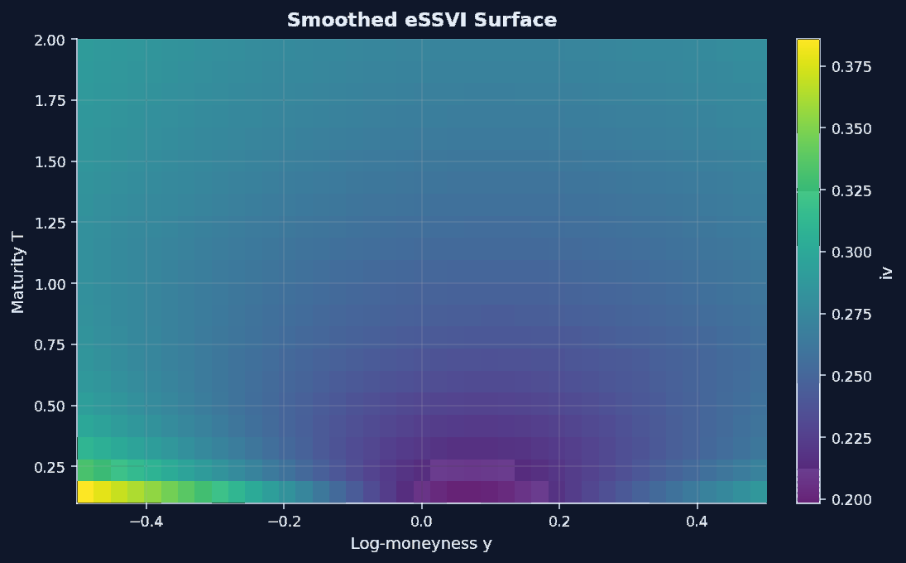
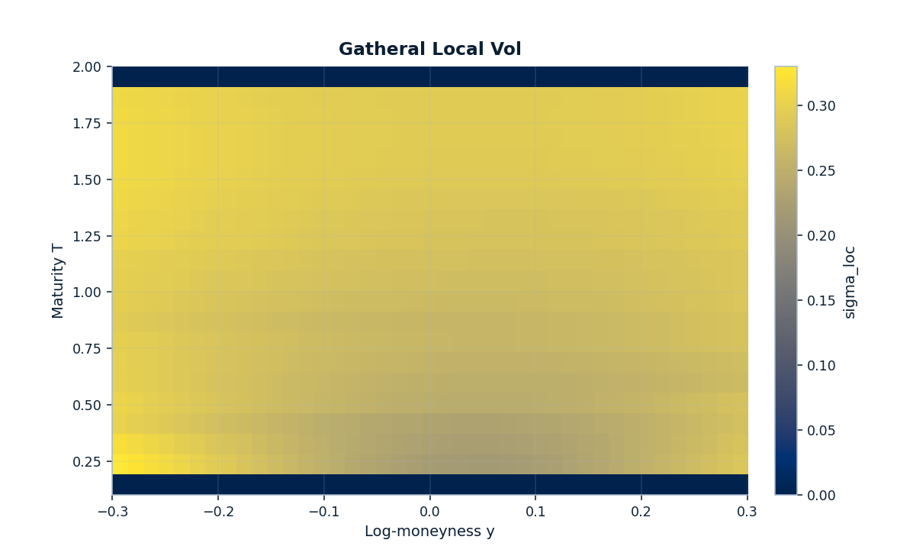
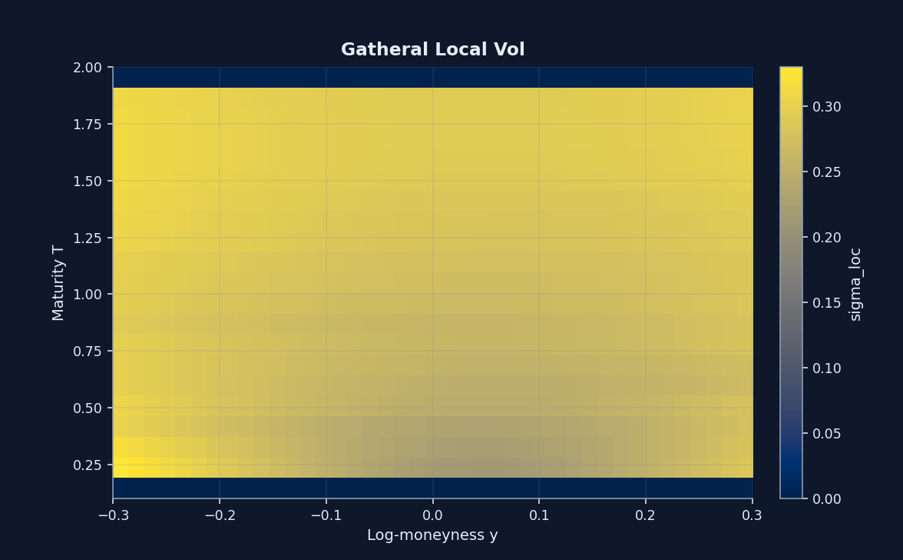
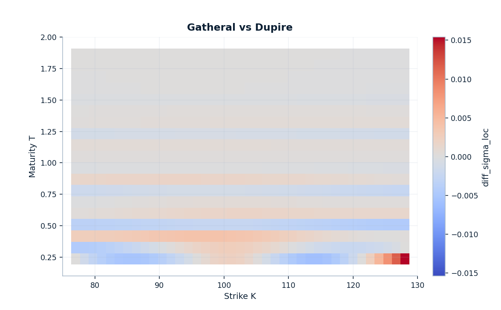
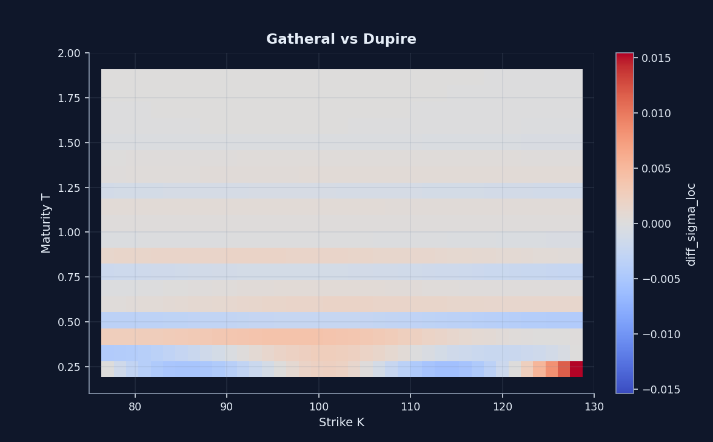

---
hide:
  - navigation
  - toc
---

# eSSVI smooth handoff

This page covers the hard transition between a repaired static surface and a local-vol workflow that needs time derivatives to behave well.

  <a class="md-button md-button--primary" href="https://github.com/willemk-stack/option-pricing-library/blob/main/demos/07_essvi_smooth_surface_for_dupire.ipynb">Open the notebook</a>
  <a class="md-button" href="../localvol_pde_validation/">Next: local-vol and PDE validation</a>

<figure markdown class="diagram">
  { .diagram-img .diagram-light }
  { .diagram-img .diagram-dark }
  <figcaption>The smoothed eSSVI surface is the preferred Dupire handoff because it gives the local-vol step a time-continuous surface instead of a stack of repaired slices.</figcaption>
</figure>

  <figure markdown class="diagram" style="--diagram-max-width: 720px">
    { .diagram-img .diagram-light }
    { .diagram-img .diagram-dark }
    <figcaption>Once the handoff is smoothed, the local-vol field becomes an object that can be inspected for shape and stability instead of treated as a hidden intermediate.</figcaption>
  </figure>
  <figure markdown class="diagram" style="--diagram-max-width: 720px">
    { .diagram-img .diagram-light }
    { .diagram-img .diagram-dark }
    <figcaption>The difference view shows where the two extraction routes agree and where the handoff still deserves scrutiny.</figcaption>
  </figure>

## Hard problem

Slice-wise SVI is useful for static-surface repair, but it is not the cleanest object to hand to Dupire. The issue is time continuity: downstream local-vol extraction needs a surface whose term structure and `w_T` behavior are smooth enough to trust.

## Method

The eSSVI workflow addresses that directly:

- calibrate an exact nodal eSSVI surface
- project those nodes into a smooth surface with explicit validation
- compare the nodal and smoothed surfaces instead of hiding the smoothing step
- hand the smoothed surface into `LocalVolSurface.from_implied(...)`

## Evidence

| Knot / metric | Repaired SVI seam jump | Smoothed eSSVI seam jump | Note |
| --- | --- | --- | --- |
| `T = 0.15` | `0.080696` | `0.000082` | largest early-maturity seam improvement |
| `T = 0.50` | `0.043331` | `0.000012` | smooth projection stays stable mid-curve |
| `T = 1.50` | `0.013674` | `0.000010` | improvement persists at longer maturities |
| Projection summary | `price_rmse = 0.02494` | `max_abs_price_error = 0.11453` | `projection_dupire_invalid_count = 0` |

The important result is not perfect nodal fidelity. It is that the projected surface materially reduces seam stress while keeping the final Dupire-invalid projection count at zero.

## Best next click

Continue to [Local-vol and PDE validation](localvol_pde_validation.md) to see what this smoother handoff buys in repricing accuracy, error structure, and convergence evidence.
