# Heston model comparison

This page is the reviewer-facing entry point for the Capstone 3 model-choice
story. It compares a fitted Heston stochastic-volatility model against the
repo's eSSVI/local-vol workflow on a common vanilla target without claiming
that one model is universally superior.

[Open Heston guide](heston.md){ .md-button .md-button--primary }
[Open Heston diagnostics](heston_diagnostics.md){ .md-button }
[Open comparison notebook](https://github.com/willemk-stack/option-pricing-library/blob/main/demos/13_heston_calibration_vs_localvol.ipynb){ .md-button }

The generated import and signature map for the same stack is in the
[Heston API reference](../api/heston.md). It keeps Heston namespaced while
making pricing, calibration, simulation, diagnostics, and model-comparison
entrypoints easier to find.

## What this page proves

The point is not that Heston is automatically better. The point is that the
library can compare volatility models with explicit diagnostics: fit quality,
calibration stability, Monte Carlo validation, local-vol/PDE evidence, and
model-purpose tradeoffs.

The comparison uses a deterministic synthetic equity-index-style quote fixture.
It is intentionally not generated from Heston, so the exercise is not a
Heston-generated repricing-recovery exercise. The purpose is to compare model behavior on a
common target: Heston gives interpretable stochastic variance dynamics, while
eSSVI/local-vol gives flexible vanilla-surface fit and direct Dupire/PDE
repricing diagnostics.

Heston is not presented as automatically superior. The comparison asks what
each model is good for: Heston gives interpretable stochastic variance
dynamics; eSSVI/local vol gives flexible vanilla surface fit and direct
Dupire/PDE validation evidence.

<figure markdown class="diagram diagram--hero" style="--diagram-max-width: 980px">
   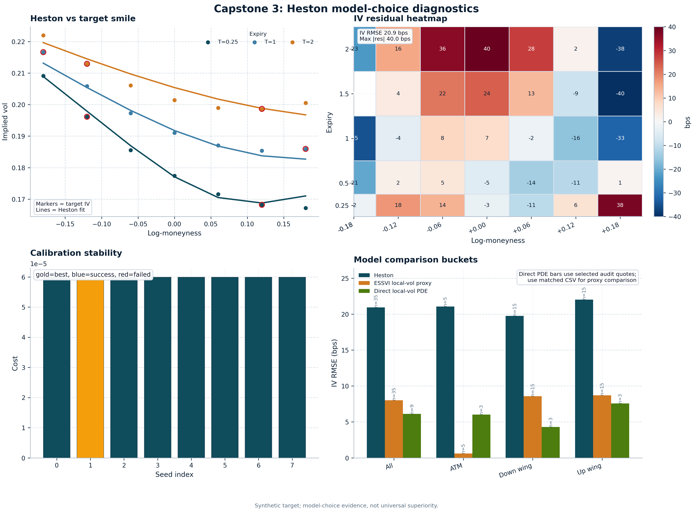{ .diagram-img .diagram-light }
   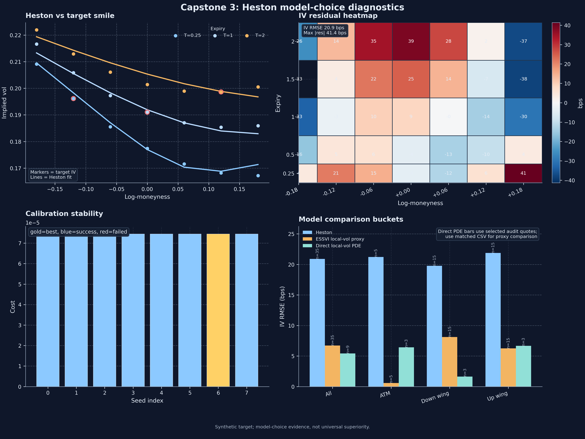{ .diagram-img .diagram-dark }
   <figcaption>Capstone 3 model-comparison summary. Synthetic deterministic quote fixture; not real market data. Heston is compared against eSSVI/local vol on the same target, not presented as universally superior.</figcaption>
</figure>

## What is being compared

- Heston Fourier repricing after calibration.
- Heston Monte Carlo cross-checks where appropriate.
- eSSVI implied-surface repricing as the flexible vanilla-surface layer.
- Direct local-vol/PDE rows as a small Dupire/PDE validation audit.
- Train/held-out and ATM/wing error buckets where available in the
  comparison outputs.

The table-level details for this workflow live in the
[Heston versus local volatility note](../notes/heston/heston_vs_local_vol.md).

The direct local-vol/PDE audit intentionally runs on selected Dupire/PDE
handoff quotes, while the Heston and eSSVI proxy rows are available on the full
comparison fixture. The full error summary is retained for continuity, but use
the matched direct-PDE subset table when comparing Heston, eSSVI proxy, and
direct PDE on the same quote indices.

## Evidence produced by the comparison report

| Evidence | What it shows | What it does not prove |
| --- | --- | --- |
| Quote-level Heston repricing errors | Whether the fitted Heston model stays close to the common quote target at the individual-row level | It does not prove parameter uniqueness or robustness outside the reviewed target |
| eSSVI repricing errors | How well the surface-first path fits the same vanilla target without imposing Heston dynamics | It does not prove dynamic realism or path-dependent suitability |
| Direct local-vol/PDE rows | Whether selected Dupire/PDE repricing rows remain aligned with the common target | It does not prove full-surface PDE accuracy across all grids or scenarios |
| ATM, downside, and upside buckets | Where model fit is concentrated or weak instead of hiding everything inside one average error | The full summary mixes full-set Heston/eSSVI rows with selected direct-PDE rows; use the matched subset table for proxy-vs-PDE comparison |
| Held-out comparison, when available | Whether the ranking changes once some rows are kept out of calibration | It does not prove broad out-of-sample generalization across dates or markets |
| Tradeoff summary | A reviewer-facing summary of fit, interpretability, diagnostics, and validation tradeoffs | It does not declare a universal model winner |

The report is bounded evidence on one shared vanilla target. It is meant to
show what the repository can measure and compare, not to make a universal claim
about stochastic-volatility superiority.

## Comparison report architecture

<figure markdown class="diagram" style="--diagram-max-width: 980px">
   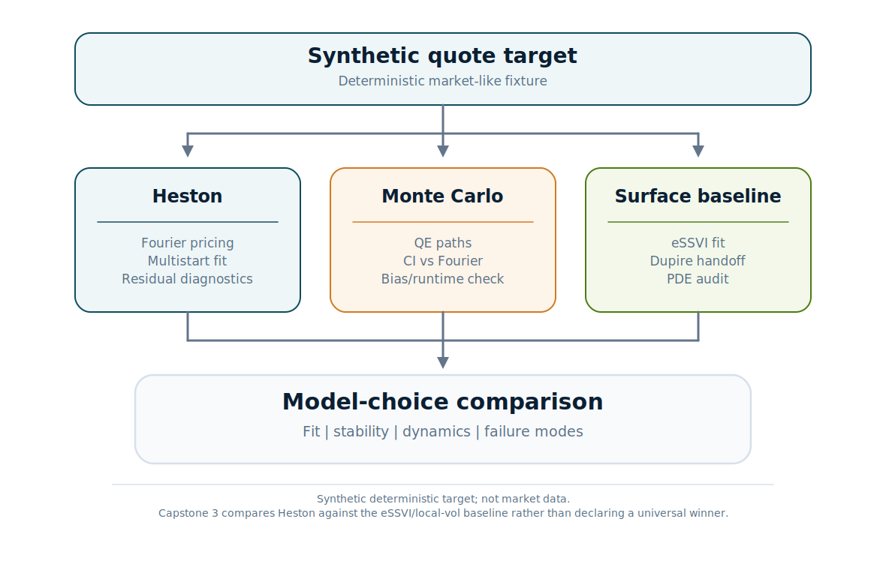{ .diagram-img .diagram-light }
   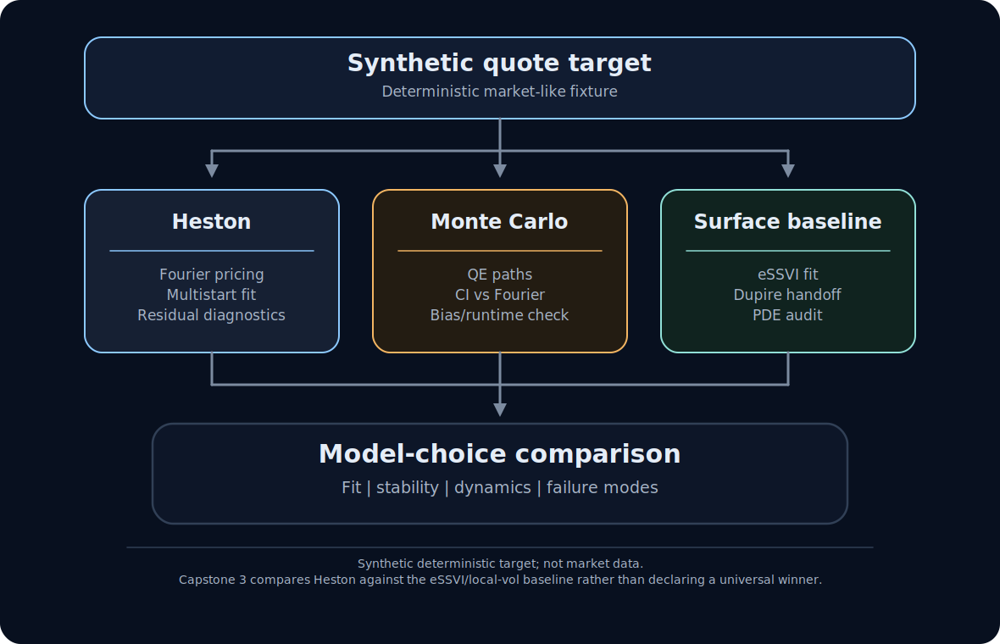{ .diagram-img .diagram-dark }
   <figcaption>Capstone 3 uses the Capstone 2 surface/local-vol/PDE stack as a comparison baseline for Heston stochastic-volatility calibration and validation.</figcaption>
</figure>

## Why Heston is not just another surface fitter

Heston gives a stochastic variance story: mean reversion, long-run variance,
vol-of-vol, spot/variance correlation, and initial variance all have model
meaning. That matters when the review question includes dynamics, simulation,
or path-dependent interpretation rather than only a static vanilla fit.

## Why eSSVI/local vol still matters

The eSSVI/local-vol side is often the better vanilla-surface fit tool. It is
flexible, smooths the surface handoff, and supports direct Dupire/PDE
validation. It does not tell the same stochastic-variance story as Heston, and
that is exactly why the comparison is useful rather than redundant.

For the smoother-surface and PDE side of the proof path, use
[Local-vol and PDE validation](localvol_pde_validation.md).

## Calibration diagnostics

A fitted Heston parameter vector is not enough. Review multistart behavior,
bounds, residual structure, objective sensitivity, train/held-out errors, and
whether the fit is weakly identified. The broader API and workflow context is
in the [Heston guide](heston.md), while the notebook-facing review layer is in
[Heston diagnostics](heston_diagnostics.md).

<figure markdown class="diagram" style="--diagram-max-width: 980px">
   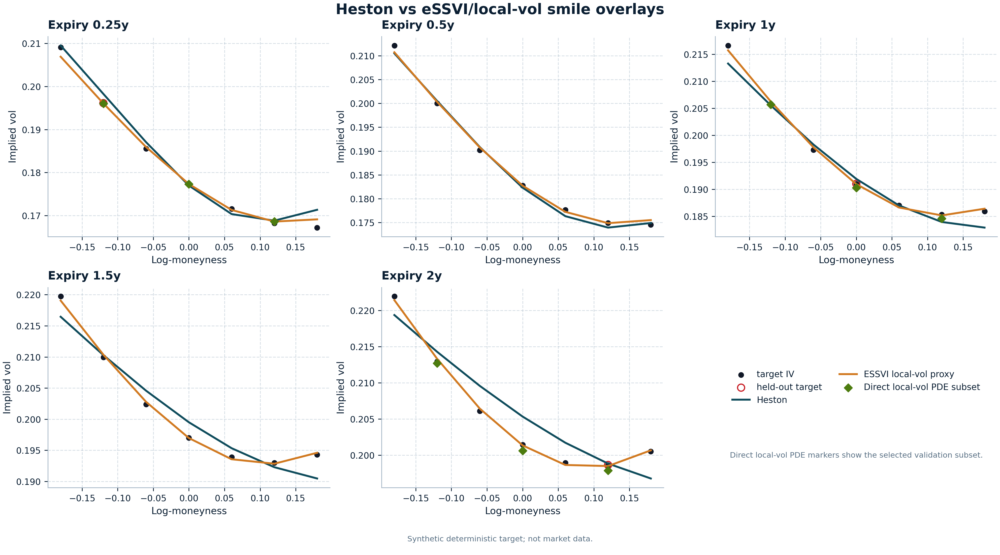{ .diagram-img .diagram-light }
   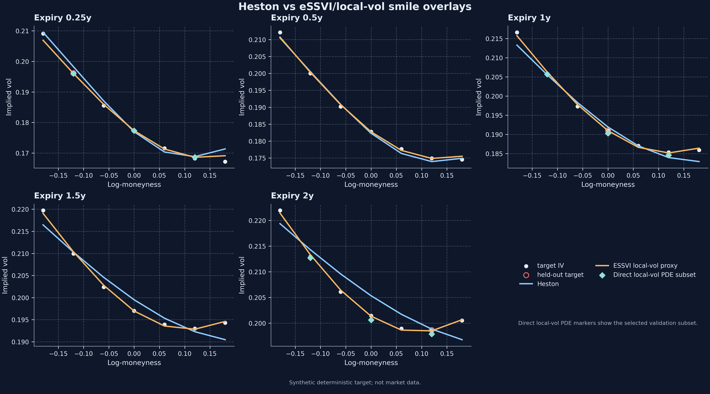{ .diagram-img .diagram-dark }
   <figcaption>Heston and eSSVI/local-vol are compared on the same deterministic quote target. The direct local-vol PDE markers show a selected validation subset rather than a full-grid repricing claim.</figcaption>
</figure>

<figure class="diagram diagram--quiet proof-path-support-figure" style="--diagram-max-width: 780px" markdown="1">
[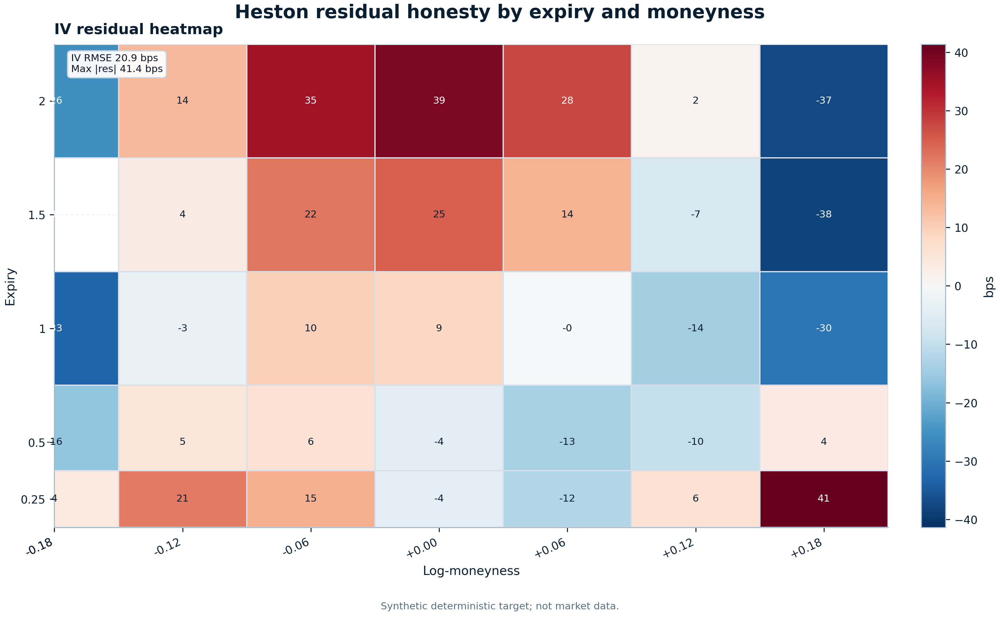{ .diagram-img .diagram-light } 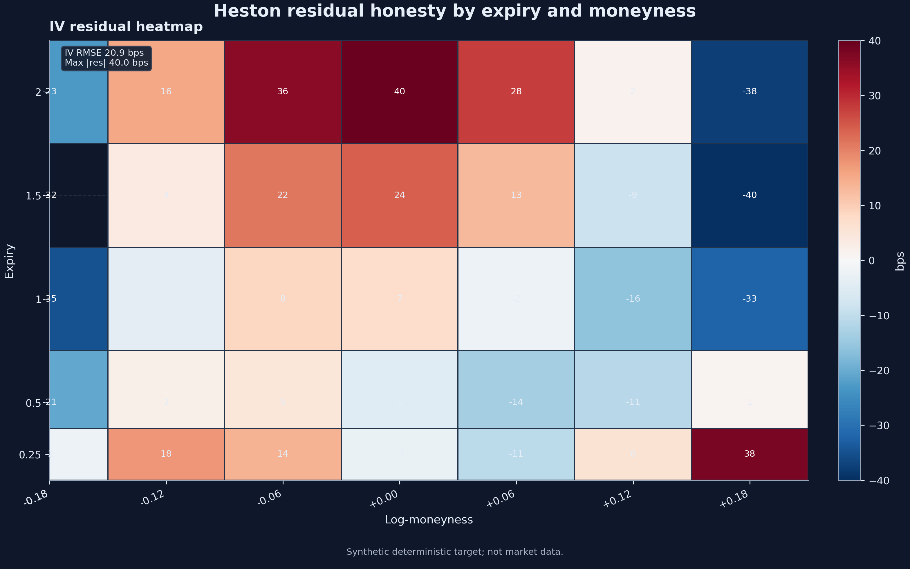{ .diagram-img .diagram-dark } Open larger view](../assets/generated/heston/heston_iv_residual_heatmap.light.png){ .proof-path-lightbox-trigger data-proof-path-lightbox="" data-light-src="../../assets/generated/heston/heston_iv_residual_heatmap.light.png" data-dark-src="../../assets/generated/heston/heston_iv_residual_heatmap.dark.png" data-alt="Heston IV residual heatmap by expiry and log-moneyness" data-lightbox-title="Heston IV residual heatmap" aria-label="Open a larger view of the Heston IV residual heatmap" aria-describedby="heston-residual-heatmap-caption" aria-haspopup="dialog" }
   <figcaption id="heston-residual-heatmap-caption">Structured residuals are part of the diagnostic story: Heston is interpretable, but it is not an unconstrained surface fitter. Synthetic deterministic quote fixture; not real market data.</figcaption>
</figure>

<figure markdown class="diagram" style="--diagram-max-width: 980px">
   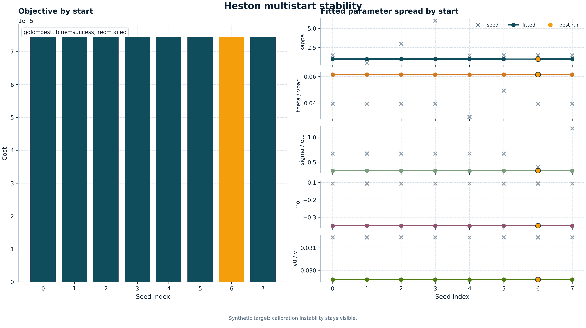{ .diagram-img .diagram-light }
   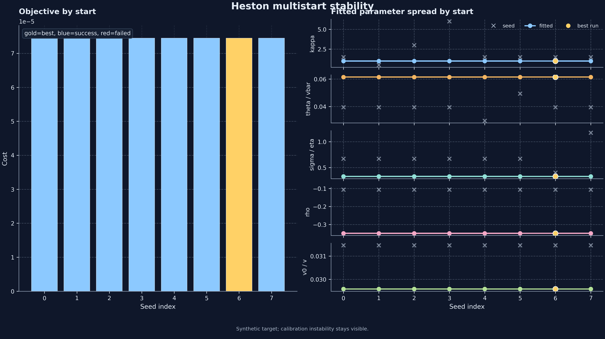{ .diagram-img .diagram-dark }
   <figcaption>Heston calibration can be weakly identifiable. Multistart diagnostics make optimizer dependence and parameter stability visible before interpreting a fit.</figcaption>
</figure>

<figure markdown class="diagram" style="--diagram-max-width: 900px">
   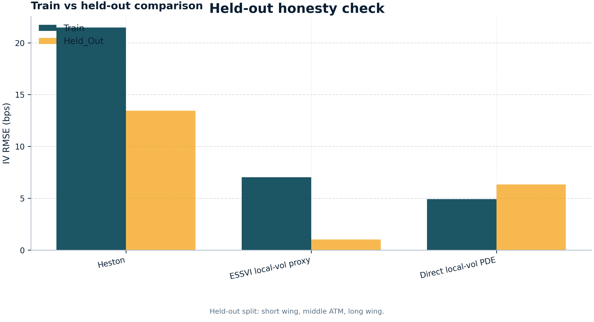{ .diagram-img .diagram-light }
   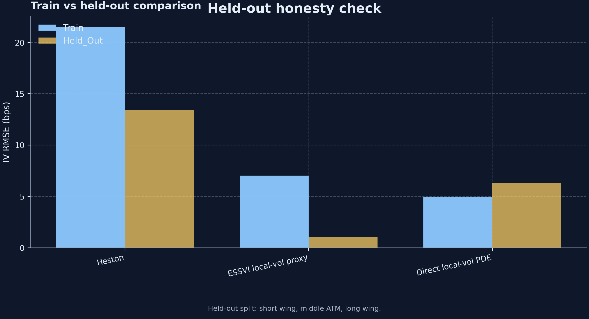{ .diagram-img .diagram-dark }
   <figcaption>Held-out diagnostics use a deterministic three-point split: short downside wing, middle-expiry ATM, and long-expiry upside wing. The goal is honesty about fit partitions, not a broad out-of-sample claim.</figcaption>
</figure>

## Monte Carlo validation

Monte Carlo results should be read with standard errors, confidence intervals,
path counts, time steps, and scheme labels. A tight confidence interval does
not remove discretization bias, and a matching point estimate does not make the
stochastic-volatility fit economically unique.

<figure markdown class="diagram" style="--diagram-max-width: 980px">
   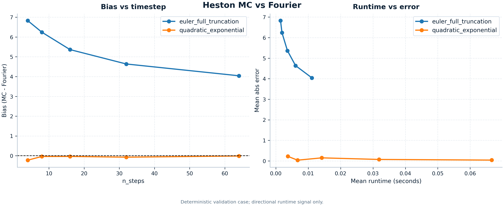{ .diagram-img .diagram-light }
   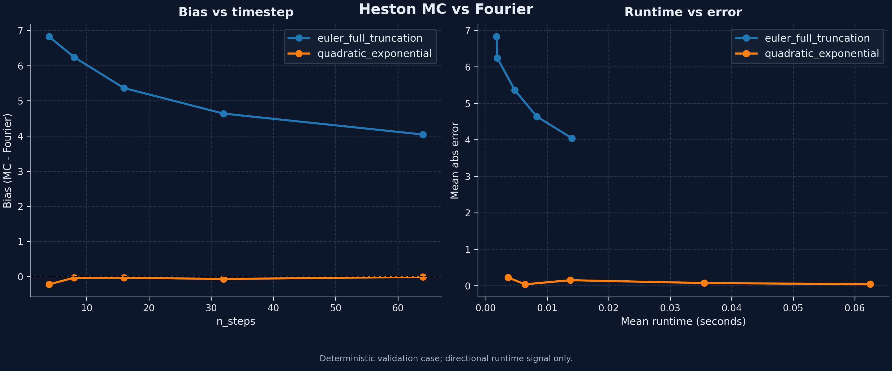{ .diagram-img .diagram-dark }
   <figcaption>Heston Monte Carlo is checked against semi-analytic Fourier pricing. QE and Euler behavior are shown as numerical validation evidence, not as universal runtime claims.</figcaption>
</figure>

<figure markdown class="diagram" style="--diagram-max-width: 900px">
   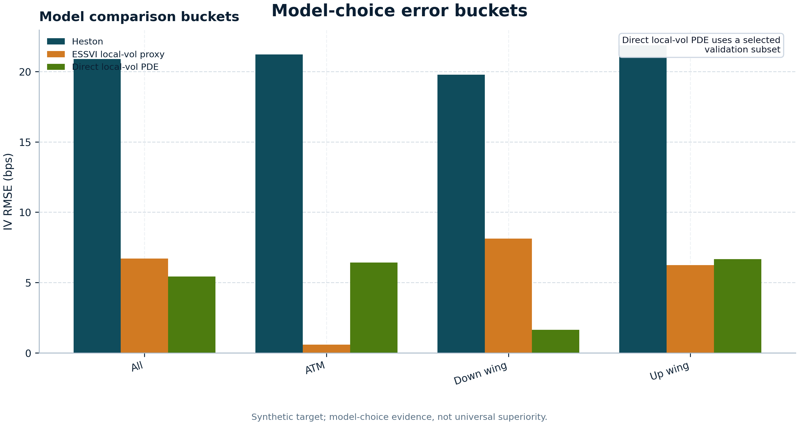{ .diagram-img .diagram-light }
   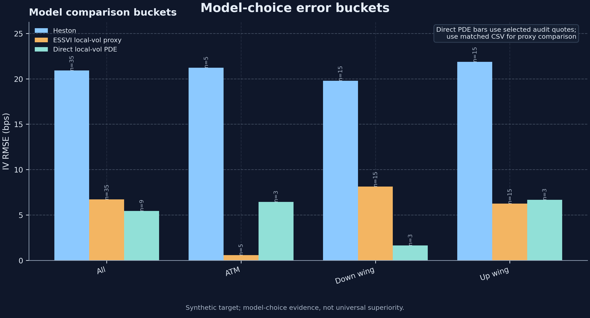{ .diagram-img .diagram-dark }
   <figcaption>Error buckets summarize fit by moneyness region. The Heston and eSSVI proxy bars retain the full quote set, while direct local-vol PDE bars use selected successful Dupire/PDE audit quotes. Use the matched direct-PDE subset table for apples-to-apples proxy-vs-direct-PDE comparisons.</figcaption>
</figure>

## Matched direct-PDE subset

The matched subset filters the quote-level fit errors to the successful direct
local-vol/PDE quote indices, then reruns the same bucket summary for Heston,
eSSVI local-vol proxy, and direct local-vol PDE. Each bucket row therefore uses
the same `n_quotes` for all three models.

- Full-set comparison: [Error summary](../assets/generated/heston/data/heston_comparison_error_summary.csv)
- Matched direct-PDE subset: [Matched error summary](../assets/generated/heston/data/heston_comparison_direct_pde_matched_error_summary.csv)
- Selected PDE audit rows: [Direct local-vol PDE audit rows](../assets/generated/heston/data/heston_comparison_direct_local_vol_pde.csv)

## Generated artifact bundle

- [Artifact manifest](../assets/generated/heston/data/heston_artifact_manifest.json)
- [Quote-level fit errors](../assets/generated/heston/data/heston_comparison_fit_errors.csv)
- [Error summary](../assets/generated/heston/data/heston_comparison_error_summary.csv)
- [Held-out comparison](../assets/generated/heston/data/heston_comparison_heldout.csv)
- [Direct local-vol PDE audit rows](../assets/generated/heston/data/heston_comparison_direct_local_vol_pde.csv)
- [Matched direct-PDE subset error summary](../assets/generated/heston/data/heston_comparison_direct_pde_matched_error_summary.csv)
- [Model tradeoff summary](../assets/generated/heston/data/heston_comparison_tradeoff_summary.csv)
- [MC convergence summary](../assets/generated/heston/data/heston_mc_convergence_summary.csv)

These generated tables are the reviewer-facing provenance surface behind the
figures on this page. They preserve the deterministic held-out split, direct
local-vol subset disclosure, matched-subset quote counts, and the synthetic-
fixture caveat in machine-readable form.

The bundle is produced by
[`scripts/build_heston_docs_artifacts.py`](https://github.com/willemk-stack/option-pricing-library/blob/main/scripts/build_heston_docs_artifacts.py).
The nearest regression checks are the
[model-comparison tests](https://github.com/willemk-stack/option-pricing-library/blob/main/tests/diagnostics/heston/test_heston_model_comparison.py)
and the
[docs artifact builder tests](https://github.com/willemk-stack/option-pricing-library/blob/main/tests/docs/test_build_heston_docs_artifacts.py).
Use the `smoke` profile as a fast wiring diagnostic and the `release` profile
as the published review bundle; both profiles remain synthetic-fixture scoped.

## When not to trust the result

- One optimizer start converged but multistart disagrees.
- Fitted parameters sit on or near bounds.
- IV residuals are structured by maturity or wing.
- Backend disagreement persists after robust quadrature reruns.
- Monte Carlo validation misses Fourier outside the expected error budget.
- Held-out errors are materially worse than fit errors.

## Minimal reviewer path

1. Read this page for the model-choice framing.
2. Open the [Heston guide](heston.md) for the namespaced pricing and
   calibration workflow.
3. Open [Heston diagnostics](heston_diagnostics.md) for report interpretation.
4. Check the [Heston API reference](../api/heston.md) for exact import paths
   and generated signatures.
5. Review the [Heston versus local volatility note](../notes/heston/heston_vs_local_vol.md)
   for the comparison outputs.
6. Run or inspect the
   [comparison notebook on `main`](https://github.com/willemk-stack/option-pricing-library/blob/main/demos/13_heston_calibration_vs_localvol.ipynb).

## What not to conclude

This comparison does not prove that either Heston or local volatility is
universally superior, and it is not a production-trading claim. It shows a
bounded model-comparison workflow inside this repository, with diagnostics that
make the tradeoffs visible enough for review on the configured comparison
target.
