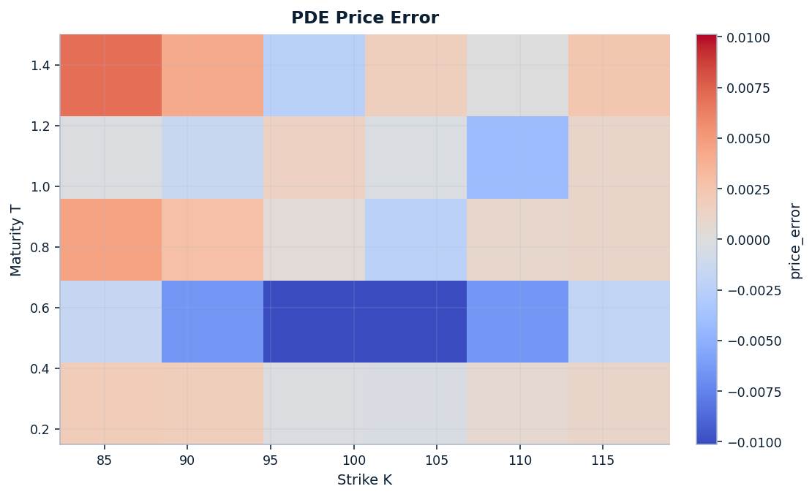
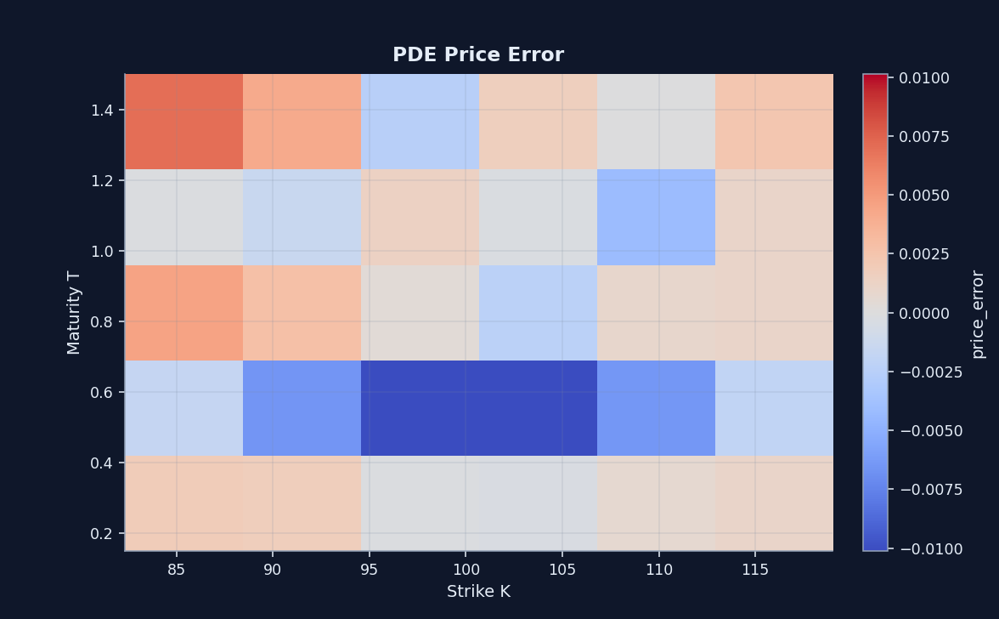
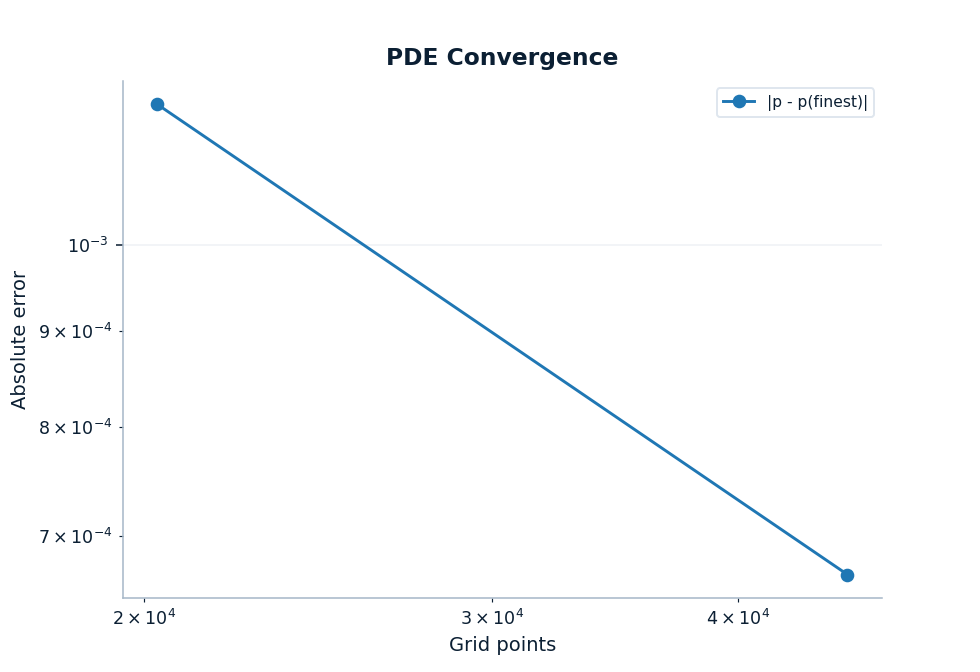
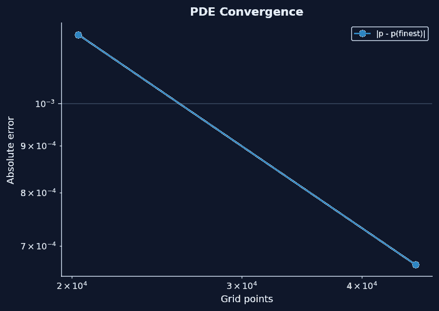

# Local-vol and PDE validation

Proof path step 3

A smooth Dupire handoff still has to earn numerical trust. This page is the validation argument for the last leg: reprice a representative vanilla bundle, show where the error actually lives, and make the mesh/runtime judgment explicit instead of implied.

The claim is deliberately bounded. The published `101x201` grid is defended for a representative `30`-option bundle, the stressed region remains visible instead of being averaged away, and the convergence sweep shows where extra runtime starts to buy less than intuition might suggest.

  Repricing stays controlled
  Stress stays localized
  Mesh judgment is stated

[Open the notebook](https://github.com/willemk-stack/option-pricing-library/blob/main/demos/08_localvol_pde_repricing.ipynb){ .md-button .md-button--primary }
[Review performance evidence](../performance.md){ .md-button }

Proof routing

<a class="proof-route__item" href="../../">StartHomepage overview</a>
<a class="proof-route__item" href="../surface_workflow/">Step 1Surface repair</a>
<a class="proof-route__item" href="../essvi_smooth_handoff/">Step 2eSSVI handoff</a>
Step 3Local-vol / PDE
<a class="proof-route__item proof-route__item--followup" href="../../performance/">Follow-upPerformance evidence</a>

## Signature evidence

This is the review object for the numerical leg: the scatter shows whether the bundle reprices cleanly, the heatmap shows where the stress clusters, and the convergence/runtime figure shows where extra mesh density stops being an automatic win.

<figure class="diagram diagram--hero localvol-validation-primary-figure" markdown="1">
  { .diagram-img .diagram-light }
  { .diagram-img .diagram-dark }
  <figcaption>The published `30`-option bundle stays close enough to the identity line to support a real validation claim rather than a cosmetic one: mean abs price error is <code>0.0026875</code>, and the worst implied-vol miss stays at <code>8.2494 bp</code> on the current <code>101x201</code> grid.</figcaption>
</figure>

<strong>Repricing claim</strong> The scatter is the first filter: the local-vol/PDE path reproduces the originating implied surface cleanly enough on the published bundle to be reviewable rather than hand-waved.

<strong>Error localization</strong> The stress is not uniform. The worst bundle errors cluster around the <code>T = 0.25</code> strip, so the page keeps strike/maturity structure visible instead of hiding it inside one average.

<strong>Runtime judgment</strong> The sweep makes the escalation path explicit: keep <code>101x201</code> as the published baseline, try <code>151x301</code> first when one contract needs more margin, and do not assume that the densest tested grid is automatically the best trade.

<figure class="diagram diagram--quiet proof-path-support-figure localvol-validation-support-figure" style="--diagram-max-width: 720px" markdown="1">
[{ .diagram-img .diagram-light } { .diagram-img .diagram-dark } Open larger view](../assets/generated/numerics/pde_price_error_heatmap.light.png){ .proof-path-lightbox-trigger data-proof-path-lightbox="" data-light-src="../../assets/generated/numerics/pde_price_error_heatmap.light.png" data-dark-src="../../assets/generated/numerics/pde_price_error_heatmap.dark.png" data-alt="Heatmap of local-vol PDE pricing error across strike and maturity on the published repricing bundle" data-lightbox-title="Price-error heatmap" aria-label="Open a larger view of the price-error heatmap" aria-describedby="localvol-validation-support-caption-heatmap" aria-haspopup="dialog" }
  <figcaption id="localvol-validation-support-caption-heatmap">The price-error heatmap shows that the bundle maximum is driven by the <code>T = 0.25</code> strip rather than by a uniform bias. That is why the aggregate mean is necessary but not sufficient.</figcaption>
</figure>

<figure class="diagram diagram--quiet proof-path-support-figure localvol-validation-support-figure" style="--diagram-max-width: 760px" markdown="1">
[{ .diagram-img .diagram-light } { .diagram-img .diagram-dark } Open larger view](../assets/generated/numerics/pde_convergence.light.png){ .proof-path-lightbox-trigger data-proof-path-lightbox="" data-light-src="../../assets/generated/numerics/pde_convergence.light.png" data-dark-src="../../assets/generated/numerics/pde_convergence.dark.png" data-alt="Two-panel convergence and runtime tradeoff plot for a representative local-vol PDE solve as the grid is refined" data-lightbox-title="PDE convergence and runtime tradeoff" aria-label="Open a larger view of the PDE convergence and runtime tradeoff plot" aria-describedby="localvol-validation-support-caption-convergence" aria-haspopup="dialog" }
  <figcaption id="localvol-validation-support-caption-convergence">The convergence sweep turns the mesh choice into a judgment call: moving from <code>101x201</code> to <code>151x301</code> cuts the representative reference error from <code>7.57e-4</code> to <code>2.37e-4</code> while runtime rises from <code>1.03 s</code> to <code>1.67 s</code>; the denser <code>201x401</code> point costs <code>2.20 s</code> without a further win on this published sweep.</figcaption>
</figure>

## Validation claim

The page is strongest when it states exactly what the validation establishes, what it does not establish, and where practical judgment enters.

What this validation demonstrates

The workflow can reprice a representative vanilla bundle on a fixed local-vol/PDE grid, keep the strike/maturity error structure inspectable, and show a credible escalation path when one representative contract needs a tighter numerical check.

What this page does not prove

It does not prove that local vol is the correct market model, it does not make universal claims across every payoff or stress regime, and the convergence leg is judged against a finer-grid local-vol PDE reference rather than an analytic truth for the full workflow.

Where judgment enters

Choosing <code>101x201</code> for the published bundle is a practical decision, not a theorem. The page makes the supporting evidence visible and names the first refinement step to try before jumping blindly to the densest tested grid.

## Chosen Validation Method

The validation is layered on purpose: start from the explicit smooth handoff, reprice the representative bundle, expose where the bundle is stressed, and judge refinement with a separate single-contract sweep rather than by staring at one default grid.

| Layer | Object or check | Design choice and reason |
| --- | --- | --- |
| Input surface | `ESSVISmoothedSurface` from the previous step | Start from an explicit time-continuous handoff rather than a rough slice stack |
| Local-vol diagnostics | invalid masks, denominator checks, worst-point inspection | Keep extraction failure modes visible before making pricing claims |
| Repricing bundle | representative `30`-option vanilla-call bundle against the originating implied surface | Show the numerical workflow where the page actually makes its claim without pretending universality |
| Error localization | repricing scatter plus strike/maturity heatmap | Let reviewers see structure instead of trusting one mean |
| Mesh check | single-option convergence/runtime sweep against a finer-grid PDE reference | Make the grid choice a defended tradeoff rather than a hard-coded habit |

### Published bundle result

| Metric | Published bundle value |
| --- | --- |
| Repriced options | `30` |
| Published bundle grid | `Nx=101`, `Nt=201` |
| Mean abs price error | `0.0026875` |
| Max abs price error | `0.0101152` |
| Mean abs IV error | `1.9422 bp` |
| Max abs IV error | `8.2494 bp` |
| Mean runtime per option | `943.43 ms` |

## Numerical judgment

The practical question is not whether a finer grid can reduce error in principle. It is where the current evidence justifies spending more runtime, and where denser meshes stop being an automatic signal of better judgment.

Main takeaway

The evidence supports a layered decision rather than one maximization rule: <code>101x201</code> is a defensible published baseline for the representative bundle because repricing stays controlled and the worst implied-vol miss remains in single-digit basis points; when one contract needs more numerical margin, <code>151x301</code> is the first refinement worth buying; the denser <code>201x401</code> point is not automatically better on this published sweep, so more mesh is not the same thing as stronger validation.

- Use the scatter and heatmap together; aggregate means alone would hide the <code>T = 0.25</code> cluster that drives the bundle maximum.
- Treat the convergence figure as a local decision aid, not a universal theorem. It is one representative contract judged against a finer-grid local-vol PDE reference.
- Use [Performance evidence](../performance.md) when the question shifts from "is this default defended?" to "how much runtime can the full workflow afford overall?"
- Return to [Architecture](../architecture.md) if you want the system-level safeguard story behind the workflow.
