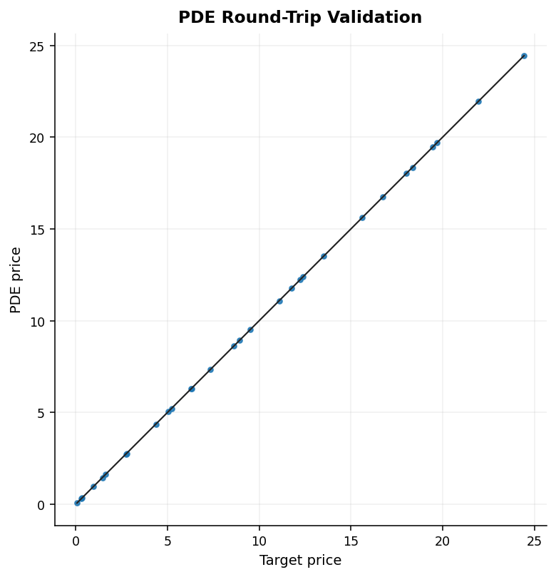
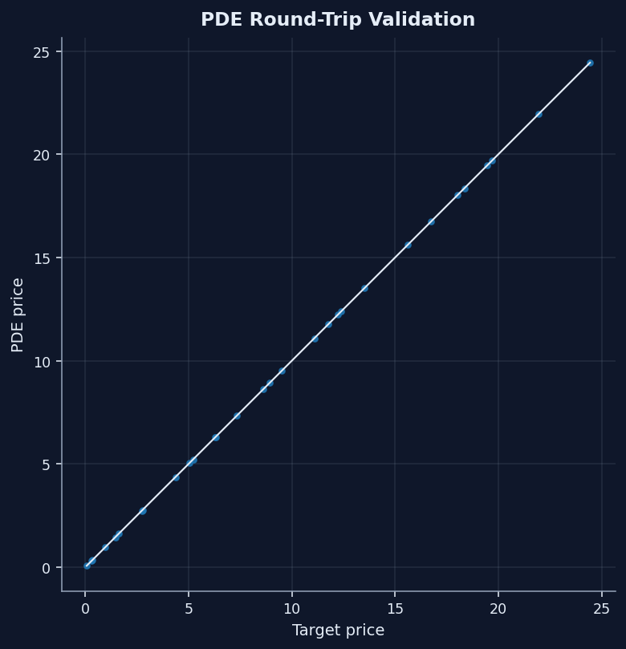

---
hide:
  - navigation
  - toc
---

# Local-vol and PDE validation

This page is the numerics proof page: it shows a local-vol workflow that is validated with repricing error, error structure, and convergence evidence instead of a single headline price.

  <a class="md-button md-button--primary" href="https://github.com/willemk-stack/option-pricing-library/blob/main/demos/08_localvol_pde_repricing.ipynb">Open the notebook</a>
  <a class="md-button" href="../../performance/">Review performance evidence</a>
  <a class="md-button" href="../../architecture/">See architecture</a>

<figure markdown class="diagram">
  { .diagram-img .diagram-light }
  { .diagram-img .diagram-dark }
  <figcaption>The repricing cloud stays close to the identity line, so accuracy can be judged from visible structure rather than a single summary claim.</figcaption>
</figure>

  <figure class="diagram" style="--diagram-max-width: 720px">
    
    
    <figcaption>The price-error heatmap shows where the workflow is most stressed across strike and maturity.</figcaption>
  </figure>
  <figure class="diagram" style="--diagram-max-width: 720px">
    
    
    <figcaption>The convergence sweep makes the mesh tradeoff explicit instead of asking the reader to trust a single chosen grid.</figcaption>
  </figure>

## Hard problem

Local-vol and PDE workflows are easy to overstate. A plausible repricing answer can still hide unstable local-vol extraction, poor mesh choices, or unexplained error concentration.

## Method

The library treats this as a diagnostics-first numerical workflow:

- start from the smoothed eSSVI handoff rather than a rough slice stack
- expose invalid masks, denominator diagnostics, and worst-point behavior
- reprice a representative option grid against the originating implied surface
- run at least one convergence sweep so the PDE mesh choice is inspectable

## Evidence

| Metric | Published bundle value |
| --- | --- |
| Repriced options | `154` |
| Mean abs price error | `0.0008067` |
| Max abs price error | `0.0044506` |
| Mean abs IV error | `1.0171 bp` |
| Max abs IV error | `18.7059 bp` |

This is the page where the repo proves the workflow is validated rather than merely implemented. The figures show where error lives, and the table gives the aggregate repricing result.

## Best next click

- Open [Performance evidence](../performance.md) for the measured scaling, digital-remedy tradeoffs, and end-to-end stage-budget benchmarks.
- Open [Architecture](../architecture.md) if the next question is how the surface, local-vol, PDE, and diagnostics layers fit together.
