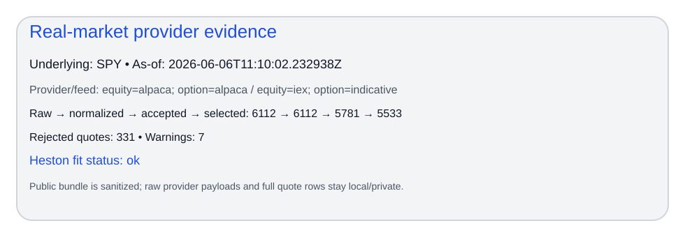
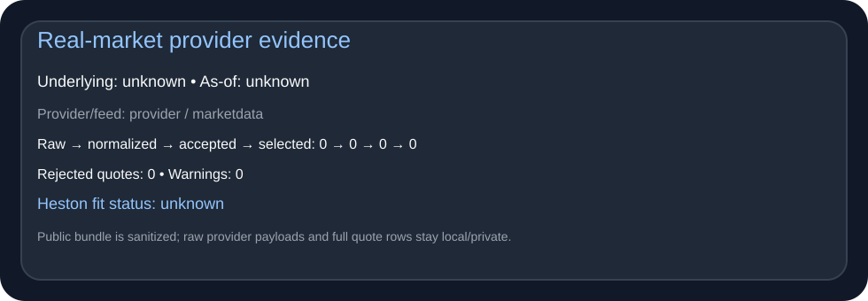
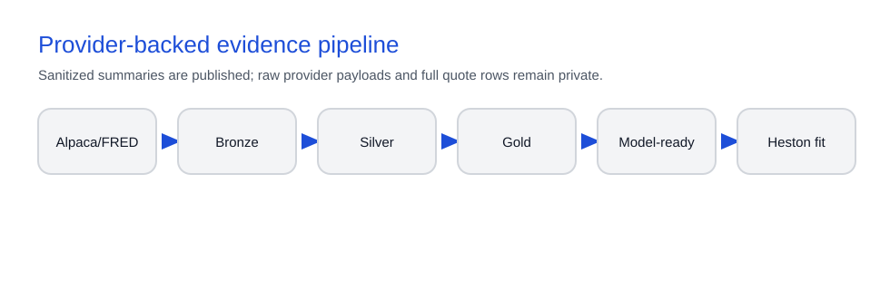
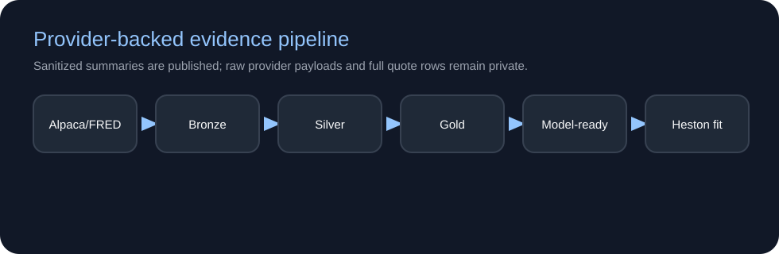
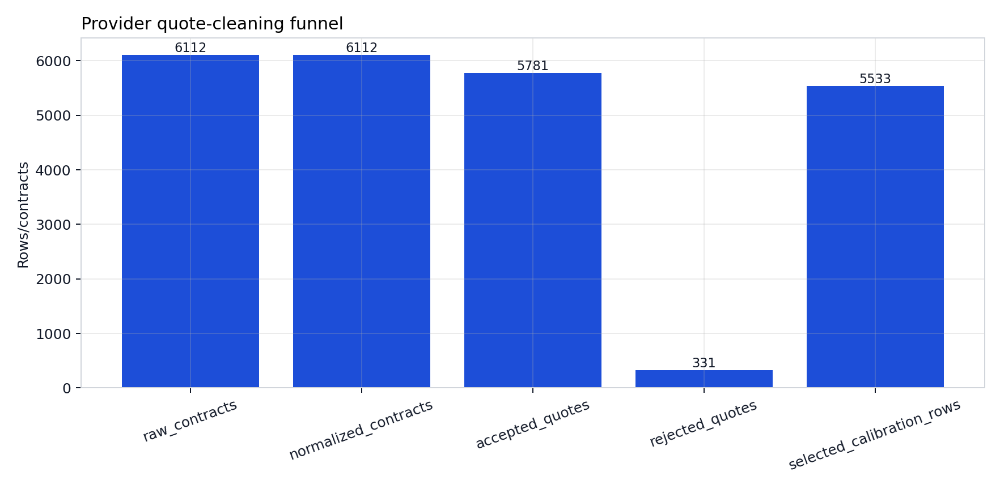
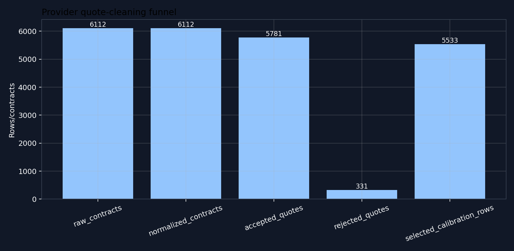
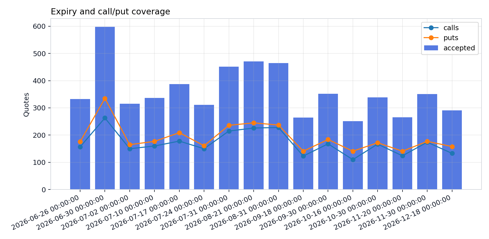
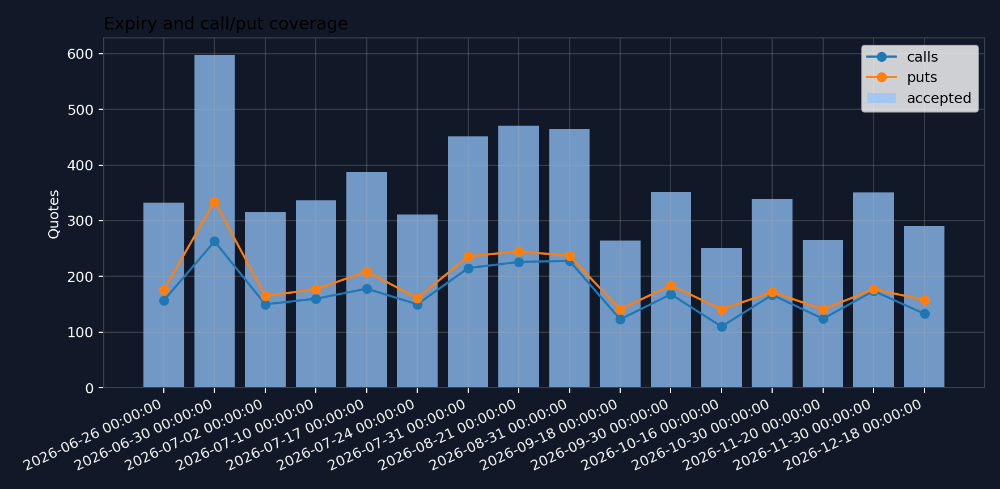
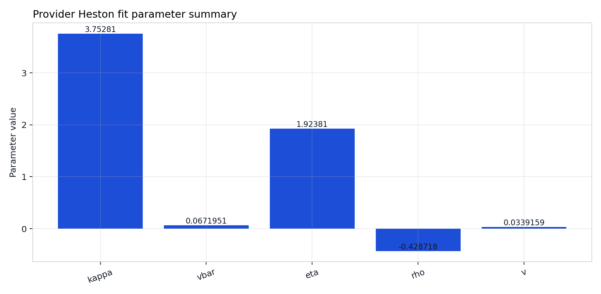
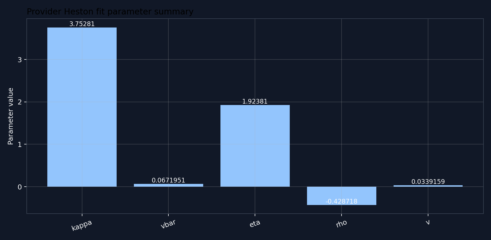

# Real-market provider evidence

This page is the public, sanitized evidence layer for provider-backed marketdata
runs. It is intentionally separate from the deterministic synthetic proof path:
the synthetic artifacts remain the reproducibility and CI baseline, while this
page shows that the provider workflow can ingest, normalize, clean, summarize,
prepare, and fit real-market data without publishing raw provider payloads or
full provider-derived quote rows.

## What this page proves

A reviewer should be able to answer five questions from this page and its
generated artifact bundle:

1. Can the library connect to real market-data providers?
2. Can it normalize provider responses into stable internal schemas?
3. Can it preserve auditability through accepted rows, rejected rows, reason
   codes, policies, and warnings?
4. Can it produce model-ready Heston artifacts from provider-backed data?
5. Can the fit workflow run while clearly disclosing status, selected quotes,
   rejected quotes, limits, and warnings?

The page does not try to make raw provider data public. That is an engineering
boundary: public artifacts demonstrate production workflow maturity, while raw
provider response bodies, credentials, and full provider-derived quote rows stay
local/private.

## Run identity and provider scope

The published summary card is the first object to inspect. It should identify
the underlying, as-of timestamp, provider/feed labels, policy names, quote
counts, warning count, model-ready status, and Heston fit status without exposing
provider response bodies or quote-row tables.

<figure markdown class="diagram diagram--hero" style="--diagram-max-width: 980px">
   { .diagram-img .diagram-light }
   { .diagram-img .diagram-dark }
   <figcaption>Sanitized provider evidence summary. Raw provider payloads and full quote rows remain local/private; this public card keeps run identity, counts, policies, status, and caveats reviewable.</figcaption>
</figure>

Machine-readable run identity is written to:

- [Public summary](../assets/generated/provider_evidence/data/provider_public_summary.json)
- [Run metadata](../assets/generated/provider_evidence/data/provider_run_metadata.json)
- [Evidence manifest](../assets/generated/provider_evidence/data/provider_evidence_manifest.json)

## Pipeline evidence card

The provider path is a pipeline rather than one opaque import. Provider feeds
flow into Bronze capture, Silver normalization and quote cleaning, Gold market
data and Heston-compatible quote artifacts, model-ready preparation, and the
optional Heston fit workflow.

<figure markdown class="diagram" style="--diagram-max-width: 980px">
   { .diagram-img .diagram-light }
   { .diagram-img .diagram-dark }
   <figcaption>Provider-backed evidence layer. The public page shows sanitized summaries from each stage, not raw payload bodies or full provider-derived tables.</figcaption>
</figure>

## Provider data policy

The public bundle follows a deliberate publication boundary.

| Publish on Pages | Keep local/private |
| --- | --- |
| Provider/feed labels, as-of timestamp, underlying, and run ID | Raw equity quote payloads |
| Raw, normalized, accepted, rejected, and selected quote counts | Raw option-chain JSON payloads |
| Rejection reason counts and stage summaries | Full provider-normalized `option_chain.parquet` |
| Expiry, strike, and moneyness coverage summaries | Full `cleaned_quotes.parquet` derived from provider rows |
| Rate, dividend, quality, and data-policy names | Full `heston_quotes.parquet` if it reconstructs provider quote rows |
| Model-ready selection/rejection counts and preflight status | Screenshots or tables that expose raw bid/ask rows |
| Heston fit status, objective, best cost, parameter summary, and warning count | Credentials, private policy files, provider response bodies, tokens, or secrets |

The policy payloads are written to:

- [Quality policy](../assets/generated/provider_evidence/data/provider_quality_policy.json)
- [Data policy](../assets/generated/provider_evidence/data/provider_data_policy.json)

## Quote cleaning and rejection evidence

Provider-backed quote cleaning should make data loss visible instead of hiding
it. The waterfall shows raw contracts, normalized contracts, accepted quotes,
rejected quotes, and selected calibration rows. The rejection reason table turns
cleanup into auditable evidence.

<figure markdown class="diagram" style="--diagram-max-width: 900px">
   { .diagram-img .diagram-light }
   { .diagram-img .diagram-dark }
   <figcaption>Provider quote-cleaning funnel. Public evidence shows stage counts and rejection reasons, not raw bid/ask rows.</figcaption>
</figure>

Data files:

- [Quote-cleaning summary](../assets/generated/provider_evidence/data/provider_quote_cleaning_summary.csv)
- [Rejection reason counts](../assets/generated/provider_evidence/data/provider_rejection_reason_counts.csv)
- [Warnings](../assets/generated/provider_evidence/data/provider_warnings.json)

## Expiry, strike, and moneyness coverage

Coverage is the calibration-shape check. The bundle should make it visible
whether the real chain has enough expiry, strike, moneyness, call, and put
coverage to support a model-ready workflow.

<figure markdown class="diagram" style="--diagram-max-width: 900px">
   { .diagram-img .diagram-light }
   { .diagram-img .diagram-dark }
   <figcaption>Coverage summary by expiry and moneyness. The chart shows usable calibration shape while keeping provider-derived quote rows private.</figcaption>
</figure>

Data files:

- [Expiry coverage](../assets/generated/provider_evidence/data/provider_expiry_coverage.csv)
- [Strike/moneyness coverage](../assets/generated/provider_evidence/data/provider_strike_moneyness_coverage.csv)

## Rate and dividend assumptions

Provider evidence should disclose the rate and dividend policy used to convert
market observations into model-ready inputs. The public summary records policy
names and compact values where safe, while the local bundle remains the source
of truth for full provider-derived inputs.

Reviewers should check that:

- the rate policy is named and reproducible
- the dividend policy is named and bounded
- the as-of timestamp and underlying match the provider run
- any missing or fallback values are surfaced as warnings

## Model-ready Heston preparation

The model-ready layer connects provider data to the official Heston fit
workflow. It should report candidate rows, selected quotes, rejected quotes,
expiry count, call count, put count, preflight status, objective, and warning
count.

Data file:

- [Model-ready summary](../assets/generated/provider_evidence/data/provider_model_ready_summary.json)

Use the dedicated model-ready Heston workflow page for the local/private
reproduction path. This page keeps only the sanitized public summary.

## Heston fit result

The Heston fit result is status evidence, not a trading claim. It should disclose
whether the fit was skipped, succeeded, or failed; which objective was used; how
many quotes were selected; the best cost when available; the parameter summary;
and any warning count.

<figure markdown class="diagram" style="--diagram-max-width: 900px">
   { .diagram-img .diagram-light }
   { .diagram-img .diagram-dark }
   <figcaption>Provider-backed Heston fit evidence. The public chart reports status, selected count, objective, cost, parameters, and warnings without exposing quote rows.</figcaption>
</figure>

Data files:

- [Heston fit summary](../assets/generated/provider_evidence/data/provider_heston_fit_summary.csv)
- [Heston parameter summary](../assets/generated/provider_evidence/data/provider_heston_parameter_summary.csv)

## What is intentionally not published

The following stay out of the public documentation bundle:

- raw Alpaca latest equity quote payloads
- raw Alpaca option-chain JSON payloads
- full provider-normalized `option_chain.parquet`
- full provider-derived `cleaned_quotes.parquet`
- full `heston_quotes.parquet` when it can reconstruct provider rows
- screenshots or tables exposing raw bid, ask, or quote-row data
- credentials, private policy files, provider response bodies, tokens, API keys,
  authorization headers, passwords, or secrets

This is not an apology for missing data. It is the publication boundary that
lets the site demonstrate provider workflow maturity without leaking raw
provider artifacts.

## How to reproduce privately

Run the provider refresh and model-validation workflow locally, then build the
sanitized public evidence bundle from the local output directory.

```bash
python scripts/build_provider_evidence_artifacts.py \
  --bundle-root out/marketdata-live/gold/model_validation_bundle/underlying=SPY/date=YYYY-MM-DD/run_id=<run-id> \
  --provider-summary-json out/marketdata-live/provider_public_summary.json \
  --output-dir docs/assets/generated/provider_evidence \
  --profile release
```

Before committing, inspect the generated `data/` directory and confirm that it
contains only public summaries, counts, coverage tables, policies, statuses,
warnings, and caveats.

## Generated artifact bundle

Figures:

- `provider_evidence_summary_card.light.svg`
- `provider_evidence_summary_card.dark.svg`
- `provider_pipeline_flow.light.svg`
- `provider_pipeline_flow.dark.svg`
- `provider_quote_cleaning_waterfall.light.png`
- `provider_quote_cleaning_waterfall.dark.png`
- `provider_expiry_strike_coverage.light.png`
- `provider_expiry_strike_coverage.dark.png`
- `provider_heston_fit_summary.light.png`
- `provider_heston_fit_summary.dark.png`

Data:

- [Evidence manifest](../assets/generated/provider_evidence/data/provider_evidence_manifest.json)
- [Public summary](../assets/generated/provider_evidence/data/provider_public_summary.json)
- [Run metadata](../assets/generated/provider_evidence/data/provider_run_metadata.json)
- [Quality policy](../assets/generated/provider_evidence/data/provider_quality_policy.json)
- [Data policy](../assets/generated/provider_evidence/data/provider_data_policy.json)
- [Quote-cleaning summary](../assets/generated/provider_evidence/data/provider_quote_cleaning_summary.csv)
- [Rejection reason counts](../assets/generated/provider_evidence/data/provider_rejection_reason_counts.csv)
- [Expiry coverage](../assets/generated/provider_evidence/data/provider_expiry_coverage.csv)
- [Strike/moneyness coverage](../assets/generated/provider_evidence/data/provider_strike_moneyness_coverage.csv)
- [Model-ready summary](../assets/generated/provider_evidence/data/provider_model_ready_summary.json)
- [Heston fit summary](../assets/generated/provider_evidence/data/provider_heston_fit_summary.csv)
- [Heston parameter summary](../assets/generated/provider_evidence/data/provider_heston_parameter_summary.csv)
- [Warnings](../assets/generated/provider_evidence/data/provider_warnings.json)

The manifest records the source run ID, generation timestamp, rebuild command,
input references, expected artifacts, and caveats. It is the machine-readable
contract that keeps this public evidence layer bounded and reproducible.
