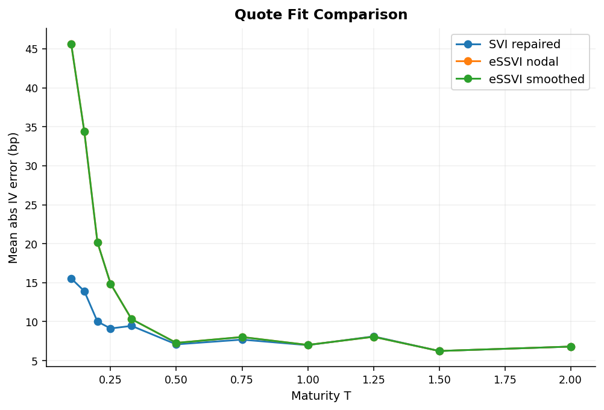
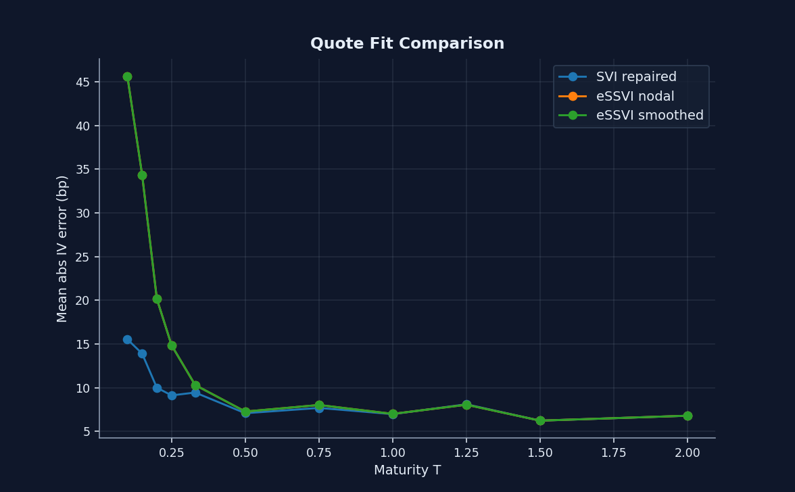

---
hide:
  - navigation
  - toc
---

# Surface repair workflow

This page shows the static-surface problem the library handles well: noisy option quotes rarely arrive in a form that is smooth, interpretable, or ready for downstream numerics.

  [Open the notebook](https://github.com/willemk-stack/option-pricing-library/blob/main/demos/06_surface_noarb_svi_repair.ipynb){ .md-button .md-button--primary }
  [Next: eSSVI smooth handoff](essvi_smooth_handoff.md){ .md-button }

<figure markdown class="diagram">
  { .diagram-img .diagram-light }
  { .diagram-img .diagram-dark }
  <figcaption>Quoted structure remains visible next to the repaired SVI fit, so the surface regularization is inspectable rather than hidden behind one polished plot.</figcaption>
</figure>

  <figure markdown class="diagram" style="--diagram-max-width: 720px">
    { .diagram-img .diagram-light }
    { .diagram-img .diagram-dark }
    <figcaption>The repaired surface heatmap makes maturity continuity and remaining stress regions visible before any local-vol step is considered.</figcaption>
  </figure>
  <figure markdown class="diagram" style="--diagram-max-width: 720px">
    { .diagram-img .diagram-light }
    { .diagram-img .diagram-dark }
    <figcaption>Per-expiry slices keep fit quality and repair behavior visible slice by slice, which is what a reviewer needs to inspect.</figcaption>
  </figure>

## Hard problem

Static implied-vol surfaces have two failure modes that matter in practice:

- the quotes are noisy and inconsistent across maturities
- a fitted surface can look smooth while still hiding slice-level fit stress or static-arbitrage problems

## Method

The workflow here keeps the surface engineering explicit:

- ingest quoted implied vols into `VolSurface.from_grid(...)`
- fit analytic SVI slices with `VolSurface.from_svi(...)`
- run static no-arbitrage diagnostics before and after repair
- compare the repaired fit to the original quote structure instead of replacing the quote view with one summary surface

## Evidence

| Expiry `T` | Mean abs SVI IV residual (bp) | Max abs SVI IV residual (bp) | Slice diagnostics after repair |
| --- | --- | --- | --- |
| `0.10` | `15.55` | `56.81` | `pass` |
| `0.25` | `9.13` | `34.09` | `flagged` |
| `1.00` | `6.98` | `21.96` | `flagged` |
| `2.00` | `6.80` | `20.45` | `pass` |

The main result is not that every slice becomes trivial. It is that the repo makes fit quality, flagged slices, and repair tradeoffs visible enough to defend.

## Best next click

If the next question is "what should feed local vol?", move directly to [eSSVI smooth handoff](essvi_smooth_handoff.md). That page is where the smoother Dupire-oriented handoff is proven, rather than assumed.
