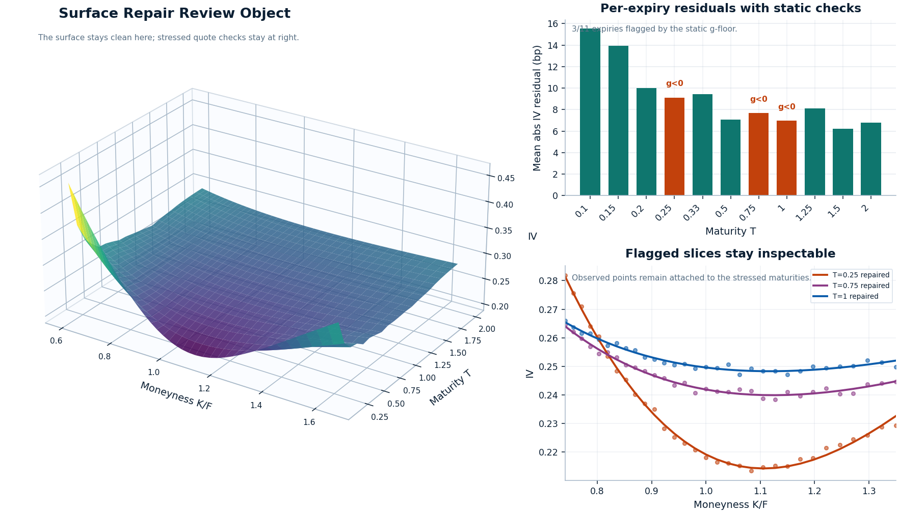
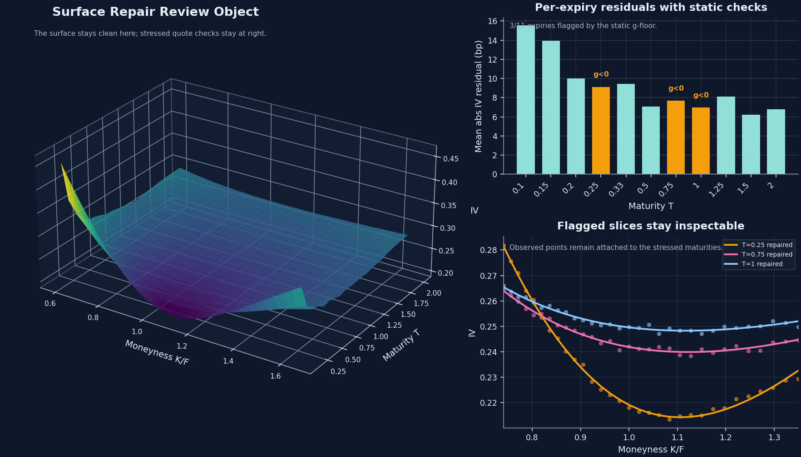
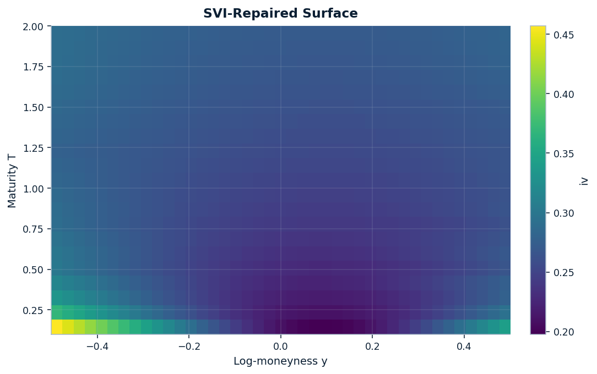
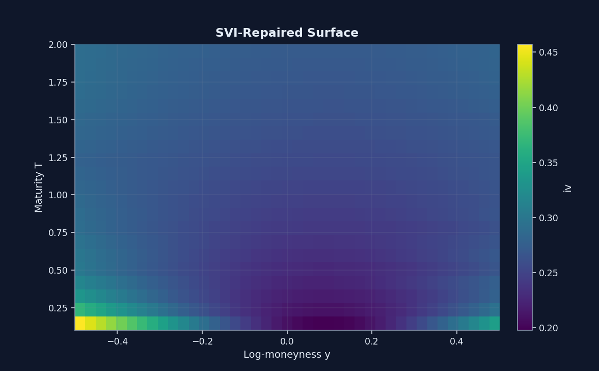
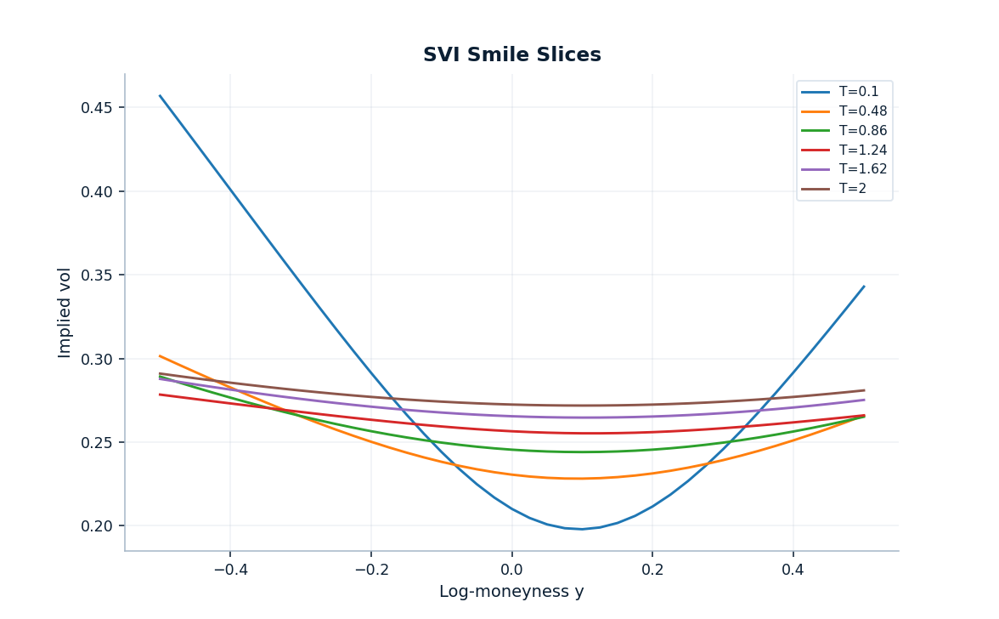
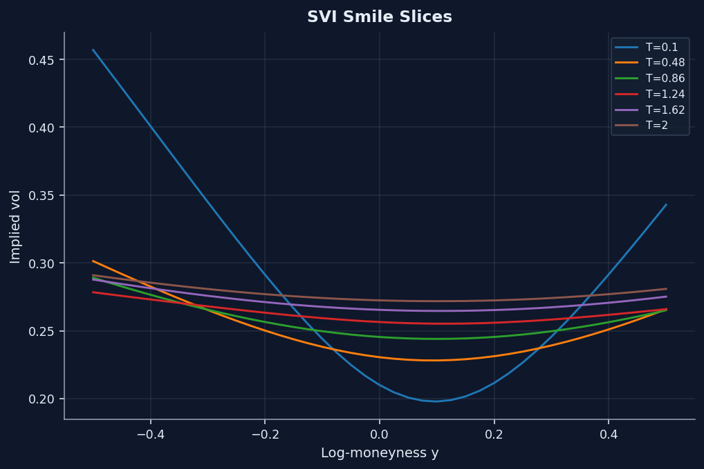

# Surface repair workflow

Proof path step 1

Production surface repair is not proven by a pretty fitted surface. It is proven by keeping the quote geometry, the analytic repair, and the slices that still deserve scrutiny visible at the same time.

This page treats static repair as an engineering judgment problem. The quoted lattice stays the reference object, the SVI repair stays inspectable, and the flagged maturities stay attached to the evidence instead of disappearing into a polished summary view.

  Quote geometry preserved
  Flagged slices stay visible
  Static repair only

[Open the notebook](https://github.com/willemk-stack/option-pricing-library/blob/main/demos/06_surface_noarb_svi_repair.ipynb){ .md-button .md-button--primary }
[Next: eSSVI smooth handoff](essvi_smooth_handoff.md){ .md-button }

## Signature evidence

This is the production review object: the repaired SVI surface stays clean in 3D, the flagged maturities remain marked, and the stressed slices still sit against observed quotes instead of being washed into one pretty surface.

<figure class="diagram diagram--hero surface-repair-signature-figure" style="--diagram-max-width: 1160px" markdown="1">
{ .diagram-img .diagram-light }
{ .diagram-img .diagram-dark }
<figcaption>The 3D panel stays clean so the repaired geometry reads immediately. Reviewability comes from the right-hand diagnostics: three expiries remain flagged by the static g-floor check, and the stressed slices still sit against observed quotes instead of disappearing into a polished surface image.</figcaption>
</figure>

Preserved

Quoted strike / maturity geometry

The raw quote lattice remains the reference object, so the repair is judged against the observed structure instead of replacing it.

Regularized

Per-expiry analytic SVI slices

Each maturity is repaired with an inspectable analytic slice rather than with an opaque smoothing pass.

Still visible

`3` flagged expiries stay marked

`T = 0.25`, `0.75`, and `1.00` remain attached to the evidence because failing slices are part of the review story, not clutter.

Not hidden

Static repair is not the Dupire handoff

The separate time-smooth maturity-direction decision stays on the <a href="essvi_smooth_handoff.md">eSSVI smooth handoff</a> page instead of being smuggled into this one.

## Problem

Naive repair presentation is misleading because a clean surface image can hide what was regularized, which slices remain delicate, and what still has not been solved for the next stage.

- Quoted surfaces are often noisy across strike and maturity before any model choice is made.
- A single repaired surface view can suggest the workflow is already safe for downstream numerics even when delicate expiries remain.
- If flagged slices disappear here, the later proof pages inherit cleaner-looking inputs without showing what was actually regularized.

Why naive repair presentation is misleading

Showing only one polished repaired surface or one pass/fail summary can make the workflow look finished too early. That hides whether the quoted structure was respected and whether the difficult maturities remained visible after repair.

Why flagged slices are evidence, not clutter

The flagged expiries are the point of the review. They show where the static repair remains delicate, they keep the later eSSVI handoff honest, and they let a reviewer see what the workflow still refuses to hide.

Boundary of this page

Static repair is necessary, but it is not the same thing as a time-smooth Dupire-ready handoff. The next page handles continuity in <code>T</code> and <code>w_T</code> explicitly rather than implying that the repair page already solved it.

## Chosen Method

The repair policy is explicit: preserve the quoted lattice as the reference, regularize each expiry with analytic SVI, keep the static checks attached, and do not smuggle the time-smoothing decision into the same page.

| Layer | Object or check | Design choice and reason |
| --- | --- | --- |
| Quoted input | `VolSurface.from_grid(...)` | Preserve the observed strike/maturity structure as the reference rather than overwriting it with a polished fitted view |
| Repair step | `calibrate_svi(...)` and `VolSurface.from_svi(...)` | Repair each expiry with an inspectable analytic surface instead of an opaque smoothing pass |
| Static diagnostics | no-arbitrage and slice-fit summaries | Let repaired slices be judged instead of treating the repair as automatically trustworthy |
| Evidence pairing | quoted-versus-repaired view plus per-expiry slices | Keep both global structure and expiry-level behavior visible at the same time |
| Next handoff | smooth eSSVI projection is handled separately | Avoid implying that static repair alone is sufficient for Dupire-oriented work |

## Supporting evidence

The signature figure establishes the review object first. The secondary figures widen the field of view so the full repaired surface and the full slice stack stay legible without replacing the quote-aware proof above.

<figure class="diagram diagram--quiet" style="--diagram-max-width: 720px" markdown="1">
{ .diagram-img .diagram-light }
{ .diagram-img .diagram-dark }
<figcaption>The repaired heatmap broadens the hero into a full-surface view, but it stays secondary so the page does not replace the quote-aware review object with one cleaner-looking surface image.</figcaption>
</figure>

<figure class="diagram diagram--quiet" style="--diagram-max-width: 720px" markdown="1">
{ .diagram-img .diagram-light }
{ .diagram-img .diagram-dark }
<figcaption>The full slice stack keeps the repair inspectable maturity by maturity instead of collapsing the page into one global surface view.</figcaption>
</figure>

### Slice-level evidence

| Expiry `T` | Mean abs SVI IV residual (bp) | Max abs SVI IV residual (bp) | Static check | What it proves |
| --- | --- | --- | --- | --- |
| `0.25` | `9.13` | `34.09` | `flagged` / `g_below_floor` | short-dated delicacy remains visible after repair |
| `0.75` | `7.69` | `19.38` | `flagged` / `g_below_floor` | mid-curve stress stays attached to the repaired result |
| `1.00` | `6.98` | `21.96` | `flagged` / `g_below_floor` | low residual alone is not enough; the curvature-floor check still matters |
| `0.10` | `15.55` | `56.81` | `pass` | high residual does not automatically imply a failed static repair slice |
| `2.00` | `6.80` | `20.45` | `pass` | a calmer long-dated slice still reads cleanly after repair |

What to notice

The page is stronger because the failures stay attached to the repair. A reviewer can see which maturities are delicate, which pass, and why the workflow still needs a separate time-smooth handoff instead of inheriting false confidence from a prettier surface view.

## Tradeoffs

The repair step is deliberately conservative about what it claims. It regularizes the surface enough to make the workflow usable, but it does not erase the evidence of delicacy or borrow confidence from the next proof step.

Main takeaway

The win is not that every expiry becomes easy. The win is that the noisy quoted surface is replaced with a defensible analytic repair while fit quality, flagged slices, and remaining stress stay visible enough to inspect. That is why the next proof step is the <a href="essvi_smooth_handoff.md">eSSVI smooth handoff</a> page rather than an immediate jump to local vol.

- Keep quoted-versus-repaired comparisons visible in review-facing work instead of showing only the fitted surface.
- Treat flagged slices as useful information about surface delicacy, not as clutter to suppress.
- Use [eSSVI smooth handoff](essvi_smooth_handoff.md) to answer the separate time-continuity question before the local-vol step begins.
