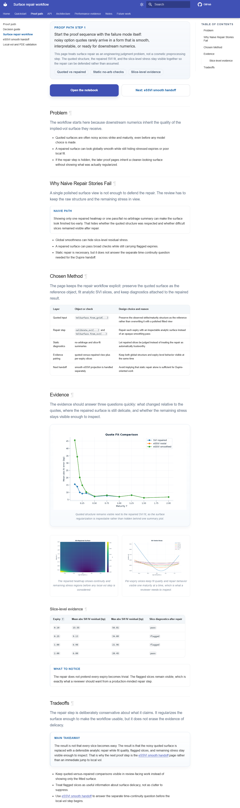
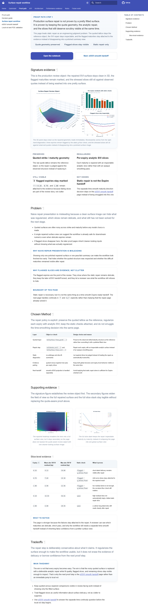
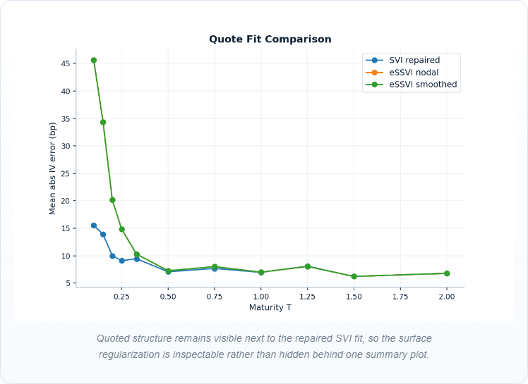
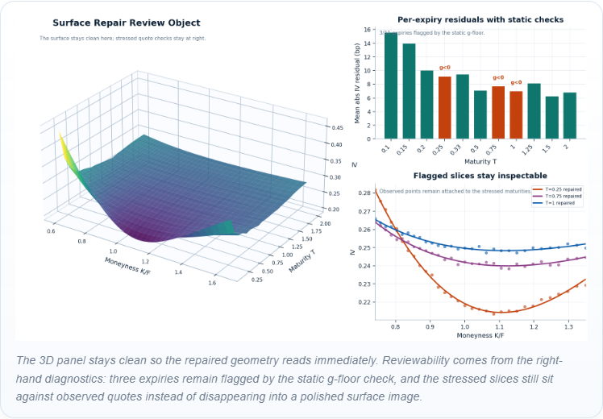
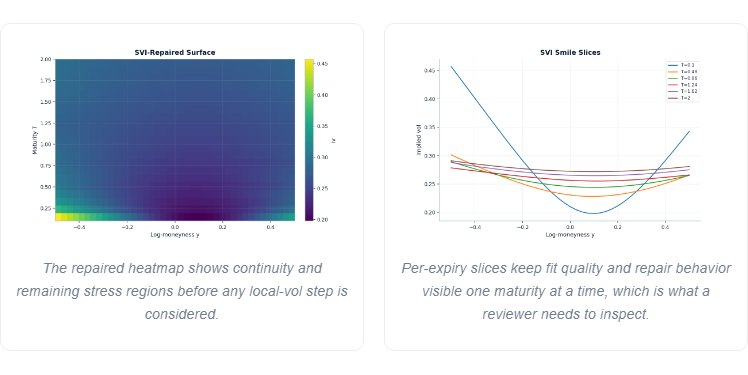
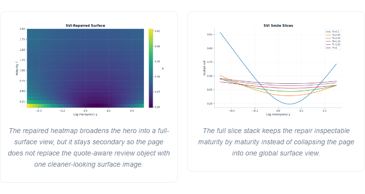
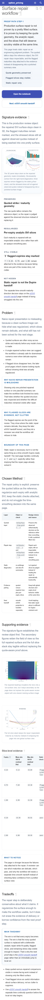
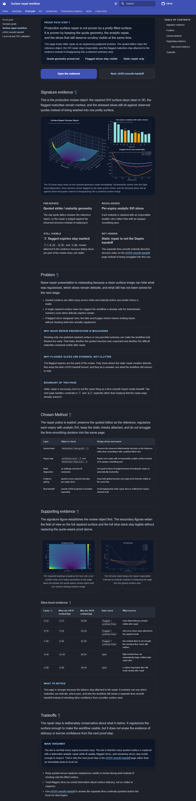

# Stage

Name: Work Package 2 - Surface repair workflow

## Summary

Reworked the surface repair workflow into the clearest production-minded proof page in the set.
The page now lands as:
- compact proof-path intro
- one custom signature review object early
- a quiet proof strip that says what is preserved, regularized, still visible, and not hidden
- supporting surface and slice diagnostics kept secondary
- explicit routing boundary into the eSSVI smooth handoff

## Goals addressed

- move the strongest proof object earlier on the page
- strengthen the page hero around a bespoke evidence composition instead of a standard figure stack
- make it explicit what is preserved, what is regularized, what remains visible, and what is not being hidden
- increase the sense of engineering judgment and reviewability
- explain why naive repair presentation is misleading
- keep flagged slices visible as evidence rather than suppressing them as clutter
- make clear that static repair is not the same thing as a time-smooth Dupire-ready handoff

## Files changed

- `docs/user_guides/surface_workflow.md`
  - rewrote the page opening, inserted the new signature-evidence section, added the preserved/regularized/visible/not-hidden proof strip, strengthened the framing panels, and updated the slice-level evidence table with sourced values
- `docs/stylesheets/extra.css`
  - added surface-workflow-specific layout rules for the custom hero figure, the four-card proof strip, and the secondary evidence grid while preserving the mobile reading order
- `src/option_pricing/demos/publishing/plots.py`
  - added a new generated `surface_repair_signature_composite` figure and renderer that combines the repaired 3D surface, per-expiry residual flags, and flagged-slice views against observed quotes from the published bundle data
- `docs/assets/generated/static/surface_repair_signature_composite.light.png`
  - generated light-theme signature repair figure
- `docs/assets/generated/static/surface_repair_signature_composite.dark.png`
  - generated dark-theme signature repair figure
- `docs/assets/generated/static/surface_repair_signature_composite.png`
  - canonical generated light-copy asset
- `tests/visual/pages.spec.ts-snapshots/user-guides-surface-workflow-*.png`
  - refreshed the full-page surface-workflow baselines at `375`, `768`, `1280`, and `1536`
- `tests/visual/components.spec.ts-snapshots/user-guides-surface-workflow-surface-guide-primary-figure-*.png`
  - refreshed the primary-figure component baseline
- `tests/visual/components.spec.ts-snapshots/user-guides-surface-workflow-surface-guide-figure-grid-*.png`
  - refreshed the secondary-evidence component baseline
- `tests/visual/artifacts/phase-6-surface-repair/before/*`
  - captured representative before screenshots for the report
- `tests/visual/artifacts/phase-6-surface-repair/after/*`
  - captured representative after screenshots for the report

## Visual changes

- The strongest proof object now appears immediately after the opening CTA instead of being buried behind a longer preamble and standard evidence stack.
- The new hero is a bespoke composition:
  - repaired 3D SVI surface as the main object
  - residual-by-expiry diagnostic showing which maturities still fail the static `g`-floor
  - flagged slice views that keep stressed maturities inspectable against observed quotes
- The page now has a quiet four-card proof strip that makes the review policy explicit:
  - preserved
  - regularized
  - still visible
  - not hidden
- The old supporting figures remain, but they are demoted into a two-up secondary grid so the page does not collapse back into a generic figure wall.
- Mobile still reads in the intended order:
  - intro
  - CTA
  - signature evidence
  - proof strip
  - problem and method framing
  - supporting evidence

## Content changes

Describe any wording changes.
Separate these into:

- intros / section leads
  - rewrote the lead so the page opens on production reviewability rather than on a generic repaired-surface explanation
  - added a short signature-evidence lead that names the repaired surface, flagged maturities, and stressed slices as the actual review object
  - rewrote the `Problem`, `Chosen Method`, `Supporting evidence`, and `Tradeoffs` section leads so they read as an engineering-judgment argument rather than a cleaned-up notebook walkthrough
- framing text
  - added explicit framing panels for:
    - why naive repair presentation is misleading
    - why flagged slices are evidence, not clutter
    - why this page stops short of the Dupire handoff
  - added a proof strip that states what is preserved, regularized, still visible, and not hidden
  - rewrote figure captions so the hero and secondary figures explain what remains inspectable instead of only naming what they depict
- anything beyond readability cleanup
  - updated the slice-level evidence table to cite actual generated residual and static-check outcomes, including the three flagged expiries `T = 0.25`, `0.75`, and `1.00`
  - explicitly separated static repair claims from the later time-smooth eSSVI handoff instead of letting the page imply that continuity in `T` is already solved here
  - did not silently broaden the mathematics beyond the published artifacts; the stronger copy is framing, evidence ordering, and sourced diagnostics

## Screenshots

Full page before, light, `1280`:

Full page after, light, `1280`:

Primary proof figure before, light, `1280`:

Primary proof figure after, light, `1280`:

Supporting evidence before, light, `1280`:

Supporting evidence after, light, `1280`:

Mobile after, light, `375`:

Desktop after, dark, `1280`:

## Why these changes were made

Phase 6 asked for the surface repair workflow to become the clearest production-minded proof page. The prior page was credible, but its strongest evidence still arrived as a standard sequence of sections and figures. That made it easier to read as a calm documentation page than as a concrete review object showing engineering judgment.

The new pass spends the emphasis budget on one substantive composition rather than on more wrapper chrome. The bespoke hero makes the real review policy visible at once: the repaired surface is inspectable in clean 3D, the static failures remain attached to the result, the observed quotes stay visible where they are actually legible in the slice diagnostics, and the page refuses to claim that the time-smooth Dupire handoff is already solved. That is the production-minded distinction the brief asked to make explicit.

## What was intentionally kept restrained

- The new hero is the only dominant proof object; the page does not introduce a second competing showcase.
- The supporting heatmap and slice stack stayed on the page, but they were demoted instead of being amplified into another hero row.
- The proof strip is quiet and textual rather than turning into a metric dashboard.
- The page still routes to the eSSVI handoff instead of collapsing both proof stages into one louder page.
- CSS changes were scoped to the surface-workflow treatments so quieter pages do not inherit more emphasis.

## Anti-regression check

- Did any wrapper become louder than the proof?
  - No. The custom composition is the emphasis point, and the surrounding cards and panels stay quiet.
- Did a second competing hero appear?
  - No. The repaired-surface composite is the only dominant proof object on the page.
- Did the page become more premium without becoming more informative?
  - No. The stronger treatment is tied directly to additional proof substance: flagged maturities, residual diagnostics, and slice-level quote-versus-repair inspection.
- Did quiet pages get louder as a side effect?
  - No. The layout and styling changes are scoped to the surface workflow, and the route-specific DOM audits passed across all required widths and themes.

## Risks / what still feels off

- The signature figure is materially stronger than the prior generic figure stack, but it is still a static raster; a later pass could add more authored annotation only if it stays disciplined.
- The secondary heatmap and full slice stack are still conventional plots. They are correctly subordinate now, but they remain less bespoke than the new hero.
- The repo already had unrelated local modifications and untracked package artifacts outside this pass; they were left untouched.

## Validation

- Rebuilt generated static visuals:
  - `& 'C:\Users\ouwez\AppData\Local\Programs\Python\Python312\python.exe' scripts/build_visual_artifacts.py plots --profile ci --preset static`
- Verified the visual publishing pipeline:
  - `& 'C:\Users\ouwez\AppData\Local\Programs\Python\Python312\python.exe' -m pytest tests/test_visual_publishing_pipeline.py -q`
- Rebuilt docs:
  - `& 'C:\Users\ouwez\AppData\Local\Programs\Python\Python312\python.exe' -m mkdocs build --strict`
- Ran surface-workflow DOM audits across light/dark and `375`, `768`, `1280`, `1536`:
  - `$env:PYTHON_EXECUTABLE='C:\Users\ouwez\AppData\Local\Programs\Python\Python312\python.exe'; $env:SERVE_PREBUILT_SITE='1'; $env:REVIEW_PATHS='/user_guides/surface_workflow/'; npx.cmd playwright test dom-audits.spec.ts`
- Captured before screenshots across light/dark and `375`, `768`, `1280`, `1536`:
  - `$env:PYTHON_EXECUTABLE='C:\Users\ouwez\AppData\Local\Programs\Python\Python312\python.exe'; $env:SERVE_PREBUILT_SITE='1'; $env:REVIEW_PATHS='/user_guides/surface_workflow/'; $env:IMPROVEMENT_CAPTURE_DIR='C:\Users\ouwez\Documents\Quant\option-pricing-library-agent-docs\tests\visual\artifacts\phase-6-surface-repair\before'; npx.cmd playwright test review-capture.spec.ts`
- Captured after screenshots across light/dark and `375`, `768`, `1280`, `1536`:
  - `$env:PYTHON_EXECUTABLE='C:\Users\ouwez\AppData\Local\Programs\Python\Python312\python.exe'; $env:SERVE_PREBUILT_SITE='1'; $env:REVIEW_PATHS='/user_guides/surface_workflow/'; $env:IMPROVEMENT_CAPTURE_DIR='C:\Users\ouwez\Documents\Quant\option-pricing-library-agent-docs\tests\visual\artifacts\phase-6-surface-repair\after'; npx.cmd playwright test review-capture.spec.ts`
- Updated route-specific page/component/sentinel baselines:
  - `$env:PYTHON_EXECUTABLE='C:\Users\ouwez\AppData\Local\Programs\Python\Python312\python.exe'; $env:SERVE_PREBUILT_SITE='1'; $env:REVIEW_PATHS='/user_guides/surface_workflow/'; npx.cmd playwright test pages.spec.ts components.spec.ts sentinel.spec.ts --update-snapshots`
- Restored two unrelated performance sentinel snapshot updates so this pass stayed scoped to the intended page:
  - `git -c safe.directory=C:/Users/ouwez/Documents/Quant/option-pricing-library-agent-docs restore -- tests/visual/sentinel.spec.ts-snapshots/performance-performance-snapshot-table-light-chromium-1280.png tests/visual/sentinel.spec.ts-snapshots/performance-performance-snapshot-table-light-chromium-375.png`

## Approval checkpoint

Do not continue to the next work package until this pass is reviewed.
