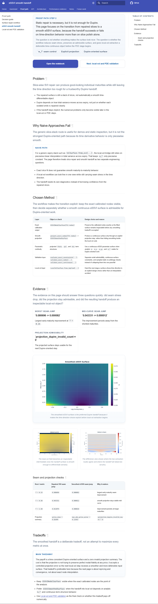
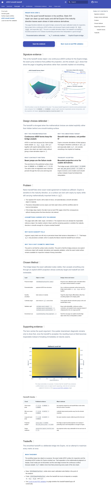
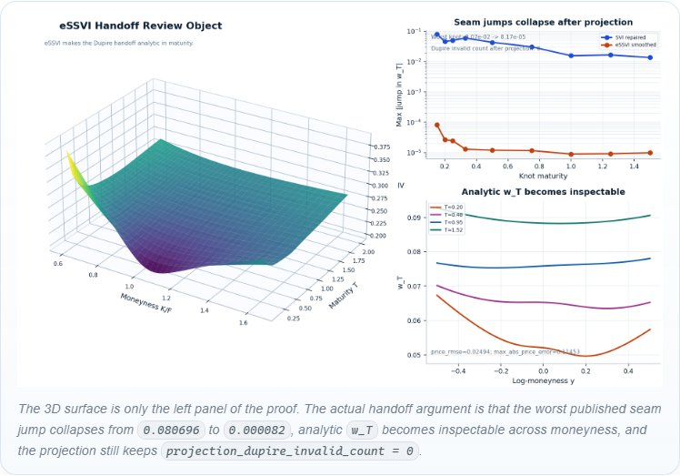
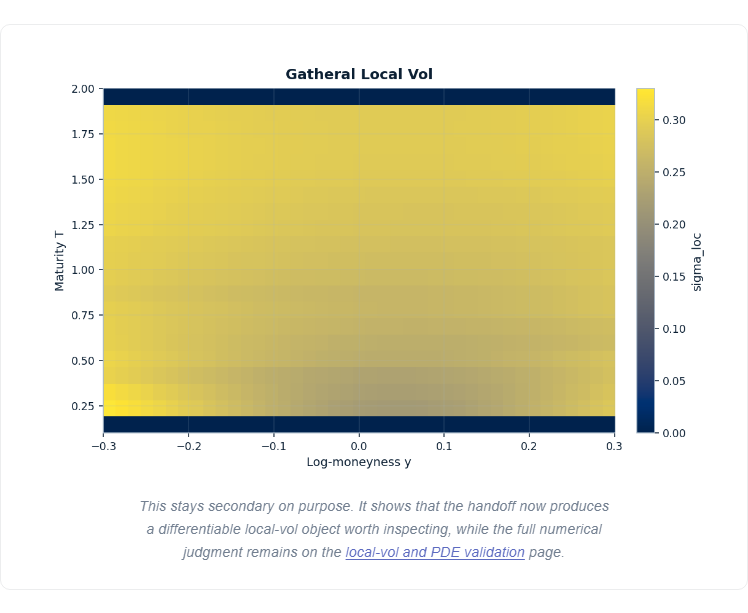
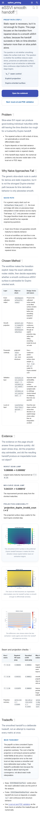
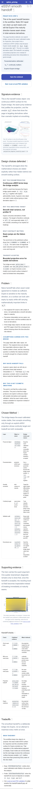
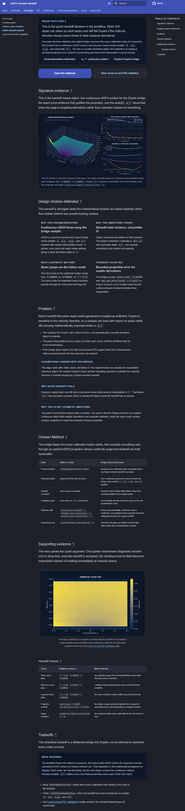

# Stage

Name: Work Package 3 - eSSVI smooth handoff

## Summary

Reworked the eSSVI smooth handoff into the clearest quant-proof page in the set.
The page now lands as:
- compact proof-path intro
- one signature handoff review object early
- a quiet "design choices defended" strip
- explicit problem, method, and tradeoff framing around the Dupire bridge
- one secondary downstream diagnostic instead of a collage wall

## Goals addressed

- strengthen the page around assumptions, parameterization choice, and the real continuity target
- make it explicit why naive handoff fails for Dupire even when expiry-by-expiry surfaces look acceptable
- show what the smoothing handoff preserves and what it intentionally trades off
- keep seam-jump and handoff-quality evidence visible alongside one premium 3D smoothed-surface hero
- add a compact "design choices defended" section without drifting into generic math exposition
- keep supporting diagnostics secondary so the page reads as one authored proof argument

## Files changed

- `docs/user_guides/essvi_smooth_handoff.md`
  - rewrote the page opening, inserted the new signature-evidence section, added the design-choice defense strip, tightened the problem/method/tradeoff framing, and updated the handoff checks table with sourced metrics
- `docs/stylesheets/extra.css`
  - added eSSVI-page-specific layout rules for the signature figure, the four-card proof strip, and the secondary evidence grid while preserving the required mobile order
- `src/option_pricing/demos/publishing/plots.py`
  - added a new generated `essvi_handoff_signature_composite` figure and renderer that combines the smoothed 3D eSSVI surface, seam-jump reduction evidence, and analytic `w_T` slices from the published bundle data
  - updated the reviewer-proof metric loader so the generated proof-card summary still parses the new handoff-check wording
- `docs/assets/generated/dupire/essvi_handoff_signature_composite.light.png`
  - generated light-theme signature handoff figure
- `docs/assets/generated/dupire/essvi_handoff_signature_composite.dark.png`
  - generated dark-theme signature handoff figure
- `docs/assets/generated/dupire/essvi_handoff_signature_composite.png`
  - canonical generated light-copy asset
- `tests/visual/targets.ts`
  - added route-specific component capture targets for the new primary figure and support grid
- `tests/visual/pages.spec.ts-snapshots/user-guides-essvi-smooth-handoff-*.png`
  - refreshed the full-page eSSVI baselines at `375`, `768`, `1280`, and `1536`
- `tests/visual/components.spec.ts-snapshots/user-guides-essvi-smooth-handoff-essvi-handoff-*.png`
  - added component baselines for the new signature figure and support grid
- `tests/visual/artifacts/phase-6-essvi-handoff/before/*`
  - captured representative before screenshots for the report
- `tests/visual/artifacts/phase-6-essvi-handoff/after/*`
  - captured representative after screenshots for the report

## Visual changes

- The strongest proof object now appears immediately after the opening CTA instead of being buried in a conventional figure stack.
- The new hero is a bespoke composition:
  - a 3D smoothed eSSVI surface as the main object
  - a seam-jump comparison that shows the maturity-direction failure mode being removed
  - analytic `w_T` slices that make the derivative target explicit
- The page now has a quiet four-card strip that states the mathematical judgment directly:
  - why this parameterization
  - why this smoothing target
  - what continuity matters
  - what tradeoff is accepted
- Supporting evidence is reduced to one quieter downstream local-vol diagnostic so the page does not regress into a collage wall.
- Mobile still reads in the intended order:
  - intro
  - CTA
  - signature evidence
  - design choices defended
  - problem and method framing
  - supporting evidence
  - tradeoffs

## Content changes

Describe any wording changes.
Separate these into:

- intros / section leads
  - rewrote the lead so the page opens on the quant handoff decision rather than on a generic smooth-surface description
  - added a signature-evidence lead that states the real review object: the smooth Dupire bridge, seam-jump reduction, and analytic `w_T`
  - added a dedicated "Design choices defended" section and rewrote the `Problem`, `Chosen Method`, `Supporting evidence`, and `Tradeoffs` leads so they read as a compact argument about mathematical judgment
- framing text
  - added explicit framing around:
    - assumptions carried into the bridge
    - why naive handoff fails
    - why this is not cosmetic smoothing
  - added quiet defense cards for parameterization choice, smoothing target, continuity target, and accepted tradeoff
  - rewrote captions so the figure text explains why the handoff passes review instead of only naming what is drawn
- anything beyond readability cleanup
  - updated the handoff-check table to cite actual published seam-jump and projection metrics:
    - `T = 0.15`: `0.080696 -> 0.000082`
    - `T = 0.50`: `0.043331 -> 0.000012`
    - `T = 1.50`: `0.013674 -> 0.000010`
    - `price_rmse = 0.02494`
    - `max_abs_price_error = 0.11453`
    - `projection_dupire_invalid_count = 0`
  - made the nodal-surface versus smoothed-surface split explicit so the page states that exact calibrated nodes remain inspectable even though Dupire receives the projected continuous bridge
  - did not broaden the mathematics into a generic explainer; the stronger copy stays tied to published artifacts, metrics, and downstream use

## Screenshots

Full page before, light, `1280`:

Full page after, light, `1280`:

Signature proof figure after, light, `1280`:

Supporting evidence after, light, `1280`:

Mobile before, light, `375`:

Mobile after, light, `375`:

Desktop after, dark, `1280`:

## Why these changes were made

Phase 6 asked for the eSSVI page to become the clearest quant-proof page by making assumptions, parameterization choice, continuity needs, and the handoff tradeoff legible without turning the page into a louder math lecture. The previous page had the right ingredients, but the strongest mathematical judgment was still dispersed across a standard documentation sequence.

This pass spends the emphasis budget on one real proof object instead of on more chrome. The signature composition earns its prominence because it combines the three things the handoff actually has to defend: the continuous surface the next stage receives, the seam-jump evidence that shows why naive maturity interpolation fails, and the analytic `w_T` slices that explain why this bridge exists at all. The page also states the accepted tradeoff explicitly: exact nodal fidelity is preserved as a reference object, while Dupire gets a bounded-error continuous projection because usable derivatives matter more here than preserving maturity seams.

## What was intentionally kept restrained

- The page has one hero only; the local-vol view remains a single secondary diagnostic.
- The new design-choice strip is quiet and textual rather than turning into a metric dashboard.
- The copy does not expand into a broad eSSVI tutorial; it stays focused on assumptions, continuity, and handoff judgment.
- The route into local-vol/PDE validation stays a simple next-step CTA instead of another premium wrapper.
- CSS changes were scoped to the eSSVI route so quieter pages do not inherit more emphasis.

## Anti-regression check

- Did any wrapper become louder than the proof?
  - No. The signature composite is the emphasis point, and the surrounding cards and panels stay quieter than the evidence.
- Did a second competing hero appear?
  - No. The composite handoff figure is the only dominant proof object on the page.
- Did the page become more premium without becoming more informative?
  - No. The stronger treatment is tied directly to additional proof substance: seam-jump reduction, analytic `w_T` visibility, and explicit projection tradeoffs.
- Did quiet pages get louder as a side effect?
  - No. The CSS and test-target additions are route-specific, and the route-level audits passed across all required widths and themes.

## Risks / what still feels off

- The signature figure is materially stronger than the previous stack, but it is still a static raster; a later pass could add more authored annotation only if it stays disciplined.
- The downstream local-vol diagnostic is intentionally secondary, but it remains a conventional plot rather than a more bespoke follow-on proof object.
- The worktree already contained unrelated local modifications and untracked Phase 6 package artifacts outside this pass; they were left untouched.

## Validation

- Rebuilt generated visuals:
  - `& 'C:\Users\ouwez\AppData\Local\Programs\Python\Python312\python.exe' scripts/build_visual_artifacts.py all --profile ci`
- Verified the visual publishing pipeline:
  - `& 'C:\Users\ouwez\AppData\Local\Programs\Python\Python312\python.exe' -m pytest tests/test_visual_publishing_pipeline.py -q`
- Rebuilt docs:
  - `& 'C:\Users\ouwez\AppData\Local\Programs\Python\Python312\python.exe' -m mkdocs build --strict`
- Ran eSSVI handoff DOM audits across light/dark and `375`, `768`, `1280`, `1536`:
  - `$env:PYTHON_EXECUTABLE='C:\Users\ouwez\AppData\Local\Programs\Python\Python312\python.exe'; $env:SERVE_PREBUILT_SITE='1'; $env:REVIEW_PATHS='/user_guides/essvi_smooth_handoff/'; npx.cmd playwright test dom-audits.spec.ts`
- Captured before screenshots across light/dark and `375`, `768`, `1280`, `1536`:
  - `$env:PYTHON_EXECUTABLE='C:\Users\ouwez\AppData\Local\Programs\Python\Python312\python.exe'; $env:SERVE_PREBUILT_SITE='1'; $env:REVIEW_PATHS='/user_guides/essvi_smooth_handoff/'; $env:IMPROVEMENT_CAPTURE_DIR='C:\Users\ouwez\Documents\Quant\option-pricing-library-agent-docs\tests\visual\artifacts\phase-6-essvi-handoff\before'; npx.cmd playwright test review-capture.spec.ts`
- Captured after screenshots across light/dark and `375`, `768`, `1280`, `1536`:
  - `$env:PYTHON_EXECUTABLE='C:\Users\ouwez\AppData\Local\Programs\Python\Python312\python.exe'; $env:SERVE_PREBUILT_SITE='1'; $env:REVIEW_PATHS='/user_guides/essvi_smooth_handoff/'; $env:IMPROVEMENT_CAPTURE_DIR='C:\Users\ouwez\Documents\Quant\option-pricing-library-agent-docs\tests\visual\artifacts\phase-6-essvi-handoff\after'; npx.cmd playwright test review-capture.spec.ts`
- Updated route-specific page/component/sentinel baselines:
  - `$env:PYTHON_EXECUTABLE='C:\Users\ouwez\AppData\Local\Programs\Python\Python312\python.exe'; $env:SERVE_PREBUILT_SITE='1'; $env:REVIEW_PATHS='/user_guides/essvi_smooth_handoff/'; npx.cmd playwright test pages.spec.ts components.spec.ts sentinel.spec.ts --update-snapshots`
- Restored two unrelated performance sentinel snapshot updates so this pass stayed scoped to the intended page:
  - `git -c safe.directory=C:/Users/ouwez/Documents/Quant/option-pricing-library-agent-docs restore -- tests/visual/sentinel.spec.ts-snapshots/performance-performance-snapshot-table-light-chromium-1280.png tests/visual/sentinel.spec.ts-snapshots/performance-performance-snapshot-table-light-chromium-375.png`

## Approval checkpoint

Do not continue to the next work package until this pass is reviewed.
