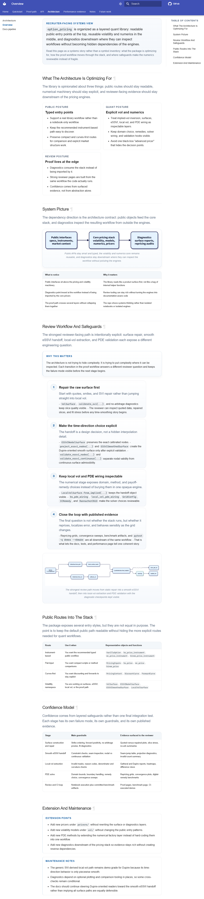
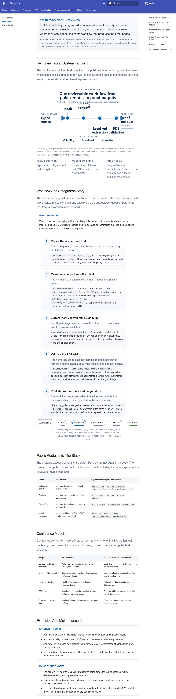
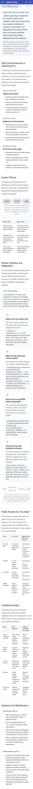
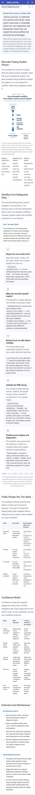
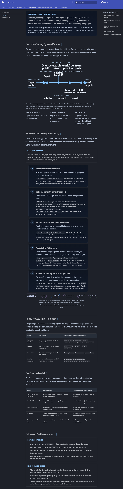
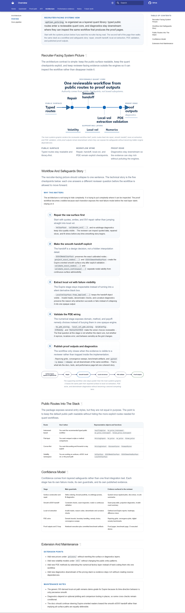

# Stage

Name: Work Package 4 - Architecture premium upgrade

## Summary

Reworked the architecture page so the main systems figure reads as one authored systems graphic instead of a documentation diagram assembled from equally weighted boxes.
The final pass does three things together:
- promotes a custom hero SVG with explicit checkpoints and open flow geometry
- separates the page into a recruiter-facing system picture first and a quieter workflow-and-safeguards story second
- removes wrapper and canvas artifacts that were making both diagrams feel boxed-in even after the earlier cleanup

## Goals addressed

- rework the main systems figure so it carries more authority on its own
- separate the page more clearly into a recruiter-facing system picture and a workflow/safeguards story
- make repair, smooth handoff, local-vol extraction, PDE validation, and proof outputs/diagnostics easier to see in the visual itself
- strengthen hierarchy, flow, and layer depth without solving weakness by adding more boxes or blueprint clutter

## Files changed

- `docs/architecture.md`
  - keeps the page split into the two requested reading modes, versions the diagram URLs so refreshed assets are actually what the browser and screenshot harness load, and swaps to a dedicated mobile hero source below `560px`
- `docs/assets/diagrams/architecture_layers.light.svg`
  - hand-authored light hero asset with open ingress/proof labels, one workflow spine, and explicit checkpoint naming
- `docs/assets/diagrams/architecture_layers.dark.svg`
  - dark-theme companion hero asset with the same geometry and tuned contrast
- `docs/assets/diagrams/architecture_layers.mobile.light.svg`, `docs/assets/diagrams/architecture_layers.mobile.dark.svg`
  - mobile-specific hero assets that reflow the architecture figure at phone widths so the labels do not collide with the arrows or with each other
- `docs/assets/diagrams/architecture_layers.svg`
  - compatibility light-copy asset kept aligned with the custom hero
- `docs/assets/diagrams/src/workflow_surface_to_pde.d2`
  - simplified supporting workflow diagram into a single restrained path with minimal emphasis and no card-wall feel
- `docs/assets/diagrams/workflow_surface_to_pde.light.svg`, `docs/assets/diagrams/workflow_surface_to_pde.dark.svg`, `docs/assets/diagrams/workflow_surface_to_pde.svg`
  - regenerated supporting workflow outputs after the D2 simplification and canvas cleanup
- `docs/assets/diagrams/validation_stack.light.svg`, `docs/assets/diagrams/validation_stack.dark.svg`, `docs/assets/diagrams/validation_stack.svg`
  - refreshed generated D2 outputs after the renderer normalization changed to strip full-canvas background rects consistently
- `docs/stylesheets/extra.css`
  - removes hero/support figure chrome so the page does not add a second border or shadow around the diagrams; keeps the quieter reading-line treatment
- `scripts/render_d2_diagrams.py`
  - strips the generated full-canvas D2 background rect during normalization so D2 diagrams do not bring their own visible page-colored box
- `docs/assets/diagrams/src/architecture_layers.d2`
  - removed from the active render path so the boxed D2 hero cannot overwrite the custom systems graphic
- `tests/artifacts/phase-6-architecture-premium/before/*`
  - retained before captures for comparison
- `tests/artifacts/phase-6-architecture-premium/after/*`
  - refreshed after captures at `375`, `768`, `1280`, and `1536` in light and dark

## Visual changes

- The hero is now one open composition instead of a boxed container holding more boxes.
- At phone widths the hero uses a separate mobile composition, so the recruiter-facing diagram still reads as one systems picture instead of a compressed desktop thumbnail.
- The figure hierarchy is clearer:
  - left public-surface ingress
  - one central workflow spine
  - four named checkpoints on the spine
  - right proof-output edge
  - one quiet supporting-layer rail underneath
- The blue filled core mass and the old frame-within-frame treatment are gone.
- The architecture reading strip is now text-only and clearly subordinate to the figure.
- The supporting workflow figure is visibly secondary and no longer arrives with its own canvas box.

## Content changes

- intros / section leads
  - kept the earlier page split: recruiter-facing picture first, workflow-and-safeguards story second
  - retained the tighter section leads that explain the architecture as a contract rather than as generic documentation
- framing text
  - kept the quieter reading-line copy for `Public surface`, `Workflow spine`, and `Proof edge`
  - updated the page so the diagrams load through versioned URLs, which was necessary to make the revised assets show up reliably in browser review
- anything beyond readability cleanup
  - no API, quantitative claim, or technical recommendation changed
  - the meaningful content change was making the five checkpoints explicit in the hero without depending on dense supporting copy

## Screenshots

Full page before, light, `1280`:

Full page after, light, `1280`:

Mobile before, light, `375`:

Mobile after, light, `375`:

Desktop after, dark, `1280`:

Wide desktop after, light, `1536`:

## Why these changes were made

The brief asked for a premium portfolio systems graphic, but the earlier pass still behaved like documentation: a figure wrapper, an SVG canvas, a large central container, and multiple internal cards all competed for the same attention. That diluted authority instead of concentrating it.

This pass fixes the root causes instead of adding more framing. The hero is no longer generated from the same D2 language that was encouraging box-first composition, the supporting D2 figure no longer carries a visible full-canvas background, and the page-level figure wrappers have been stripped back so the diagrams can sit directly on the page. The result is more premium because the emphasis is now invested in one readable systems object, not in more chrome around it.

## What was intentionally kept restrained

- No new dashboard, stats strip, or proof table was added to make the page feel more premium.
- The supporting workflow figure stayed in D2 and stayed simple instead of becoming a second bespoke hero.
- The reading line remained text-first rather than turning back into a row of bordered cards.
- The public-routes and confidence-model tables were left functional and quiet.
- CSS emphasis changes stayed scoped to the architecture page treatment.

## Anti-regression check

- Did any wrapper become louder than the proof?
  - No. The hero figure lost its wrapper chrome and the D2 support figure lost its canvas box.
- Did a second competing hero appear?
  - No. The support figure is linear, smaller, and quieter than the main systems graphic.
- Did the page become more premium without becoming more informative?
  - No. The stronger treatment is tied directly to more visible information: ingress, checkpoints, supporting layers, and proof edge.
- Did quiet pages get louder as a side effect?
  - No. The styling changes are limited to the architecture variants and the route-level browser checks passed.

## Risks / what still feels off

- The `375px` hero is materially cleaner than the original desktop-downscale version, but it is still the tightest breakpoint on the page.
- The supporting workflow figure is appropriately secondary, but it is still a conventional D2 flow rather than a bespoke explanatory graphic.
- The version query on the diagram URLs is now part of the asset-refresh contract; future material hero/support figure changes should bump that suffix again.

## Validation

- Re-rendered D2 diagrams:
  - `& 'C:\Users\ouwez\AppData\Local\Programs\Python\Python312\python.exe' scripts/render_d2_diagrams.py`
- Rebuilt docs:
  - `& 'C:\Users\ouwez\AppData\Local\Programs\Python\Python312\python.exe' -m mkdocs build --strict`
- Refreshed architecture screenshots across `375`, `768`, `1280`, and `1536` in light and dark:
  - `npm.cmd run test:capture`
  - executed from `tests/visual` with `PYTHON_EXECUTABLE`, `REVIEW_PAGE_KEYS='architecture'`, `SERVE_PREBUILT_SITE='1'`, and `IMPROVEMENT_CAPTURE_DIR='..\\artifacts\\phase-6-architecture-premium\\after\\captures'`
- Verified route smoke and DOM audits across the same matrix:
  - `npx.cmd playwright test smoke.spec.ts dom-audits.spec.ts`
  - executed from `tests/visual` with `PYTHON_EXECUTABLE`, `REVIEW_PATHS='/architecture/'`, and `SERVE_PREBUILT_SITE='1'`
- Manually inspected the final desktop and mobile captures plus direct rasterization of the built hero SVG to confirm that the boxed hero geometry had actually been removed

## Approval checkpoint

Do not continue to the next work package until this pass is reviewed.
