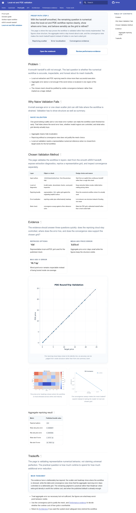
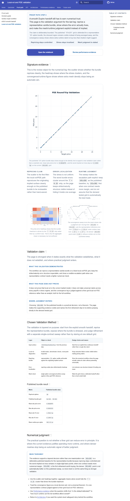
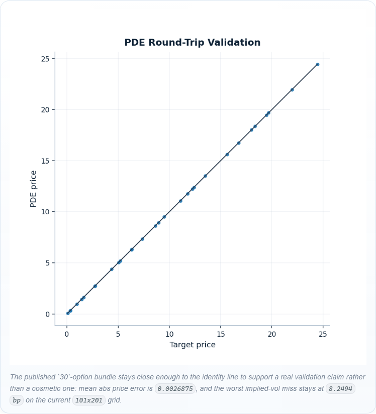
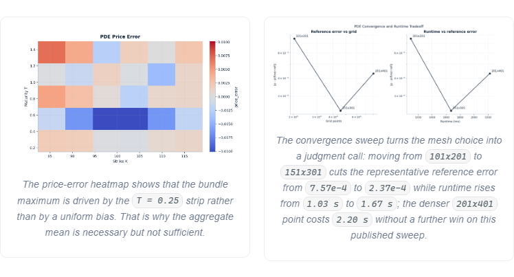
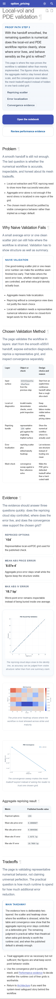
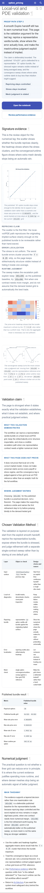
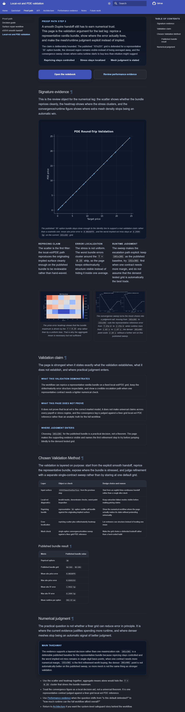

# Stage

Name: Work Package 5 - Local-vol / PDE validation

## Summary

Reworked the Local-vol / PDE page so it reads as one authored validation argument instead of a cleaned-up notebook stack.
The page now lands as:
- compact proof-path intro with explicit numerical scope
- one signature validation section built around repricing, localization, and runtime/error judgment
- a direct statement of what the validation demonstrates, what it does not prove, and where judgment enters
- a corrected published metric table sourced to the current committed bundle
- a more explicit runtime tradeoff conclusion around `101x201`, `151x301`, and `201x401`

## Goals addressed

- make the page feel like a deliberate validation argument rather than adjacent notebook outputs
- strengthen one composition around repricing scatter, error localization, and convergence/runtime tradeoff
- keep 2D validation figures primary and avoid turning the page into a pretty local-vol-surface showcase
- state the numerical tradeoff judgment explicitly instead of implying it through one default grid
- say clearly what the page demonstrates and what it does not prove
- keep the page restrained by removing the dashboard-like metric strip rather than adding more chrome

## Files changed

- `docs/user_guides/localvol_pde_validation.md`
  - rewrote the page structure, replaced the metric-card strip with a signature validation section plus explicit claim framing, and corrected the stale published bundle metrics
- `docs/stylesheets/extra.css`
  - added route-specific layout rules for the Local-vol validation hero, reading line, and support grid while preserving the required mobile order
- `src/option_pricing/demos/publishing/plots.py`
  - upgraded the `pde_convergence` renderer into a two-panel convergence/runtime tradeoff figure using the existing convergence sweep data
- `docs/assets/generated/numerics/pde_convergence.*`
  - regenerated the updated convergence/runtime tradeoff figure in light, dark, and canonical variants
- `docs/index.md`
  - removed a stale hard-coded homepage caption metric reference so the homepage no longer duplicates outdated Local-vol bundle numbers
- `docs/assets/generated/showcase/readme_proof_card.*`
  - regenerated the metric-driven proof-card asset because the Local-vol published metrics changed
- `docs/assets/generated/showcase/reviewer_proof_panel.*`
  - regenerated the reviewer proof panel so its Local-vol metrics match the current page values
- `tests/visual/targets.ts`
  - added route-specific component capture targets for the new Local-vol primary figure and support grid
- `tests/visual/pages.spec.ts-snapshots/user-guides-localvol-pde-validation-*.png`
  - refreshed the full-page Local-vol baselines at `375`, `768`, `1280`, and `1536`
- `tests/visual/components.spec.ts-snapshots/user-guides-localvol-pde-validation-*.png`
  - added component baselines for the new Local-vol primary figure and support grid
- `tests/visual/pages.spec.ts-snapshots/home-*.png`
  - refreshed homepage page baselines because the Local-vol homepage support caption was intentionally corrected
- `tests/visual/components.spec.ts-snapshots/home-*.png`
  - refreshed homepage component baselines for the same caption cleanup
- `tests/visual/sentinel.spec.ts-snapshots/home-home-snapshot-grid-*.png`
  - refreshed the homepage sentinel snapshots affected by the Local-vol support-card caption
- `tests/visual/artifacts/phase-6-localvol-pde-validation/before/*`
  - captured before screenshots for the report
- `tests/visual/artifacts/phase-6-localvol-pde-validation/after/*`
  - captured after screenshots for the report

## Visual changes

- The page now spends its emphasis budget on one signature validation section instead of on a metric strip plus three loosely connected figures.
- The primary figure remains the repricing scatter, but it now reads as part of one composed argument:
  - scatter first
  - a three-part reading line that states the interpretation
  - a secondary support grid with the error heatmap and the upgraded convergence/runtime tradeoff figure
- The old convergence figure is now a two-panel plot, so the page no longer asks the reader to infer runtime judgment from an error-only sweep.
- The support grid stays subordinate; there is still only one dominant proof object on the page.
- The homepage support caption for this page is now generic and durable, which removes stale numeric duplication instead of turning the homepage into another metrics surface.

## Content changes

Describe any wording changes.
Separate these into:

- intros / section leads
  - rewrote the intro so the page opens on the numerical validation question rather than on a generic "does it work?" summary
  - replaced `Problem` and `Why Naive Validation Fails` with a single `Signature evidence` section that names the review object directly
  - added a `Validation claim` section and rewrote the `Chosen Validation Method` and `Numerical judgment` leads so the page states its boundaries and decisions explicitly
- framing text
  - added explicit text for:
    - what the validation demonstrates
    - what it does not prove
    - where judgment is being exercised
  - rewrote the support-figure captions so they explain why the figures matter rather than only naming what is plotted
  - added a reading line under the scatter to state the repricing claim, the localized stress region, and the runtime judgment in plain review language
- anything beyond readability cleanup
  - corrected the published Local-vol bundle metrics from the stale `154`-option / `8.07e-4` framing to the current committed bundle values:
    - `n_options = 30`
    - `mean_abs_price_error = 0.0026875`
    - `max_abs_price_error = 0.0101152`
    - `mean_abs_iv_error = 1.9422 bp`
    - `max_abs_iv_error = 8.2494 bp`
    - published bundle grid `Nx=101`, `Nt=201`
  - made the localized stress callout explicit:
    - the worst bundle errors cluster around the `T = 0.25` strip
  - made the mesh/runtime judgment explicit from the committed convergence sweep:
    - `101x201`: `7.57e-4` reference error at `1.03 s`
    - `151x301`: `2.37e-4` reference error at `1.67 s`
    - `201x401`: `4.31e-4` reference error at `2.20 s`
  - removed the stale hard-coded homepage Local-vol caption metrics and replaced them with a non-duplicative summary so the site no longer advertises numbers that disagree with the current page

## Screenshots

Full page before, light, `1280`:

Full page after, light, `1280`:

Primary figure after, light, `1280`:

Support grid after, light, `1280`:

Mobile before, light, `375`:

Mobile after, light, `375`:

Desktop after, dark, `1280`:

## Why these changes were made

Phase 6 asked for this page to feel less like a cleaned-up notebook and more like a deliberate validation argument, with clearer numerical judgment and stronger composition around repricing, error localization, and convergence/runtime tradeoffs. The previous page already had the right raw ingredients, but they were still presented as adjacent evidence blocks plus a small metrics dashboard. That made the page readable, but not especially authored.

This pass spends the emphasis budget on one real proof composition instead of on more summary chrome. The scatter remains the page star because it is still the fastest way to answer "does the workflow reprice cleanly?". The heatmap stays right next to it so the page cannot hide localization inside one mean. The convergence figure was upgraded so it now shows the runtime tradeoff directly, which makes the numerical judgment legible rather than implicit. The prose then states the bound of the claim: this page demonstrates representative numerical control on a published vanilla bundle and a defended escalation path, not universal truth about local vol or every payoff family.

Correcting the stale bundle numbers was also necessary. The page and homepage were quoting an older `154`-option snapshot, while the current committed visual bundle is the `30`-option quick-profile publication set. Phase 6 explicitly disallows silent technical drift, so the authored argument had to be brought back into line with the current committed artifacts before the styling work could be considered credible.

## What was intentionally kept restrained

- No 3D local-vol surface was added; the page stays grounded in 2D validation figures.
- The old metric-card strip was removed rather than replaced with another dashboard treatment.
- The support figures remain secondary to the scatter; there is still only one dominant proof object.
- The convergence/runtime figure is more informative, but it stays a compact two-panel diagnostic rather than becoming a benchmark-page import.
- The new CSS is route-specific so quieter pages do not inherit more emphasis.

## Anti-regression check

- Did any wrapper become louder than the proof?
  - No. The page is quieter overall because the metric strip was removed; the strongest emphasis still belongs to the scatter-led validation section.
- Did a second competing hero appear?
  - No. The repricing scatter remains the only dominant proof object.
- Did the page become more premium without becoming more informative?
  - No. The upgraded figure and rewritten framing are tied directly to more information: corrected metrics, localized stress interpretation, and explicit runtime/error judgment.
- Did quiet pages get louder as a side effect?
  - No. The shared CSS changes are route-specific. The homepage did change, but only to remove stale Local-vol metric duplication from one support caption.

## Risks / what still feels off

- The Local-vol published metrics are still authored in markdown rather than generated from a dedicated page template, so future bundle changes will still require a coordinated doc refresh.
- The runtime/error judgment is intentionally based on one representative single-contract convergence sweep, which is the right scope for this page but not a universal statement about every contract region.
- The worktree already contained unrelated modified and untracked files outside this pass, including other visual artifacts and Phase 6 package material; they were left untouched.

## Validation

- Rebuilt the visual publishing bundle:
  - `& 'C:\Users\ouwez\AppData\Local\Programs\Python\Python312\python.exe' scripts/build_visual_artifacts.py all --profile ci`
- Rebuilt docs:
  - `& 'C:\Users\ouwez\AppData\Local\Programs\Python\Python312\python.exe' -m mkdocs build --strict`
- Verified the visual publishing pipeline:
  - `py -3.12 -m pytest tests/test_visual_publishing_pipeline.py -q`
- Ran DOM audits across light/dark and `375`, `768`, `1280`, `1536` for the homepage and Local-vol page:
  - `$env:PYTHON_EXECUTABLE='C:\Users\ouwez\AppData\Local\Programs\Python\Python312\python.exe'; $env:SERVE_PREBUILT_SITE='1'; $env:REVIEW_PATHS='/,/user_guides/localvol_pde_validation/'; .\node_modules\.bin\playwright.cmd test dom-audits.spec.ts`
- Captured before screenshots across light/dark and `375`, `768`, `1280`, `1536` for the Local-vol page:
  - `$env:PYTHON_EXECUTABLE='C:\Users\ouwez\AppData\Local\Programs\Python\Python312\python.exe'; $env:SERVE_PREBUILT_SITE='1'; $env:REVIEW_PATHS='/user_guides/localvol_pde_validation/'; $env:IMPROVEMENT_CAPTURE_DIR='C:\Users\ouwez\Documents\Quant\option-pricing-library-agent-docs\tests\visual\artifacts\phase-6-localvol-pde-validation\before'; .\node_modules\.bin\playwright.cmd test review-capture.spec.ts`
- Captured after screenshots across light/dark and `375`, `768`, `1280`, `1536` for the Local-vol page and its new component targets:
  - `$env:PYTHON_EXECUTABLE='C:\Users\ouwez\AppData\Local\Programs\Python\Python312\python.exe'; $env:SERVE_PREBUILT_SITE='1'; $env:REVIEW_PATHS='/user_guides/localvol_pde_validation/'; $env:IMPROVEMENT_CAPTURE_DIR='C:\Users\ouwez\Documents\Quant\option-pricing-library-agent-docs\tests\visual\artifacts\phase-6-localvol-pde-validation\after'; .\node_modules\.bin\playwright.cmd test review-capture.spec.ts`
- Updated route-specific page/component/sentinel baselines for the homepage and Local-vol page:
  - `$env:PYTHON_EXECUTABLE='C:\Users\ouwez\AppData\Local\Programs\Python\Python312\python.exe'; $env:SERVE_PREBUILT_SITE='1'; $env:REVIEW_PATHS='/,/user_guides/localvol_pde_validation/'; .\node_modules\.bin\playwright.cmd test pages.spec.ts components.spec.ts sentinel.spec.ts --update-snapshots`
- Restored two unrelated performance sentinel snapshot updates so this pass stayed scoped to the intended routes:
  - `git -c safe.directory=C:/Users/ouwez/Documents/Quant/option-pricing-library-agent-docs restore -- tests/visual/sentinel.spec.ts-snapshots/performance-performance-snapshot-table-light-chromium-1280.png tests/visual/sentinel.spec.ts-snapshots/performance-performance-snapshot-table-light-chromium-375.png`

## Approval checkpoint

Do not continue to the next work package until this pass is reviewed.
